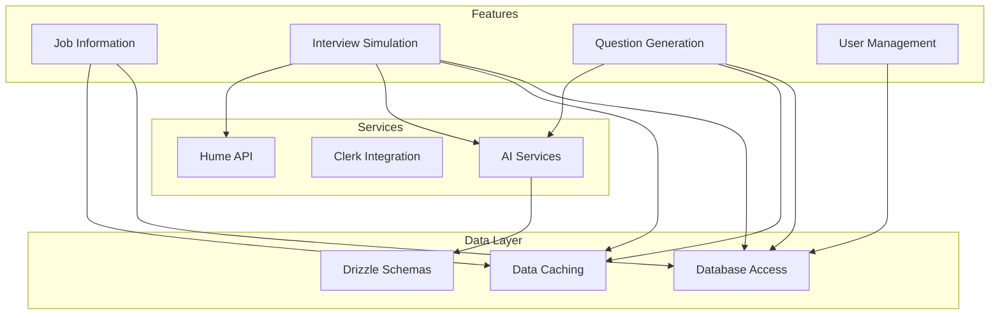
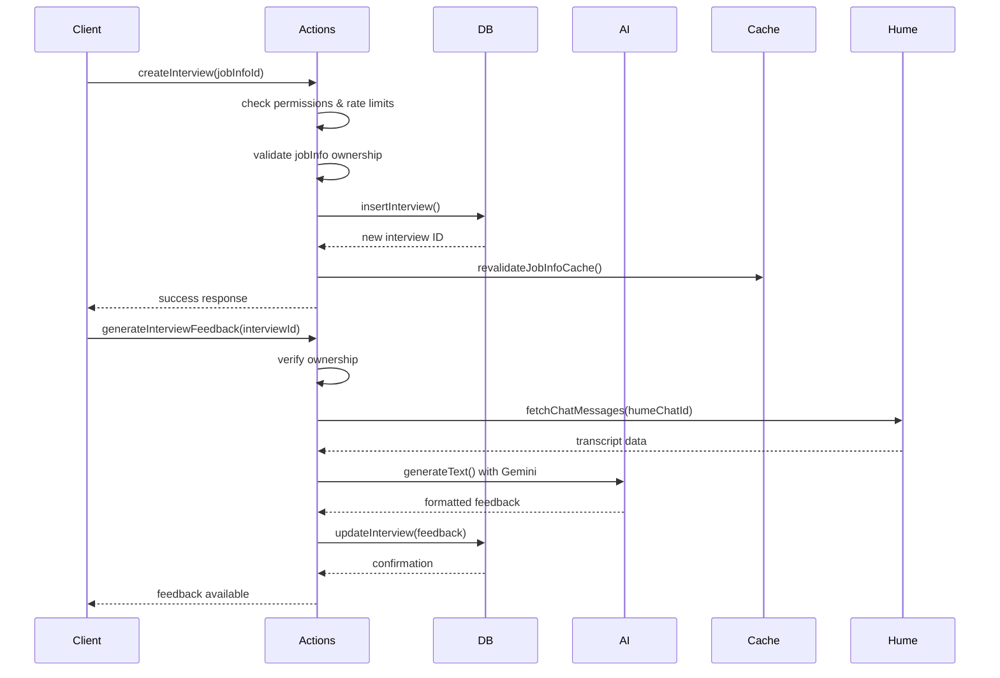
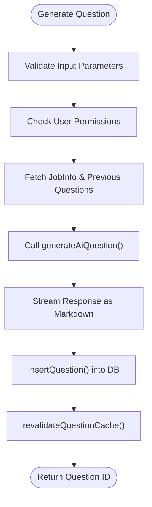

# Domain-Driven Design

<cite>
**Referenced Files in This Document**  
- [jobinfo.ts](file://src/drizzle/schema/jobinfo.ts)
- [question.ts](file://src/drizzle/schema/question.ts)
- [interview.ts](file://src/drizzle/schema/interview.ts)
- [actions.ts](file://src/features/jobInfos/actions.ts)
- [db.ts](file://src/features/jobInfos/db.ts)
- [actions.ts](file://src/features/interviews/actions.ts)
- [db.ts](file://src/features/interviews/db.ts)
- [db.ts](file://src/features/questions/db.ts)
- [questions.ts](file://src/services/ai/questions.ts)
- [interviews.ts](file://src/services/ai/interviews.ts)
- [dbCache.ts](file://src/features/jobInfos/dbCache.ts)
- [permissions.ts](file://src/features/interviews/permissions.ts)
</cite>

## Table of Contents
1. [Introduction](#introduction)
2. [Project Structure and Domain Organization](#project-structure-and-domain-organization)
3. [Core Domains Overview](#core-domains-overview)
4. [Job Information Management Domain](#job-information-management-domain)
5. [Interview Simulation Domain](#interview-simulation-domain)
6. [Question Generation Domain](#question-generation-domain)
7. [User Management and Permissions](#user-management-and-permissions)
8. [Bounded Contexts and Integration Points](#bounded-contexts-and-integration-points)
9. [Domain Events and Side Effects](#domain-events-and-side-effects)
10. [Architecture Diagram](#architecture-diagram)

## Introduction
This document provides a comprehensive overview of the Domain-Driven Design (DDD) implementation in the darasa application. The system is structured around key business domains including Job Information Management, Interview Simulation, Question Generation, and User Management. Each domain encapsulates its own logic, data access, caching strategies, and permissions, forming well-defined bounded contexts that interact through clear integration points.

The architecture emphasizes separation of concerns, with domain entities, services, and actions organized into dedicated feature folders. Aggregate roots such as `JobInfo` serve as central coordination points across multiple domains, enabling cohesive behavior while maintaining loose coupling between components.

## Project Structure and Domain Organization
The project follows a domain-centric organization where each major business capability resides within the `src/features` directory. Domains are implemented as self-contained modules containing their own actions, database access logic, caching mechanisms, and permission checks.

Key structural characteristics:
- **Feature-based organization**: Each domain has a dedicated folder under `/features`
- **Separation of concerns**: Actions, data access, and business logic are separated within each domain
- **Shared infrastructure**: Common utilities for caching, error handling, and formatting reside in `/lib`
- **AI service layer**: AI-powered capabilities are abstracted into the `/services/ai` module
- **Database schema definition**: Drizzle ORM schemas define domain entities and relationships

**Diagram sources**
- [jobinfo.ts](file://src/drizzle/schema/jobinfo.ts)
- [interview.ts](file://src/drizzle/schema/interview.ts)
- [question.ts](file://src/drizzle/schema/question.ts)

**Section sources**
- [jobinfo.ts](file://src/drizzle/schema/jobinfo.ts)
- [interview.ts](file://src/drizzle/schema/interview.ts)
- [question.ts](file://src/drizzle/schema/question.ts)

## Core Domains Overview
The application implements four primary business domains:

| Domain | Purpose | Key Entities | Integration Points |
|-------|--------|--------------|-------------------|
| **Job Information Management** | Central repository for job descriptions used to tailor interviews and questions | JobInfo (aggregate root), ExperienceLevel | Connects to Interview, Question, Resume Analysis |
| **Interview Simulation** | Real-time conversational interview experience with AI feedback generation | Interview, HumeChatId, Feedback | Uses JobInfo context, generates AI feedback via Hume |
| **Question Generation** | Dynamic creation of technical interview questions based on job context | Question, Difficulty levels | Powered by AI models using JobInfo context |
| **User Management** | Handles user identity, permissions, and subscription plans | User, Plan limits, Permissions | Enforces access control across all domains |

Each domain maintains its own set of value objects, domain services, and repositories while sharing common infrastructure components.

## Job Information Management Domain
The Job Information Management domain serves as the central organizing principle in the application's domain model. It represents the aggregate root that connects various interview preparation activities.

### Aggregate Root: JobInfo
The `JobInfo` entity acts as the primary aggregate root with the following attributes:
- **id**: Unique identifier
- **name**: Job title or identifier
- **title**: Optional formal job title
- **description**: Detailed job requirements
- **experienceLevel**: Junior, Mid-level, or Senior
- **userId**: Owner reference
- **timestamps**: Created/updated at

It establishes relationships with:
- One **User** (owner)
- Many **Questions**
- Many **Interviews**

### Domain Structure
The domain is organized into:
- **actions.ts**: Server actions for CRUD operations with permission checks
- **db.ts**: Database operations with automatic cache invalidation
- **dbCache.ts**: Cache tagging and revalidation logic
- **schemas.ts**: Zod validation schema
- **components/**: UI components specific to job info management

When a job information record is created, updated, or deleted, corresponding cache tags are invalidated to ensure consistency across related views.

**Section sources**
- [jobinfo.ts](file://src/drizzle/schema/jobinfo.ts)
- [actions.ts](file://src/features/jobInfos/actions.ts)
- [db.ts](file://src/features/jobInfos/db.ts)

## Interview Simulation Domain
The Interview Simulation domain enables users to conduct realistic mock interviews powered by AI conversation systems.

### Key Components
- **Interview Entity**: Tracks interview sessions with duration, chat ID, and feedback
- **Hume Integration**: Real-time voice/video interview capabilities
- **AI Feedback Generation**: Post-interview analysis using Gemini model
- **Rate Limiting**: Arcjet integration for usage control

### Domain Services
The domain implements several key services:
- **Interview Creation**: Validates user permissions and plan limits before creating new interviews
- **Session Management**: Updates interview state during live sessions
- **Feedback Processing**: Generates comprehensive performance evaluations after completion

The domain depends heavily on the `JobInfo` context to tailor feedback to specific job roles and experience levels.

**Diagram sources**
- [actions.ts](file://src/features/interviews/actions.ts)
- [db.ts](file://src/features/interviews/db.ts)
- [interviews.ts](file://src/services/ai/interviews.ts)

**Section sources**
- [actions.ts](file://src/features/interviews/actions.ts)
- [db.ts](file://src/features/interviews/db.ts)
- [permissions.ts](file://src/features/interviews/permissions.ts)

## Question Generation Domain
The Question Generation domain provides dynamic creation of technical interview questions tailored to specific job contexts.

### Value Objects
- **Difficulty**: Enumerated values (easy, medium, hard)
- **Question Text**: Generated content in markdown format
- **Previous Questions Context**: History used to avoid repetition

### Domain Logic
The domain leverages AI models to generate relevant questions based on:
- Job description content
- Required experience level
- Specified difficulty
- Previously generated questions

The generation process uses few-shot learning by including previous question/difficulty pairs in the prompt context.

### Data Flow

The domain ensures that each generated question is properly associated with its parent `JobInfo` and triggers appropriate cache invalidation.

**Section sources**
- [db.ts](file://src/features/questions/db.ts)
- [questions.ts](file://src/services/ai/questions.ts)

## User Management and Permissions
User management spans multiple domains with centralized authentication through Clerk and distributed permission checking.

### Permission Model
Permissions are implemented as domain-specific functions that:
- Verify user ownership of resources
- Check subscription plan limits
- Integrate with rate limiting systems

Example: Only the owner of a `JobInfo` record can create interviews or questions associated with it.

### Plan-Based Restrictions
The system enforces usage limits based on user subscription tiers:
- Free tier: Limited number of interviews per day
- Pro tier: Higher limits and additional features
- Rate limiting enforced via Arcjet token bucket algorithm

Permission checks are colocated with domain actions to maintain encapsulation.

**Section sources**
- [permissions.ts](file://src/features/interviews/permissions.ts)
- [getCurrentUser.ts](file://src/services/clerk/lib/getCurrentUser.ts)

## Bounded Contexts and Integration Points
The application implements several bounded contexts that communicate through well-defined integration points.

### Bounded Contexts
| Context | Responsibility | Internal Entities | External Dependencies |
|--------|----------------|-------------------|----------------------|
| Job Information | Job description management | JobInfo | User |
| Interview | Mock interview execution | Interview, Session | JobInfo, Hume, AI |
| Question | Question generation | Question | JobInfo, AI |
| User | Identity and access | User, Plan | All domains |

### Integration Strategy
The system uses a **shared kernel** pattern for core domain entities:
- `JobInfo` serves as the central integrating entity
- Foreign key relationships enforce referential integrity
- Cache tags enable cross-context invalidation
- Domain events are implicitly handled through synchronous side effects

For example, when a new `JobInfo` is created, it immediately becomes available as context for question generation and interview simulation without requiring event publication.

**Section sources**
- [jobinfo.ts](file://src/drizzle/schema/jobinfo.ts)
- [interview.ts](file://src/drizzle/schema/interview.ts)
- [question.ts](file://src/drizzle/schema/question.ts