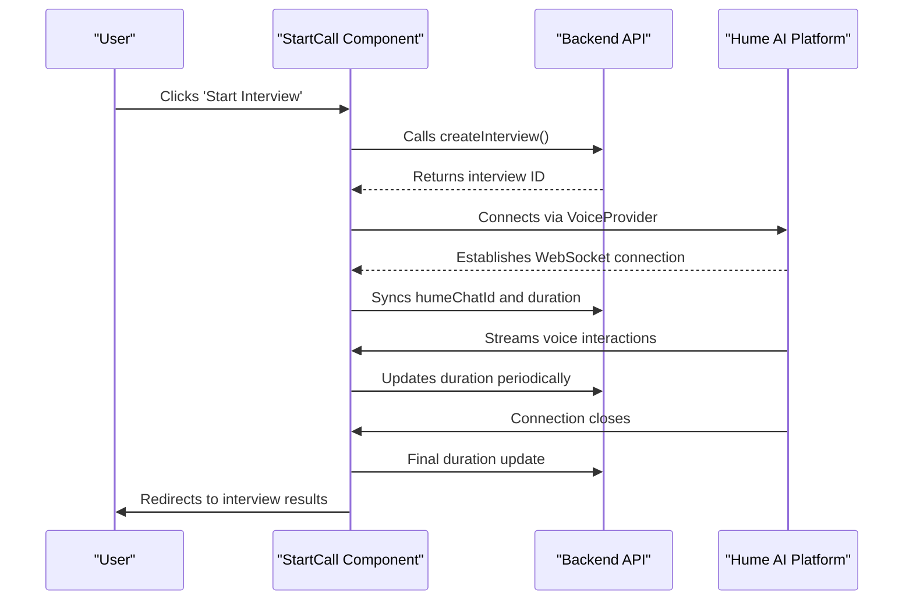
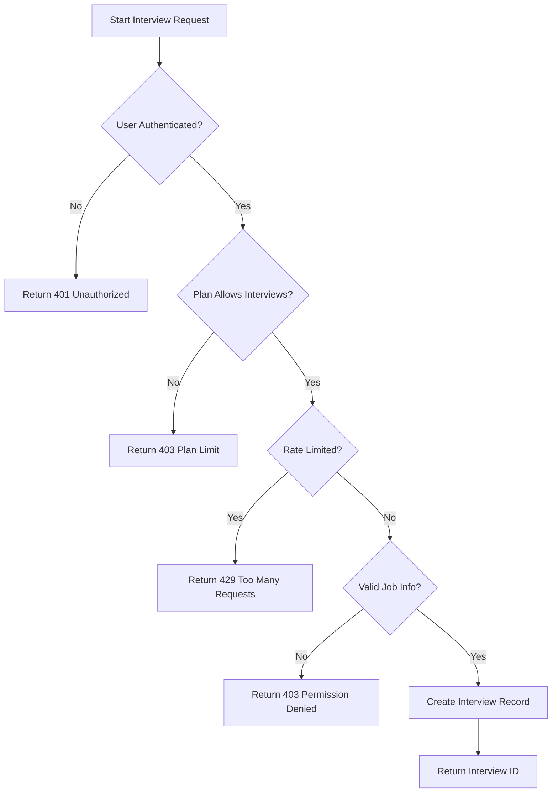
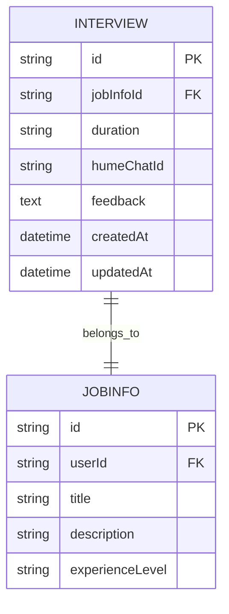
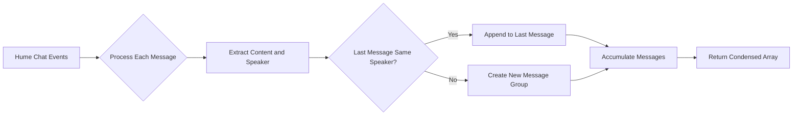
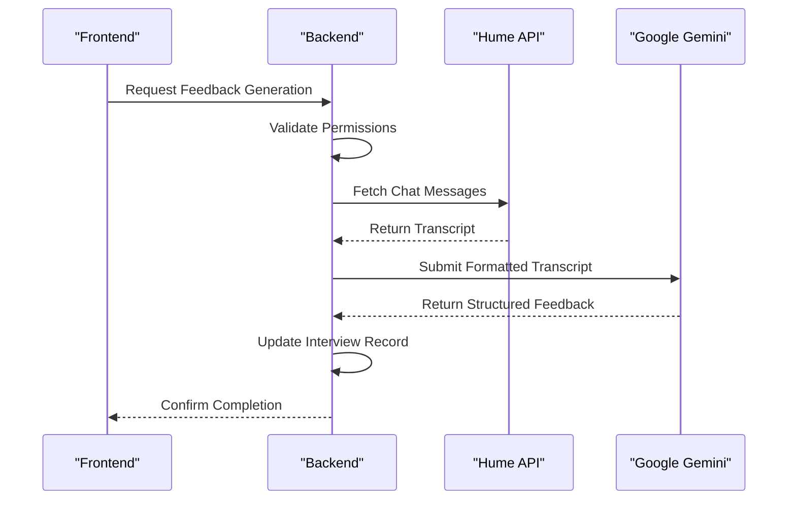

# Interview Simulation

<cite>
**Referenced Files in This Document**   
- [StartCall.tsx](file://src/app/app/job-infos/[jobInfoId]/interviews/new/_StartCall.tsx)
- [actions.ts](file://src/features/interviews/actions.ts)
- [api.ts](file://src/services/hume/lib/api.ts)
- [condenseChatMessages.ts](file://src/services/hume/lib/condenseChatMessages.ts)
- [interview.ts](file://src/drizzle/schema/interview.ts)
- [interviews.ts](file://src/services/ai/interviews.ts)
- [page.tsx](file://src/app/app/job-infos/[jobInfoId]/interviews/new/page.tsx)
- [CondensedMessages.tsx](file://src/services/hume/components/CondensedMessages.tsx)
</cite>

## Table of Contents
1. [Introduction](#introduction)
2. [Interview Session Lifecycle](#interview-session-lifecycle)
3. [Server-Side Interview Management](#server-side-interview-management)
4. [Chat Message Processing and Storage](#chat-message-processing-and-storage)
5. [Frontend Integration with Hume AI](#frontend-integration-with-hume-ai)
6. [Error Handling and Resilience](#error-handling-and-resilience)
7. [Performance Considerations](#performance-considerations)
8. [Post-Interview Feedback Generation](#post-interview-feedback-generation)

## Introduction

The Interview Simulation module enables users to conduct realistic mock job interviews using voice-based interaction powered by the Hume AI platform. The system orchestrates a complete interview lifecycle from initiation through real-time conversation to post-interview analysis. This document details the technical implementation, focusing on the integration between frontend components and backend services, data management strategies, and performance optimization techniques.

## Interview Session Lifecycle

The interview session begins when a user navigates to the new interview page and clicks the "Start Interview" button within the `StartCall` component. This action triggers a sequence of operations that establish a connection with the Hume AI voice platform and create a corresponding record in the application's database.

**Diagram sources**
- [StartCall.tsx](file://src/app/app/job-infos/[jobInfoId]/interviews/new/_StartCall.tsx#L17-L124)
- [actions.ts](file://src/features/interviews/actions.ts#L39-L103)

**Section sources**
- [StartCall.tsx](file://src/app/app/job-infos/[jobInfoId]/interviews/new/_StartCall.tsx#L17-L124)
- [page.tsx](file://src/app/app/job-infos/[jobInfoId]/interviews/new/page.tsx#L36-L64)

## Server-Side Interview Management

The server manages interview records through a series of actions that enforce permissions, handle rate limiting, and maintain data consistency. When an interview is initiated, the `createInterview` function validates user permissions based on subscription plans and applies rate limiting using Arcjet. Upon successful validation, it creates a new record in the `interviews` table with initial values for duration and references to the associated job information.

The interview schema includes fields for tracking duration, storing the Hume chat identifier, and saving AI-generated feedback. Database transactions are managed through Drizzle ORM, ensuring referential integrity between interviews and their parent job information records.

**Diagram sources**
- [actions.ts](file://src/features/interviews/actions.ts#L39-L103)
- [interview.ts](file://src/drizzle/schema/interview.ts#L1-L22)

**Section sources**
- [actions.ts](file://src/features/interviews/actions.ts#L39-L103)
- [interview.ts](file://src/drizzle/schema/interview.ts#L1-L22)

## Chat Message Processing and Storage

During the interview, voice interactions are streamed through Hume's WebSocket API and processed client-side before being stored efficiently. The `condenseChatMessages` utility function aggregates consecutive messages from the same speaker into single entries, reducing redundancy and optimizing storage. This transformation occurs when retrieving historical messages for display in the interview review interface.

This approach significantly reduces the number of DOM elements needed to render conversation history while preserving the semantic flow of the dialogue. The condensed format groups all user utterances and AI responses separately, creating a cleaner visual representation of the interview exchange.

**Diagram sources**
- [condenseChatMessages.ts](file://src/services/hume/lib/condenseChatMessages.ts#L5-L26)
- [CondensedMessages.tsx](file://src/services/hume/components/CondensedMessages.tsx#L1-L55)

**Section sources**
- [condenseChatMessages.ts](file://src/services/hume/lib/condenseChatMessages.ts#L5-L26)
- [CondensedMessages.tsx](file://src/services/hume/components/CondensedMessages.tsx#L1-L55)

## Frontend Integration with Hume AI

The frontend integrates with Hume's voice platform through the `@humeai/voice-react` SDK, which provides React hooks and components for managing real-time audio interactions. The `VoiceProvider` wraps the `StartCall` component, establishing a context for voice session management. The `useVoice` hook exposes connection state, chat metadata, and control functions that enable seamless interaction between the application and Hume's empathic voice API.

Key integration points include:
- Authentication using access tokens generated server-side
- Configuration of voice sessions with job-specific variables (title, description, experience level)
- Real-time synchronization of interview state (duration, chat ID) with the backend
- Handling of connection lifecycle events (connecting, connected, closed)

The integration maintains bidirectional communication, allowing the application to respond to voice events while simultaneously updating server-side records to ensure data persistence across sessions.

**Section sources**
- [StartCall.tsx](file://src/app/app/job-infos/[jobInfoId]/interviews/new/_StartCall.tsx#L17-L124)
- [page.tsx](file://src/app/app/job-infos/[jobInfoId]/interviews/new/page.tsx#L36-L64)

## Error Handling and Resilience

The system implements comprehensive error handling at multiple levels to ensure reliability during interview sessions. Client-side error handling captures issues during interview initiation, displaying appropriate toast notifications when operations fail. The `createInterview` action returns structured error objects that trigger user-friendly messages through the `errorToast` utility.

Network resilience is achieved through periodic state synchronization. The interview duration is updated every 10 seconds during active sessions, ensuring that partial progress is preserved even if the connection terminates unexpectedly. When the WebSocket connection closes, the final duration is immediately synced before redirecting to the results page.

Permission checks occur at both the UI and API levels, preventing unauthorized access to interview functionality based on subscription status. Rate limiting is enforced using Arcjet's token bucket algorithm, protecting backend resources from abuse while providing clear feedback to users who exceed usage limits.

**Section sources**
- [StartCall.tsx](file://src/app/app/job-infos/[jobInfoId]/interviews/new/_StartCall.tsx#L79-L80)
- [actions.ts](file://src/features/interviews/actions.ts#L39-L103)

## Performance Considerations

Performance optimization focuses on minimizing latency in voice processing and ensuring responsive user interfaces. The architecture separates concerns between real-time voice streaming and background data processing, allowing the primary interview experience to remain fluid while secondary operations occur asynchronously.

Critical performance strategies include:
- Caching of frequently accessed data (job information, user profiles) using Next.js cache tags
- Efficient message retrieval with paginated fetching from Hume's API
- Debounced state updates to reduce unnecessary re-renders
- Preemptive loading of dependencies before interview initiation

Latency in voice processing is mitigated through Hume's optimized WebSocket infrastructure, while the frontend employs loading states and skeleton screens to maintain perceived performance during initialization phases. The use of Suspense boundaries ensures smooth transitions between loading and interactive states.

**Section sources**
- [page.tsx](file://src/app/app/job-infos/[jobInfoId]/interviews/new/page.tsx#L1-L64)
- [actions.ts](file://src/features/interviews/actions.ts#L39-L103)

## Post-Interview Feedback Generation

After interview completion, the system generates comprehensive feedback by analyzing the full conversation transcript. The `generateAiInterviewFeedback` function retrieves chat messages from Hume's API using the stored `humeChatId`, formats them with relevant context (job description, experience level), and submits them to Google's Gemini model for evaluation.

The AI analysis evaluates multiple dimensions of interview performance, including communication clarity, confidence, response quality, pacing, engagement, and role fit. Feedback is structured according to predefined categories with numerical ratings, providing actionable insights for improvement. The generated feedback is then stored in the interview record for future reference.

**Diagram sources**
- [interviews.ts](file://src/services/ai/interviews.ts#L5-L113)
- [actions.ts](file://src/features/interviews/actions.ts#L101-L156)

**Section sources**
- [interviews.ts](file://src/services/ai/interviews.ts#L5-L113)
- [actions.ts](file://src/features/interviews/actions.ts#L101-L156)