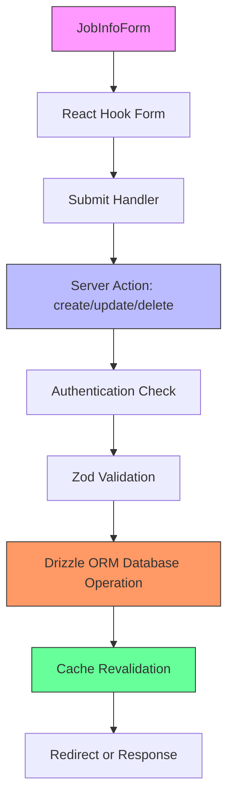
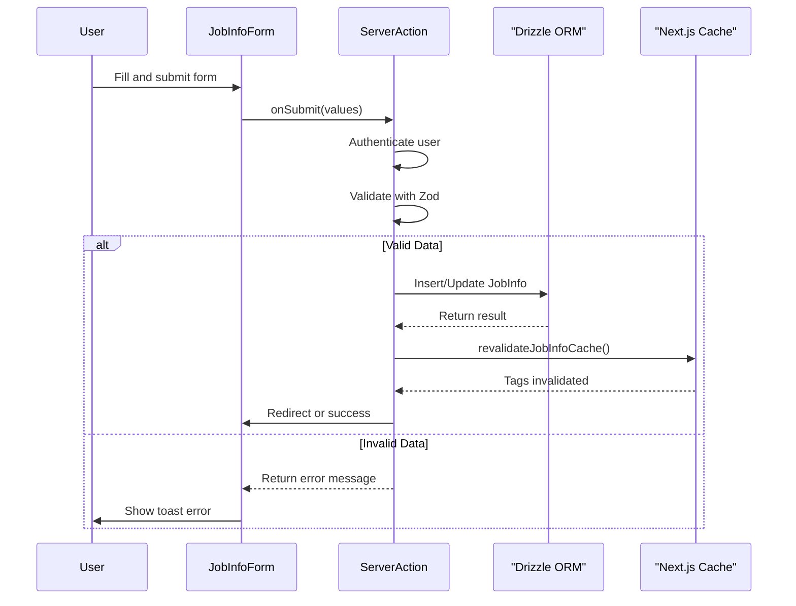
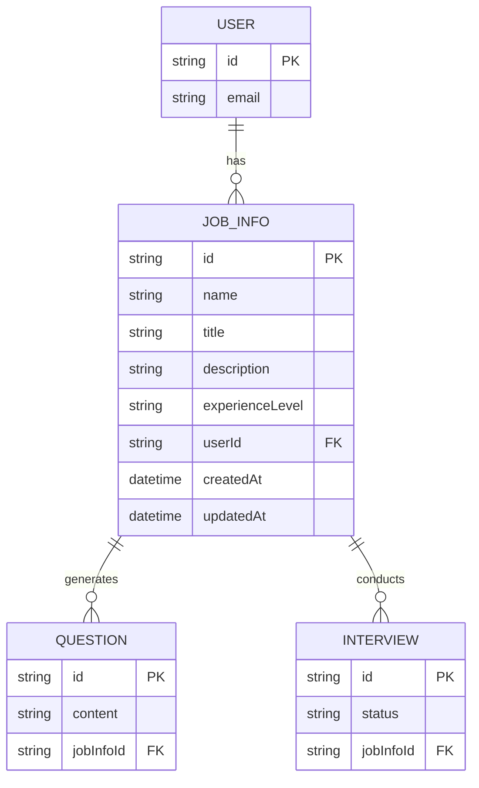
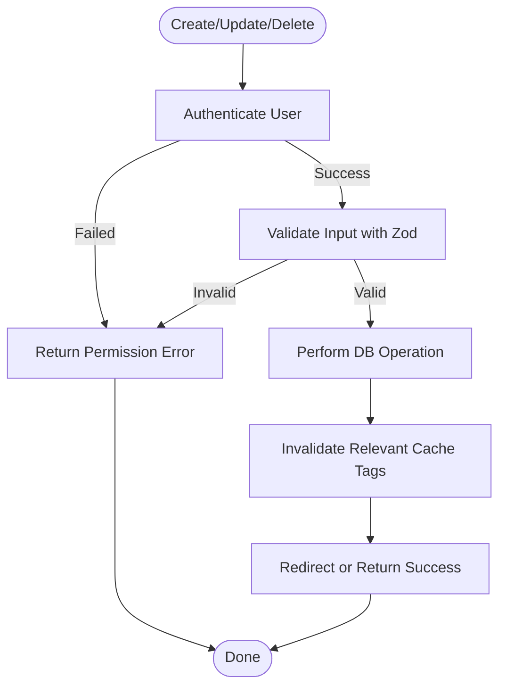
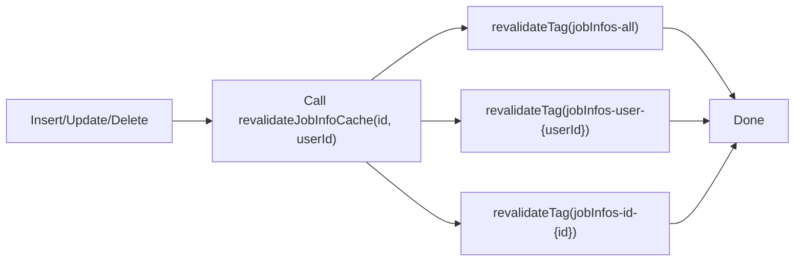

# Job Information Management

<cite>
**Referenced Files in This Document**   
- [jobinfo.ts](file://src/drizzle/schema/jobinfo.ts)
- [jobInfoSchema.ts](file://src/features/jobInfos/schemas.ts)
- [actions.ts](file://src/features/jobInfos/actions.ts)
- [db.ts](file://src/features/jobInfos/db.ts)
- [dbCache.ts](file://src/features/jobInfos/dbCache.ts)
- [JobInfoForm.tsx](file://src/features/jobInfos/components/JobInfoForm.tsx)
</cite>

## Table of Contents
1. [Introduction](#introduction)
2. [Core Components](#core-components)
3. [Architecture Overview](#architecture-overview)
4. [Detailed Component Analysis](#detailed-component-analysis)
5. [Data Model and Schema](#data-model-and-schema)
6. [CRUD Operations and Server Actions](#crud-operations-and-server-actions)
7. [Validation and Error Handling](#validation-and-error-handling)
8. [Caching and Revalidation Strategy](#caching-and-revalidation-strategy)
9. [Frontend Integration with React Hook Form](#frontend-integration-with-react-hook-form)
10. [Integration with Other Domain Features](#integration-with-other-domain-features)
11. [Common Issues and Troubleshooting](#common-issues-and-troubleshooting)

## Introduction
The Job Information Management module serves as the central aggregate root in the application’s domain model, anchoring key functionalities such as interview preparation, question generation, and resume analysis. It encapsulates essential job-related metadata including title, experience level, and detailed job descriptions. This document details the implementation of CRUD operations via server actions, database interactions using Drizzle ORM, cache-tag-based revalidation, Zod validation schemas, and integration between the `JobInfoForm` component and backend logic.

**Section sources**
- [jobinfo.ts](file://src/drizzle/schema/jobinfo.ts#L1-L35)
- [schemas.ts](file://src/features/jobInfos/schemas.ts#L1-L8)

## Core Components
The core components of the Job Information Management system include:
- **JobInfoTable**: The primary database schema defining job information structure.
- **jobInfoSchema**: Zod schema for input validation.
- **Server Actions (`createJobInfo`, `updateJobInfo`, `deleteJobInfo`)**: Handle secure, authenticated CRUD operations.
- **Database Access Layer (`insertJobInfo`, `updateJobInfo`, `deleteJobInfo`)**: Abstracts direct Drizzle ORM interactions.
- **Cache Management (`revalidateJobInfoCache`, `getJobInfoIdTag`)**: Implements tag-based cache invalidation.
- **JobInfoForm**: Client-side React component integrating form state with backend actions.

These components work cohesively to ensure data integrity, performance, and user experience.

**Section sources**
- [jobinfo.ts](file://src/drizzle/schema/jobinfo.ts#L14-L25)
- [schemas.ts](file://src/features/jobInfos/schemas.ts#L3-L8)
- [actions.ts](file://src/features/jobInfos/actions.ts#L1-L121)
- [db.ts](file://src/features/jobInfos/db.ts#L1-L54)
- [dbCache.ts](file://src/features/jobInfos/dbCache.ts#L1-L25)
- [JobInfoForm.tsx](file://src/features/jobInfos/components/JobInfoForm.tsx#L1-L165)

## Architecture Overview
The Job Information Management module follows a layered architecture pattern, separating concerns across presentation, business logic, data access, and persistence layers. The frontend uses React Hook Form for state management, which communicates securely with server actions. These actions enforce authentication, validate inputs using Zod, interact with the database via Drizzle ORM, and trigger cache revalidation upon mutation.

**Diagram sources**
- [JobInfoForm.tsx](file://src/features/jobInfos/components/JobInfoForm.tsx#L1-L165)
- [actions.ts](file://src/features/jobInfos/actions.ts#L1-L121)
- [db.ts](file://src/features/jobInfos/db.ts#L1-L54)
- [dbCache.ts](file://src/features/jobInfos/dbCache.ts#L1-L25)

## Detailed Component Analysis

### JobInfoForm Component
The `JobInfoForm` component is a client-side React form that leverages `react-hook-form` and `Zod` resolver for robust type-safe form handling. It conditionally binds either `createJobInfo` or `updateJobInfo` based on whether an existing `jobInfo` object is passed as a prop.

Upon submission, it invokes the appropriate server action and handles responses through `sonner` toast notifications. The form supports dynamic field handling, including nullable string fields (e.g., `title`) and enum-based selection (e.g., `experienceLevel`), rendered via ShadCN UI components.

**Diagram sources**
- [JobInfoForm.tsx](file://src/features/jobInfos/components/JobInfoForm.tsx#L1-L165)
- [actions.ts](file://src/features/jobInfos/actions.ts#L1-L121)
- [db.ts](file://src/features/jobInfos/db.ts#L1-L54)
- [dbCache.ts](file://src/features/jobInfos/dbCache.ts#L1-L25)

**Section sources**
- [JobInfoForm.tsx](file://src/features/jobInfos/components/JobInfoForm.tsx#L1-L165)

## Data Model and Schema
The `JobInfoTable` represents the core entity in the domain model, storing structured job information linked to a user. It includes fields such as `name`, `title`, `description`, `experienceLevel`, and foreign key `userId`. The table enforces referential integrity with cascading delete behavior on user deletion.

The `experienceLevel` field uses a PostgreSQL enum type restricted to predefined values: `"junior"`, `"mid-level"`, and `"senior"`.

Relationships are defined via Drizzle ORM relations:
- One-to-many from `UserTable` to `JobInfoTable`
- One-to-many from `JobInfoTable` to `QuestionTable`
- One-to-many from `JobInfoTable` to `InterviewTable`

This makes `JobInfo` an aggregate root connecting downstream entities.

**Diagram sources**
- [jobinfo.ts](file://src/drizzle/schema/jobinfo.ts#L14-L25)
- [question.ts](file://src/drizzle/schema/question.ts#L1-L10)
- [interview.ts](file://src/drizzle/schema/interview.ts#L1-L10)
- [user.ts](file://src/drizzle/schema/user.ts#L1-L10)

**Section sources**
- [jobinfo.ts](file://src/drizzle/schema/jobinfo.ts#L1-L35)

## CRUD Operations and Server Actions
CRUD operations are implemented as server actions in `actions.ts`, ensuring security by verifying user authentication before any operation. Each action uses `getCurrentUser()` from Clerk integration to retrieve session context.

- **createJobInfo**: Inserts new job info, then redirects to its detail page.
- **updateJobInfo**: Updates only if the current user owns the record.
- **deleteJobInfo**: Deletes the record and checks remaining job infos; redirects to `/new` if none remain.

All mutations go through the abstraction layer in `db.ts`, which returns identifiers needed for cache invalidation.

**Diagram sources**
- [actions.ts](file://src/features/jobInfos/actions.ts#L1-L121)
- [db.ts](file://src/features/jobInfos/db.ts#L1-L54)

**Section sources**
- [actions.ts](file://src/features/jobInfos/actions.ts#L1-L121)
- [db.ts](file://src/features/jobInfos/db.ts#L1-L54)

## Validation and Error Handling
Input validation is enforced using Zod through the `jobInfoSchema`, which defines strict typing and constraints:
- `name`: Required non-empty string
- `title`: Optional but must be non-empty if provided
- `experienceLevel`: Must be one of the allowed enum values
- `description`: Required non-empty string

Validation occurs within server actions using `.safeParse()`, returning structured `{ success, data }` results. Errors are communicated back to the client and displayed via `toast.error()`.

This approach ensures type safety both at runtime and compile time while providing clear feedback to users.

**Section sources**
- [schemas.ts](file://src/features/jobInfos/schemas.ts#L3-L8)
- [actions.ts](file://src/features/jobInfos/actions.ts#L1-L121)
- [JobInfoForm.tsx](file://src/features/jobInfos/components/JobInfoForm.tsx#L1-L165)

## Caching and Revalidation Strategy
The system employs Next.js cache tags for efficient revalidation. Upon any mutation (insert, update, delete), the `revalidateJobInfoCache` function is called with the affected `id` and `userId`.

Three cache tags are invalidated:
- Global list: `jobInfos-all`
- User-specific list: `jobInfos-user-{userId}`
- Individual item: `jobInfos-id-{id}`

This ensures stale data is purged from edge caches without full site revalidation, improving performance and consistency.

**Diagram sources**
- [dbCache.ts](file://src/features/jobInfos/dbCache.ts#L1-L25)
- [db.ts](file://src/features/jobInfos/db.ts#L1-L54)

**Section sources**
- [dbCache.ts](file://src/features/jobInfos/dbCache.ts#L1-L25)

## Frontend Integration with React Hook Form
The `JobInfoForm` integrates tightly with `react-hook-form` and `@hookform/resolvers/zod`, enabling seamless two-way binding and real-time validation. Default values are set conditionally based on presence of `jobInfo`, supporting both creation and editing workflows.

Special handling is applied for nullable fields like `title`, where empty input maps to `null`. The submit handler dynamically binds the correct server action (`createJobInfo` or `updateJobInfo.bind(id)`), abstracting complexity from the UI layer.

Loading states are managed via `formState.isSubmitting`, with visual feedback using `LoadingSwap` during submission.

**Section sources**
- [JobInfoForm.tsx](file://src/features/jobInfos/components/JobInfoForm.tsx#L1-L165)

## Integration with Other Domain Features
The `JobInfo` entity acts as a hub for multiple downstream features:
- **Interviews**: Stored under `/app/job-infos/[jobInfoId]/interviews`, interviews derive context from associated job info.
- **Questions**: AI-generated questions are based on job description and experience level.
- **Resume Analysis**: Analyzed resumes