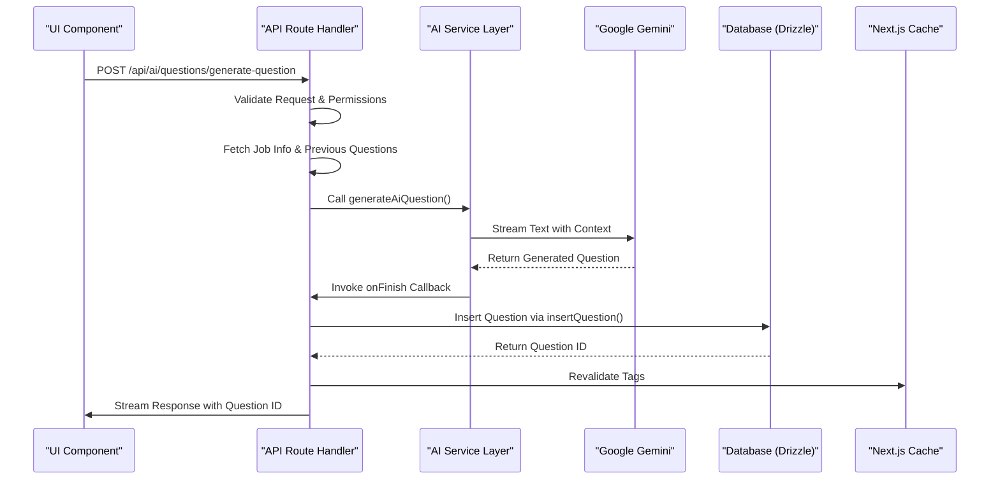

# Question Generation System

<cite>
**Referenced Files in This Document **   
- [generate-question/route.ts](file://src/app/api/ai/questions/generate-question/route.ts)
- [questions.ts](file://src/services/ai/questions.ts)
- [db.ts](file://src/features/questions/db.ts)
- [dbCache.ts](file://src/features/questions/dbCache.ts)
- [formatters.ts](file://src/features/questions/formatters.ts)
- [permissions.ts](file://src/features/questions/permissions.ts)
- [google.ts](file://src/services/ai/models/google.ts)
- [_NewQuestionClientPage.tsx](file://src/app/app/job-infos/[jobInfoId]/questions/_NewQuestionClientPage.tsx)
- [question.ts](file://src/drizzle/schema/question.ts)
- [jobinfo.ts](file://src/drizzle/schema/jobinfo.ts)
</cite>

## Table of Contents
1. [Introduction](#introduction)
2. [Architecture Overview](#architecture-overview)
3. [Core Components](#core-components)
4. [Request Flow and Processing Logic](#request-flow-and-processing-logic)
5. [AI Service Integration](#ai-service-integration)
6. [Data Persistence and Caching Strategy](#data-persistence-and-caching-strategy)
7. [Output Formatting and Standardization](#output-formatting-and-standardization)
8. [Security and Access Control](#security-and-access-control)
9. [Error Handling and Recovery](#error-handling-and-recovery)
10. [Scalability Considerations](#scalability-considerations)

## Introduction
The Question Generation System is a domain module designed to create context-aware technical interview questions based on job information. It enables users to generate realistic, relevant technical questions tailored to specific job roles by leveraging AI models such as Google Gemini or OpenAI. The system integrates seamlessly with the application's frontend, allowing for interactive question generation, immediate feedback analysis, and persistent storage of generated content. This document details the end-to-end flow from UI request through server processing to AI invocation, validation, database persistence via Drizzle ORM, and caching mechanisms.

## Architecture Overview

**Diagram sources **
- [generate-question/route.ts](file://src/app/api/ai/questions/generate-question/route.ts#L0-L89)
- [questions.ts](file://src/services/ai/questions.ts#L8-L63)
- [db.ts](file://src/features/questions/db.ts#L4-L21)

## Core Components

The Question Generation System comprises several key components that work together to deliver a seamless experience:

- **Frontend Client**: Handles user interaction and displays generated questions.
- **API Route Handler**: Processes incoming requests, validates inputs, enforces permissions, and orchestrates the generation workflow.
- **AI Service Layer**: Interfaces with external AI providers to generate questions using contextual job data.
- **Database Abstraction**: Manages CRUD operations for question entities using Drizzle ORM.
- **Caching Layer**: Implements efficient cache invalidation strategies using unique tags.
- **Formatting Utilities**: Standardizes presentation of difficulty levels and other metadata.

**Section sources**
- [generate-question/route.ts](file://src/app/api/ai/questions/generate-question/route.ts#L0-L89)
- [_NewQuestionClientPage.tsx](file://src/app/app/job-infos/[jobInfoId]/questions/_NewQuestionClientPage.tsx#L0-L416)

## Request Flow and Processing Logic

When a user initiates a question generation request from the UI, the following sequence occurs:

1. The client sends a POST request to `/api/ai/questions/generate-question` with the target `jobInfoId` and desired `difficulty`.
2. The route handler validates the input schema using Zod, ensuring both parameters are present and correctly typed.
3. Authentication is verified via `getCurrentUser()` from Clerk integration.
4. Plan-based permissions are checked using `canCreateQuestion()`, which evaluates subscription limits (e.g., 5 free questions vs unlimited).
5. Authorization is enforced by verifying ownership of the `jobInfo` record through a database query filtered by both `jobInfoId` and `userId`.
6. Historical context is retrieved via `getQuestions(jobInfoId)`, fetching all previously generated questions for conversational continuity.
7. The AI service is invoked with structured context including job title, description, experience level, and prior interactions.
8. Upon completion, the generated question is persisted to the database and streamed back to the client.

This flow ensures secure, personalized, and contextually relevant question generation while maintaining scalability and responsiveness.

**Section sources**
- [generate-question/route.ts](file://src/app/api/ai/questions/generate-question/route.ts#L0-L89)
- [permissions.ts](file://src/features/questions/permissions.ts#L6-L16)

## AI Service Integration

The system leverages the `@ai-sdk/google` library to interface with Google Gemini's `gemini-2.5-flash` model. The integration is abstracted through a factory function in `google.ts` that initializes the provider with an API key from environment variables.

Key aspects of the AI integration include:

- **Contextual Prompting**: The system constructs a detailed system prompt containing job-specific information such as title, description, and experience level.
- **Conversational Memory**: Previous question-answer pairs are included in the message history to maintain coherence across multiple generations.
- **Streaming Output**: Uses `streamText()` to enable real-time delivery of partially generated responses, improving perceived performance.
- **Controlled Generation**: Enforces strict output guidelines requiring markdown formatting, single-question responses, and no answer inclusion.
- **Difficulty Alignment**: Tailors complexity based on user-selected difficulty ("easy", "medium", "hard").

The AI service returns a streamable response object that can be merged into the HTTP response for progressive rendering on the client side.

**Section sources**
- [questions.ts](file://src/services/ai/questions.ts#L8-L63)
- [google.ts](file://src/services/ai/models/google.ts#L0-L5)

## Data Persistence and Caching Strategy

Generated questions are stored in a PostgreSQL database using Drizzle ORM. The schema defines a `questions` table with foreign key references to `job_info`, enforcing referential integrity and cascading deletes.

Upon successful generation:
1. The `insertQuestion()` function inserts the new question into the database.
2. It returns the generated `id` and associated `jobInfoId` for caching purposes.
3. The `revalidateQuestionCache()` function triggers revalidation of three distinct cache tags:
   - Global questions tag
   - Job-specific questions tag (`getQuestionJobInfoTag(jobInfoId)`)
   - Individual question tag (`getQuestionIdTag(id)`)

This multi-level tagging strategy enables fine-grained cache invalidation, ensuring stale data is efficiently purged while maximizing cache hit rates for related queries. The use of `use cache` directives in data-fetching functions further optimizes performance by preventing redundant database calls during SSR.

**Section sources**
- [db.ts](file://src/features/questions/db.ts#L4-L21)
- [dbCache.ts](file://src/features/questions/dbCache.ts#L0-L25)
- [question.ts](file://src/drizzle/schema/question.ts#L0-L28)

## Output Formatting and Standardization

The system employs formatter utilities to ensure consistent presentation of domain data. Specifically, the `formatQuestionDifficulty()` function in `formatters.ts` converts machine-readable enum values (`"easy"`, `"medium"`, `"hard"`) into human-friendly labels ("Easy", "Medium", "Hard") for display in the UI.

This separation of concerns allows:
- Internal systems to operate with standardized, type-safe enums
- User interfaces to present localized, properly capitalized text
- Easy extension to support additional difficulty levels or localization in the future

The formatter uses exhaustive type checking via TypeScript's `never` assertion to catch unhandled cases at compile time, enhancing reliability.

**Section sources**
- [formatters.ts](file://src/features/questions/formatters.ts#L0-L15)

## Security and Access Control

Access to question generation is protected through a multi-layered security model:

1. **Authentication**: Verified via Clerk's `getCurrentUser()` middleware, rejecting unauthenticated requests with 401 status.
2. **Authorization**: Each request checks that the requesting user owns the referenced `jobInfo` record using a parameterized database query.
3. **Rate Limiting / Quotas**: Implemented through `canCreateQuestion()`, which combines feature flags (`unlimited_questions`, `5_questions`) with runtime counting of existing questions per user.
4. **Input Validation**: All payloads are validated against a Zod schema before processing.
5. **Principle of Least Privilege**: Database queries fetch only necessary fields using `Pick<>` types to minimize exposure.

These measures collectively ensure that users can only generate questions for their own job entries and are subject to plan-enforced usage limits.

**Section sources**
- [permissions.ts](file://src/features/questions/permissions.ts#L6-L16)
- [generate-question/route.ts](file://src/app/api/ai/questions/generate-question/route.ts#L36-L41)

## Error Handling and Recovery

The system implements robust error handling at multiple levels:

- **Client-Side**: The `_NewQuestionClientPage` component uses `useCompletion()` from `@ai-sdk/react` to manage streaming state and includes error callbacks that trigger toast notifications via `errorToast()`.
- **Server-Side**: Invalid requests return 400 errors; unauthorized access attempts return 401 or 403 statuses with descriptive messages.
- **Fallback Behavior**: Permission checks use `Promise.any()` with `.catch(() => false)` to gracefully degrade when quota checks fail.
- **Streaming Resilience**: The `createDataStreamResponse` utility ensures partial results are delivered even if generation is interrupted.

Errors are handled non-disruptively, allowing users to retry failed operations without losing context.

**Section sources**
- [_NewQuestionClientPage.tsx](file://src/app/app/job-infos/[jobInfoId]/questions/_NewQuestionClientPage.tsx#L78-L86)
- [generate-question/route.ts](file://src/app/api/ai/questions/generate-question/route.ts#L10-L15)

## Scalability Considerations

The architecture supports scalable concurrent question generation through several design choices:

- **Stateless API Routes**: Each request contains all necessary context, enabling horizontal scaling.
- **Efficient Caching**: Unique cache tags per `jobInfoId` allow high cache hit ratios even under heavy load.
- **Streamed Responses**: Reduce memory pressure by avoiding full response buffering.
- **Database Indexing**: Foreign key relationships and creation timestamp ordering suggest optimized query performance.
- **External AI Offload**: Computationally intensive generation is delegated to cloud AI services.

Potential bottlenecks could arise from:
- High concurrency on cache revalidation
- Rate limits on the Gemini API
- Database connection pooling constraints

Mitigations include optimizing tag granularity, implementing client-side queuing, and monitoring usage patterns for proactive scaling.

**Section sources**
- [dbCache.ts](file://src/features/questions/dbCache.ts#L0-L25)
- [questions.ts](file://src/services/ai/questions.ts#L8-L63)