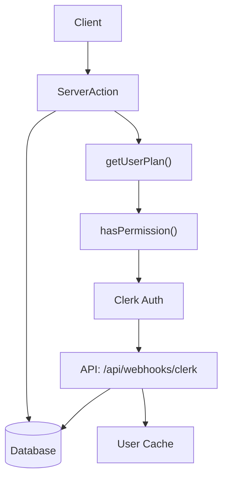
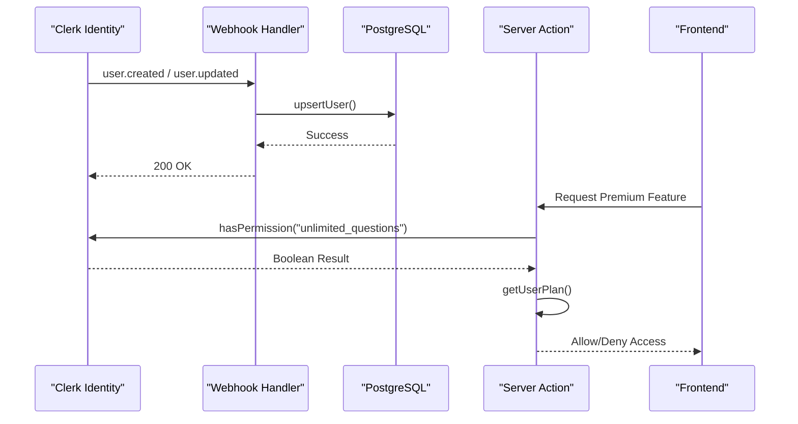
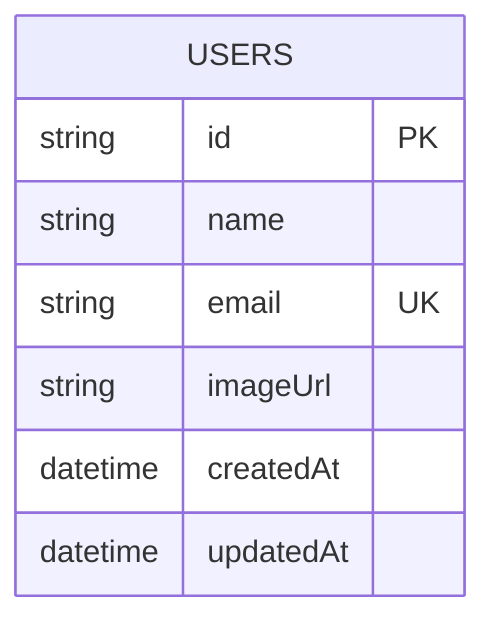
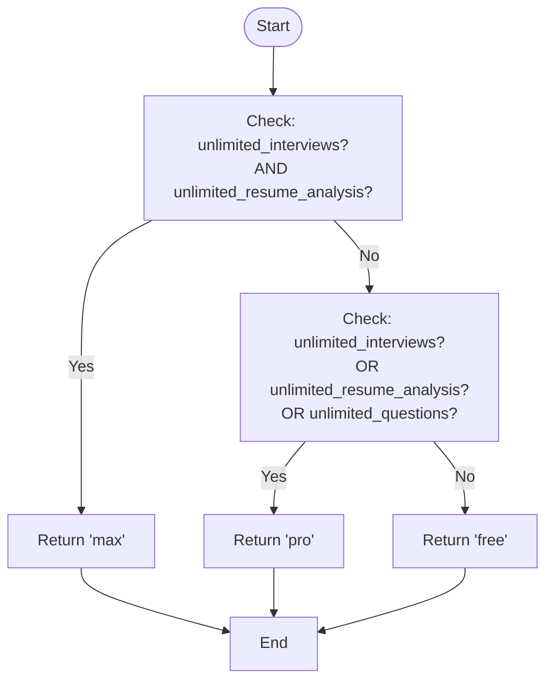
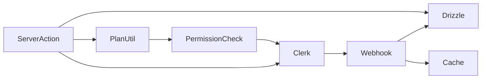

# User Management & Permissions

<cite>
**Referenced Files in This Document**   
- [plan.ts](file://src/features/users/plan.ts)
- [getCurrentUser.ts](file://src/services/clerk/lib/getCurrentUser.ts)
- [hasPermission.ts](file://src/services/clerk/lib/hasPermission.ts)
- [route.ts](file://src/app/api/webhooks/clerk/route.ts)
- [user.ts](file://src/drizzle/schema/user.ts)
- [db.ts](file://src/features/users/db.ts)
</cite>

## Table of Contents
1. [Introduction](#introduction)
2. [Project Structure](#project-structure)
3. [Core Components](#core-components)
4. [Architecture Overview](#architecture-overview)
5. [Detailed Component Analysis](#detailed-component-analysis)
6. [Dependency Analysis](#dependency-analysis)
7. [Performance Considerations](#performance-considerations)
8. [Troubleshooting Guide](#troubleshooting-guide)
9. [Conclusion](#conclusion)

## Introduction
This document provides a comprehensive overview of the User Management & Permissions module within the application. It details how user data is synchronized from Clerk, persisted in the database, and used to enforce subscription-based access controls. The system leverages Clerk’s authentication and feature flags to determine user plans and permissions, which are then validated server-side before granting access to premium features.

The architecture ensures secure, scalable, and consistent enforcement of plan limits through server actions, webhook synchronization, and permission checking utilities. Special attention is given to edge cases such as stale data, race conditions, and free vs pro plan differentiation.

## Project Structure
The user management functionality is organized across multiple directories with clear separation of concerns:
- `src/features/users`: Contains core user operations including database interactions and plan logic.
- `src/services/clerk/lib`: Houses utilities for retrieving authenticated user context and checking permissions via Clerk.
- `src/app/api/webhooks/clerk`: Handles incoming user lifecycle events from Clerk.
- `src/drizzle/schema`: Defines the internal user schema stored in PostgreSQL.



**Diagram sources**
- [route.ts](file://src/app/api/webhooks/clerk/route.ts#L1-L124)
- [plan.ts](file://src/features/users/plan.ts#L1-L34)
- [hasPermission.ts](file://src/services/clerk/lib/hasPermission.ts#L1-L16)

**Section sources**
- [route.ts](file://src/app/api/webhooks/clerk/route.ts#L1-L124)
- [user.ts](file://src/drizzle/schema/user.ts#L1-L18)

## Core Components
Key components involved in user management include:
- **Clerk Integration**: Manages authentication and feature-based permissions.
- **User Synchronization**: Ensures internal database reflects current Clerk user state via webhooks.
- **Plan Detection Logic**: Determines user tier (free/pro/max) by evaluating Clerk feature flags.
- **Permission Guard Clauses**: Prevent unauthorized access in server actions using runtime checks.

These components work together to provide a secure and responsive user experience while minimizing unnecessary database queries.

**Section sources**
- [plan.ts](file://src/features/users/plan.ts#L1-L34)
- [getCurrentUser.ts](file://src/services/clerk/lib/getCurrentUser.ts#L1-L25)
- [hasPermission.ts](file://src/services/clerk/lib/hasPermission.ts#L1-L16)

## Architecture Overview
The user management system follows a distributed model where identity is managed externally by Clerk, while application-specific data and access control decisions are handled internally.

Upon user creation or update in Clerk, a webhook notifies the application, which upserts the user into the local database. When accessing protected features, server actions use `getUserPlan()` and `hasPermission()` to validate entitlements based on Clerk's JWT claims.



**Diagram sources**
- [route.ts](file://src/app/api/webhooks/clerk/route.ts#L1-L124)
- [plan.ts](file://src/features/users/plan.ts#L1-L34)
- [hasPermission.ts](file://src/services/clerk/lib/hasPermission.ts#L1-L16)

## Detailed Component Analysis

### User Data Synchronization via Webhooks
The Clerk webhook endpoint processes `user.created`, `user.updated`, and `user.deleted` events to keep the internal user store in sync. On creation or update, it extracts essential profile information and persists it using `upsertUser`.

#### Key Implementation Flow:
```mermaid
flowchart TD
A["Receive POST /api/webhooks/clerk"] --> B{Validate Svix Headers}
B --> |Invalid| C[Return 400]
B --> |Valid| D[Parse Payload]
D --> E[Verify Signature with Svix]
E --> |Failed| F[Return 400]
E --> |Success| G{Event Type?}
G --> |"user.created<br/>or user.updated"| H[Extract Email & Profile]
H --> I[Call upsertUser()]
I --> J[Revalidate Cache]
G --> |"user.deleted"| K[Call deleteUser()]
K --> L[Revalidate Cache]
G --> |Other| M[Log & Ignore]
I --> N[Return 200]
K --> N
M --> N
```

**Diagram sources**
- [route.ts](file://src/app/api/webhooks/clerk/route.ts#L1-L124)
- [db.ts](file://src/features/users/db.ts#L5-L21)

**Section sources**
- [route.ts](file://src/app/api/webhooks/clerk/route.ts#L1-L124)
- [db.ts](file://src/features/users/db.ts#L5-L21)

### Internal User Schema and Persistence
The application maintains a minimal user representation in PostgreSQL, storing only necessary fields for display and reference. The schema avoids duplicating authentication data, relying instead on Clerk for identity verification.

#### Database Schema:


The `upsertUser` function uses PostgreSQL’s `ON CONFLICT DO UPDATE` to ensure idempotency during synchronization.

**Diagram sources**
- [user.ts](file://src/drizzle/schema/user.ts#L1-L18)
- [db.ts](file://src/features/users/db.ts#L5-L21)

**Section sources**
- [user.ts](file://src/drizzle/schema/user.ts#L1-L18)
- [db.ts](file://src/features/users/db.ts#L5-L21)

### Subscription Plan Enforcement
The `getUserPlan()` function evaluates multiple Clerk feature flags to determine the user's subscription tier. It supports backward compatibility by checking both plural and singular forms of certain permissions.

#### Plan Determination Logic:


This logic enables fine-grained control over feature availability without requiring direct access to billing systems.

**Diagram sources**
- [plan.ts](file://src/features/users/plan.ts#L1-L34)

**Section sources**
- [plan.ts](file://src/features/users/plan.ts#L1-L34)

### Permission Checking and Guard Clauses
Server actions use `hasPermission()` to perform real-time authorization checks against Clerk’s feature flags. These guard clauses prevent unauthorized access even if clients attempt to invoke protected functions directly.

Example usage pattern:
```ts
if (!(await hasPermission("unlimited_questions"))) {
  throw new Error("Upgrade required to generate more questions");
}
```

Multiple permissions are checked in parallel using `Promise.all` to minimize latency.

**Section sources**
- [hasPermission.ts](file://src/services/clerk/lib/hasPermission.ts#L1-L16)
- [plan.ts](file://src/features/users/plan.ts#L1-L34)

## Dependency Analysis
The user management system depends on several external and internal modules:



Key dependencies:
- `@clerk/nextjs`: For authentication and permission evaluation
- `svix`: For webhook signature verification
- `drizzle-orm`: For database operations
- `next/cache`: For revalidation of cached user data

Circular dependencies are avoided through strict layering: services depend on infrastructure, not vice versa.

**Diagram sources**
- [go.mod](file://package.json#L1-L10)
- [plan.ts](file://src/features/users/plan.ts#L1-L34)

**Section sources**
- [package.json](file://package.json#L1-L10)
- [plan.ts](file://src/features/users/plan.ts#L1-L34)

## Performance Considerations
To optimize performance and reduce database load:
- User data retrieval is cached using `cacheTag` and invalidated on updates via `revalidateUserCache`.
- Permission checks are performed client-side via JWT claims, eliminating round-trips to external APIs when possible.
- Multiple permission checks in `getUserPlan()` are executed concurrently with `Promise.all`.

Avoid repeated calls to `getCurrentUser({ allData: true })` in render contexts; instead, fetch user data once per request and pass it down.

For high-frequency checks, consider memoizing plan results within a single request lifecycle.

**Section sources**
- [getCurrentUser.ts](file://src/services/clerk/lib/getCurrentUser.ts#L1-L25)
- [dbCache.ts](file://src/features/users/dbCache.ts#L1-L10)

## Troubleshooting Guide
Common issues and solutions:

| Issue | Cause | Solution |
|------|-------|----------|
| Stale user data after upgrade | Cache not invalidated | Ensure `revalidateUserCache(id)` is called after upsert |
| Permission denied despite active subscription | Feature flag mismatch | Verify Clerk dashboard assigns correct permissions |
| Webhook fails validation | Missing or invalid Svix headers | Confirm environment variable `CLERK_WEBHOOK_SIGNING_SECRET` is set |
| Race condition on user creation | Concurrent requests before sync completes | Implement retry logic or temporary fallback UI |

Edge case: Free users with legacy "1_interview" permission should be treated as pro for backward compatibility.

**Section sources**
- [route.ts](file://src/app/api/webhooks/clerk/route.ts#L1-L124)
- [hasPermission.ts](file://src/services/clerk/lib/hasPermission.ts#L1-L16)
- [db.ts](file://src/features/users/db.ts#L5-L21)

## Conclusion
The User Management & Permissions module effectively integrates Clerk’s identity platform with internal business logic to enable secure, scalable access control. By synchronizing user data via webhooks and enforcing plan limits through server-side guards, the system ensures that premium features are accessible only to entitled users.

Future improvements could include caching resolved plan tiers and adding audit logging for permission checks.