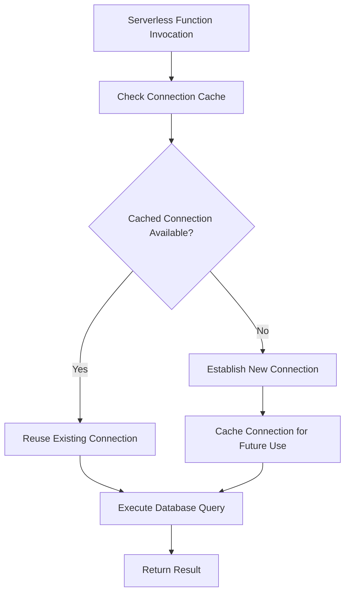
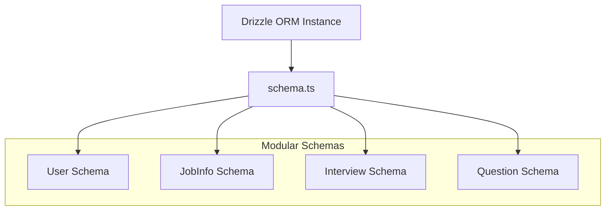
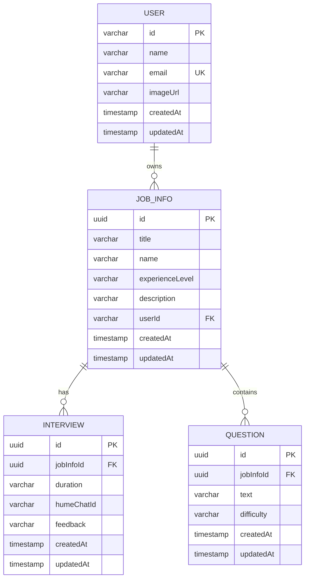
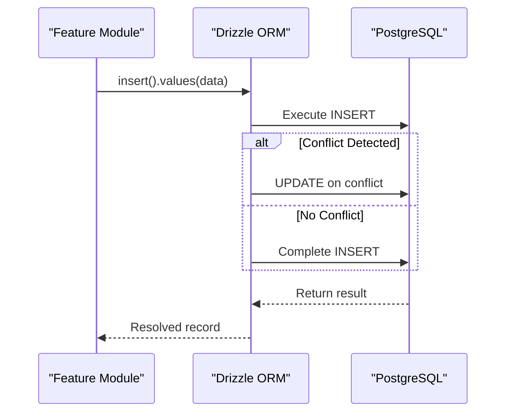
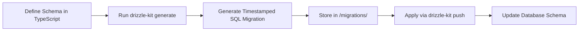
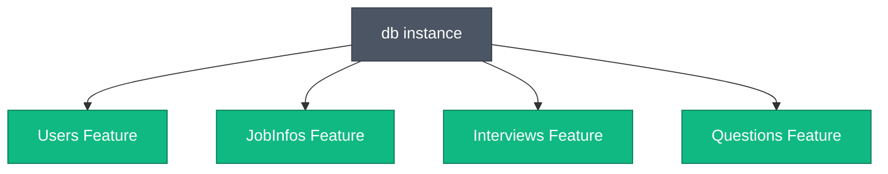

# Data Access Layer

<cite>
**Referenced Files in This Document**
- [db.ts](file://src/drizzle/db.ts)
- [schema.ts](file://src/drizzle/schema.ts)
- [user.ts](file://src/drizzle/schema/user.ts)
- [jobinfo.ts](file://src/drizzle/schema/jobinfo.ts)
- [interview.ts](file://src/drizzle/schema/interview.ts)
- [question.ts](file://src/drizzle/schema/question.ts)
- [drizzle.config.ts](file://drizzle.config.ts)
- [users/db.ts](file://src/features/users/db.ts)
- [jobInfos/db.ts](file://src/features/jobInfos/db.ts)
- [interviews/db.ts](file://src/features/interviews/db.ts)
- [questions/db.ts](file://src/features/questions/db.ts)
</cite>

## Table of Contents
1. [Introduction](#introduction)
2. [Database Connection Management](#database-connection-management)
3. [Schema Organization and Structure](#schema-organization-and-structure)
4. [Data Model Definitions](#data-model-definitions)
5. [Query Patterns and Data Operations](#query-patterns-and-data-operations)
6. [Migration Strategy](#migration-strategy)
7. [Integration with Feature Modules](#integration-with-feature-modules)
8. [Conclusion](#conclusion)

## Introduction
This document provides comprehensive architectural documentation for the data access layer of the application, which is built on Drizzle ORM and Neon PostgreSQL. It details how database connections are managed efficiently in a serverless environment, explains the modular schema organization, describes common query patterns, outlines the migration strategy, and demonstrates how feature modules integrate with the data layer while maintaining type safety through TypeScript inference.

## Database Connection Management
The data access layer establishes a persistent and performant connection to the Neon PostgreSQL database using the `neon-http` driver optimized for Vercel serverless functions. Connection reuse is enabled via connection caching to minimize latency across function invocations.

**Diagram sources**
- [db.ts](file://src/drizzle/db.ts#L1-L11)

**Section sources**
- [db.ts](file://src/drizzle/db.ts#L1-L11)

## Schema Organization and Structure
The database schema is organized into multiple dedicated files based on domain entities: user, jobinfo, interview, and question. These individual schema definitions are consolidated into a unified export via `schema.ts`, enabling centralized management while preserving modularity.

**Diagram sources**
- [schema.ts](file://src/drizzle/schema.ts#L1-L5)
- [user.ts](file://src/drizzle/schema/user.ts#L1-L18)
- [jobinfo.ts](file://src/drizzle/schema/jobinfo.ts#L1-L36)
- [interview.ts](file://src/drizzle/schema/interview.ts#L1-L23)
- [question.ts](file://src/drizzle/schema/question.ts#L1-L29)

**Section sources**
- [schema.ts](file://src/drizzle/schema.ts#L1-L5)

## Data Model Definitions
The application defines four primary data models that represent core business entities and their relationships. Each model uses shared helpers for consistent field definitions such as timestamps and identifiers.

### User Model
Represents application users with essential profile information and authentication metadata.

**Section sources**
- [user.ts](file://src/drizzle/schema/user.ts#L5-L12)

### JobInfo Model
Captures job position details including title, experience level, and description, linked to a specific user.

**Section sources**
- [jobinfo.ts](file://src/drizzle/schema/jobinfo.ts#L14-L25)

### Interview Model
Stores interview session data associated with a job info entry, including duration and feedback.

**Section sources**
- [interview.ts](file://src/drizzle/schema/interview.ts#L5-L15)

### Question Model
Holds practice questions tied to job infos, categorized by difficulty levels (easy, medium, hard).

**Section sources**
- [question.ts](file://src/drizzle/schema/question.ts#L12-L21)

#### Entity Relationship Diagram

**Diagram sources**
- [user.ts](file://src/drizzle/schema/user.ts#L5-L12)
- [jobinfo.ts](file://src/drizzle/schema/jobinfo.ts#L14-L25)
- [interview.ts](file://src/drizzle/schema/interview.ts#L5-L15)
- [question.ts](file://src/drizzle/schema/question.ts#L12-L21)

## Query Patterns and Data Operations
The data access layer implements consistent patterns for database operations across all feature modules, emphasizing transaction safety, selective projections, and cache coordination.

### Insertion with Conflict Handling
Records are inserted using upsert patterns that safely handle conflicts, particularly important for user data synchronization.

**Diagram sources**
- [users/db.ts](file://src/features/users/db.ts#L6-L14)
- [jobInfos/db.ts](file://src/features/jobInfos/db.ts#L8-L17)

### Selective Field Projections
Queries use explicit column selection to optimize performance and reduce payload size, especially when returning identifiers for cache invalidation.

**Section sources**
- [jobInfos/db.ts](file://src/features/jobInfos/db.ts#L10-L11)
- [interviews/db.ts](file://src/features/interviews/db.ts#L10-L11)
- [questions/db.ts](file://src/features/questions/db.ts#L10-L12)

## Migration Strategy
The application uses Drizzle Kit for database schema migrations, generating timestamped SQL files that are version-controlled alongside the codebase. A snapshot-based approach ensures schema consistency across environments.

**Diagram sources**
- [drizzle.config.ts](file://drizzle.config.ts#L1-L15)

**Section sources**
- [drizzle.config.ts](file://drizzle.config.ts#L1-L15)

## Integration with Feature Modules
Feature modules import the centralized `db` instance to perform type-safe database operations. TypeScript inference ensures compile-time validation of queries against the defined schema, reducing runtime errors.

**Diagram sources**
- [db.ts](file://src/drizzle/db.ts#L9-L9)
- [users/db.ts](file://src/features/users/db.ts#L1-L2)
- [jobInfos/db.ts](file://src/features/jobInfos/db.ts#L1-L2)
- [interviews/db.ts](file://src/features/interviews/db.ts#L1-L2)
- [questions/db.ts](file://src/features/questions/db.ts#L1-L2)

**Section sources**
- [users/db.ts](file://src/features/users/db.ts#L1-L22)
- [jobInfos/db.ts](file://src/features/jobInfos/db.ts#L1-L54)
- [interviews/db.ts](file://src/features/interviews/db.ts#L1-L31)
- [questions/db.ts](file://src/features/questions/db.ts#L1-L21)

## Conclusion
The data access layer effectively leverages Drizzle ORM and Neon PostgreSQL to provide a robust, type-safe, and performant foundation for the application. By implementing connection caching, modular schema design, standardized query patterns, and automated migrations, it supports scalable development in a serverless environment while maintaining data integrity and developer productivity.