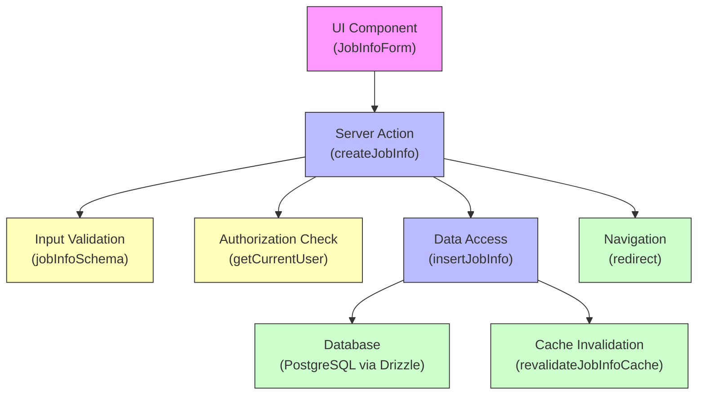
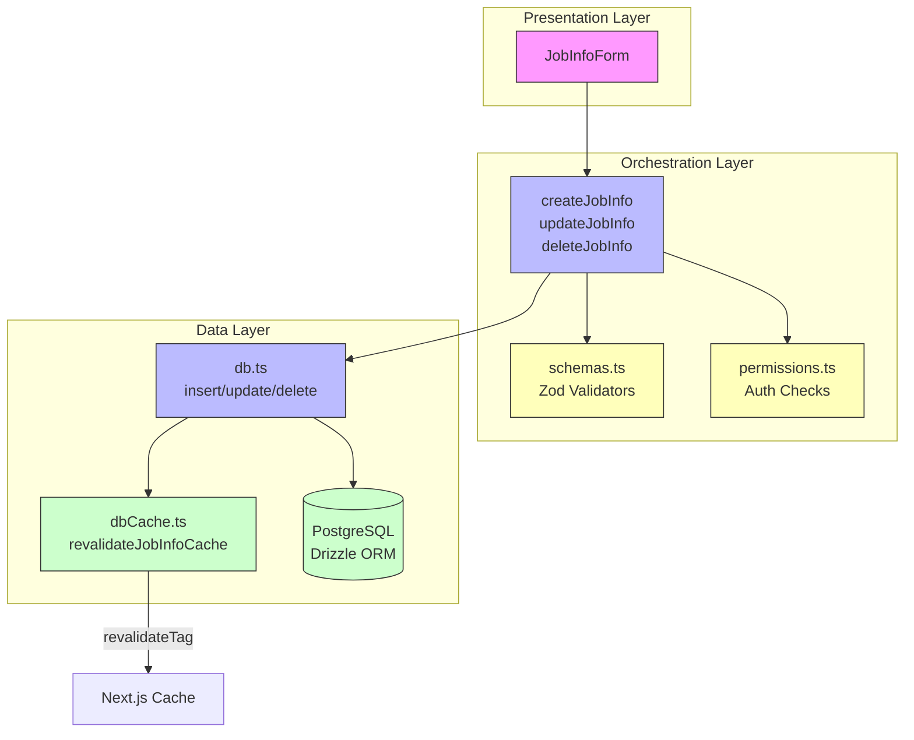
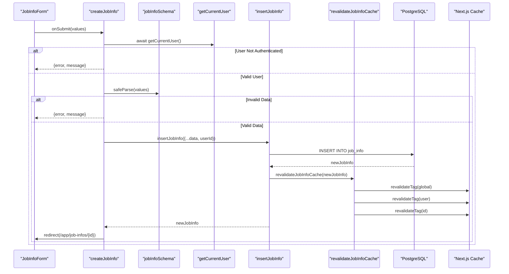
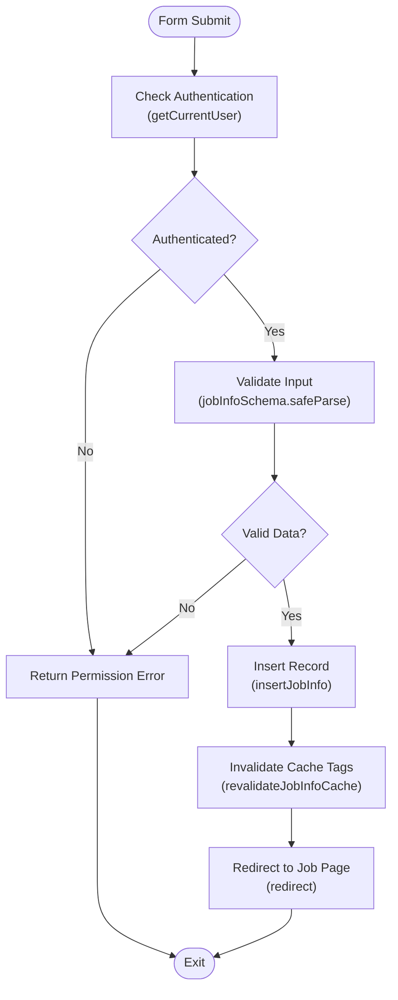

# Feature Domain Logic Layer

<cite>
**Referenced Files in This Document**   
- [src/features/jobInfos/actions.ts](file://src/features/jobInfos/actions.ts)
- [src/features/jobInfos/db.ts](file://src/features/jobInfos/db.ts)
- [src/features/jobInfos/schemas.ts](file://src/features/jobInfos/schemas.ts)
- [src/features/jobInfos/dbCache.ts](file://src/features/jobInfos/dbCache.ts)
- [src/features/jobInfos/components/JobInfoForm.tsx](file://src/features/jobInfos/components/JobInfoForm.tsx)
- [src/drizzle/schema/jobinfo.ts](file://src/drizzle/schema/jobinfo.ts)
- [src/drizzle/db.ts](file://src/drizzle/db.ts)
</cite>

## Table of Contents
1. [Introduction](#introduction)
2. [Project Structure](#project-structure)
3. [Core Components](#core-components)
4. [Architecture Overview](#architecture-overview)
5. [Detailed Component Analysis](#detailed-component-analysis)
6. [Dependency Analysis](#dependency-analysis)
7. [Performance Considerations](#performance-considerations)
8. [Troubleshooting Guide](#troubleshooting-guide)
9. [Conclusion](#conclusion)

## Introduction
The feature domain logic layer located in `src/features` encapsulates the core business rules, workflows, and use-case orchestrations for key application functionalities such as job information management, interview lifecycle handling, and AI-powered question generation. This documentation details how this layer enforces separation of concerns, promotes testability, and coordinates interactions between UI components, server actions, data accessors, and external services.

**Section sources**
- [src/features/jobInfos/actions.ts](file://src/features/jobInfos/actions.ts#L1-L5)
- [src/features/jobInfos/db.ts](file://src/features/jobInfos/db.ts#L1-L5)

## Project Structure
The `src/features` directory organizes functionality by domain, with each subdirectory (e.g., `jobInfos`, `interviews`, `questions`) representing a distinct business capability. Within each feature folder, modular files handle specific responsibilities:
- `actions.ts`: Server Actions invoked directly from UI components
- `db.ts`: Data access functions abstracting database operations
- `schemas.ts`: Zod validators defining input contracts
- `permissions.ts`: Authorization checks ensuring secure access
- `dbCache.ts`: Cache invalidation utilities maintaining data consistency

This structure enables independent development, testing, and maintenance of each feature while promoting code reuse and clarity.



**Diagram sources**
- [src/features/jobInfos/components/JobInfoForm.tsx](file://src/features/jobInfos/components/JobInfoForm.tsx#L33-L164)
- [src/features/jobInfos/actions.ts](file://src/features/jobInfos/actions.ts#L17-L37)
- [src/features/jobInfos/schemas.ts](file://src/features/jobInfos/schemas.ts#L3-L8)
- [src/features/jobInfos/db.ts](file://src/features/jobInfos/db.ts#L10-L19)
- [src/features/jobInfos/dbCache.ts](file://src/features/jobInfos/dbCache.ts#L15-L25)

**Section sources**
- [src/features/jobInfos](file://src/features/jobInfos)
- [src/features/interviews](file://src/features/interviews)
- [src/features/questions](file://src/features/questions)

## Core Components
The job information management feature exemplifies the design principles of the domain logic layer. It orchestrates form submission, validation, authorization, persistence, and navigation through a well-defined chain of modular functions. The system ensures that all operations are performed securely and efficiently, leveraging Next.js server actions and caching mechanisms.

**Section sources**
- [src/features/jobInfos/actions.ts](file://src/features/jobInfos/actions.ts#L17-L37)
- [src/features/jobInfos/db.ts](file://src/features/jobInfos/db.ts#L10-L19)
- [src/features/jobInfos/schemas.ts](file://src/features/jobInfos/schemas.ts#L3-L8)

## Architecture Overview
The architecture follows a clean separation between presentation, orchestration, and data layers. Server Actions serve as entry points from the UI, coordinating calls to validation schemas, permission checks, and database accessors. Each operation maintains referential integrity and cache consistency through atomic updates and tag-based revalidation.



**Diagram sources**
- [src/features/jobInfos/actions.ts](file://src/features/jobInfos/actions.ts#L17-L37)
- [src/features/jobInfos/schemas.ts](file://src/features/jobInfos/schemas.ts#L3-L8)
- [src/features/jobInfos/db.ts](file://src/features/jobInfos/db.ts#L10-L19)
- [src/features/jobInfos/dbCache.ts](file://src/features/jobInfos/dbCache.ts#L15-L25)

## Detailed Component Analysis

### Job Information Management Analysis
The job information feature demonstrates a complete workflow from user input to persistent storage and cache synchronization. When a user submits the job information form, the `JobInfoForm` component invokes the `createJobInfo` server action, which orchestrates the entire process.

#### For API/Service Components:


**Diagram sources**
- [src/features/jobInfos/components/JobInfoForm.tsx](file://src/features/jobInfos/components/JobInfoForm.tsx#L33-L164)
- [src/features/jobInfos/actions.ts](file://src/features/jobInfos/actions.ts#L17-L37)
- [src/features/jobInfos/schemas.ts](file://src/features/jobInfos/schemas.ts#L3-L8)
- [src/features/jobInfos/db.ts](file://src/features/jobInfos/db.ts#L10-L19)
- [src/features/jobInfos/dbCache.ts](file://src/features/jobInfos/dbCache.ts#L15-L25)

#### For Complex Logic Components:


**Diagram sources**
- [src/features/jobInfos/actions.ts](file://src/features/jobInfos/actions.ts#L17-L37)
- [src/features/jobInfos/db.ts](file://src/features/jobInfos/db.ts#L10-L19)
- [src/features/jobInfos/dbCache.ts](file://src/features/jobInfos/dbCache.ts#L15-L25)

**Section sources**
- [src/features/jobInfos/actions.ts](file://src/features/jobInfos/actions.ts#L17-L37)
- [src/features/jobInfos/db.ts](file://src/features/jobInfos/db.ts#L10-L19)
- [src/features/jobInfos/dbCache.ts](file://src/features/jobInfos/dbCache.ts#L1-L25)
- [src/features/jobInfos/schemas.ts](file://src/features/jobInfos/schemas.ts#L3-L8)

## Dependency Analysis
The feature domain logic layer maintains clear dependency boundaries. Higher-level modules depend on lower-level abstractions without circular references. Server actions import schema validators and database accessors, while database modules depend on the shared Drizzle ORM instance and cache utilities. This unidirectional flow enhances maintainability and testability.

```mermaid
graph LR
A[actions.ts] --> B[schemas.ts]
A --> C[db.ts]
A --> D[getCurrentUser]
C --> E[db.ts (drizzle)]
C --> F[dbCache.ts]
F --> G[next/cache]
A --> H[next/navigation]
style A fill:#bbf,stroke:#333
style B fill:#ffb,stroke:#333
style C fill:#bbf,stroke:#333
style D fill:#ffb,stroke:#333
style E fill:#cfc,stroke:#333
style F fill:#cfc,stroke:#333
style G fill:#cfc,stroke:#333
style H fill:#cfc,stroke:#333
```

**Diagram sources**
- [src/features/jobInfos/actions.ts](file://src/features/jobInfos/actions.ts#L1-L121)
- [src/features/jobInfos/db.ts](file://src/features/jobInfos/db.ts#L1-L54)
- [src/features/jobInfos/dbCache.ts](file://src/features/jobInfos/dbCache.ts#L1-L25)

**Section sources**
- [src/features/jobInfos/actions.ts](file://src/features/jobInfos/actions.ts#L1-L121)
- [src/features/jobInfos/db.ts](file://src/features/jobInfos/db.ts#L1-L54)
- [src/features/jobInfos/dbCache.ts](file://src/features/jobInfos/dbCache.ts#L1-L25)
- [src/drizzle/db.ts](file://src/drizzle/db.ts#L1-L10)

## Performance Considerations
The implementation leverages Next.js caching strategies to minimize database load and improve response times. Cache tags are used strategically at global, user, and individual record levels, allowing precise revalidation after mutations. The use of server actions reduces client-side JavaScript payload while maintaining interactivity.

**Section sources**
- [src/features/jobInfos/dbCache.ts](file://src/features/jobInfos/dbCache.ts#L15-L25)
- [src/lib/dataCache.ts](file://src/lib/dataCache.ts)

## Troubleshooting Guide
Common issues in the feature domain logic layer typically involve authentication state mismatches, schema validation failures, or cache invalidation gaps. Developers should verify that:
-