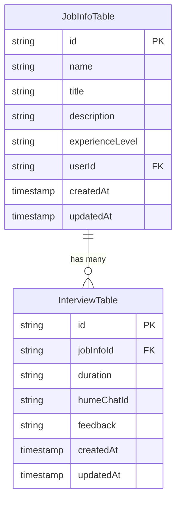
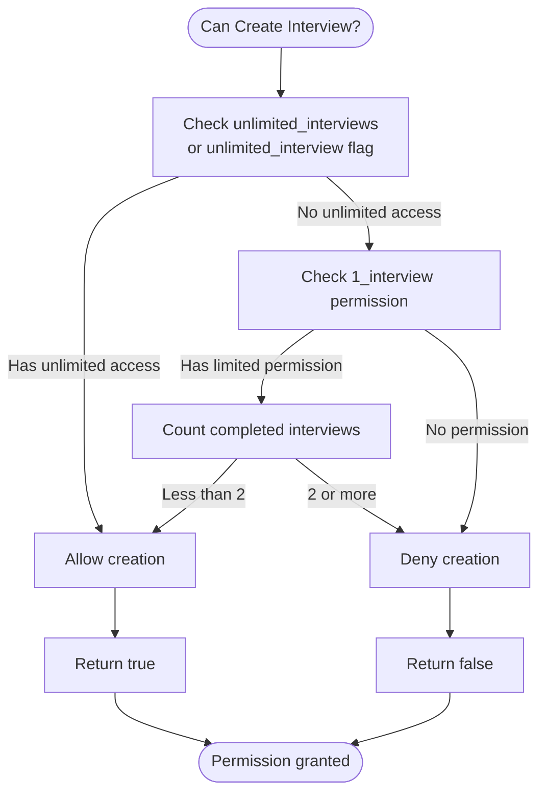
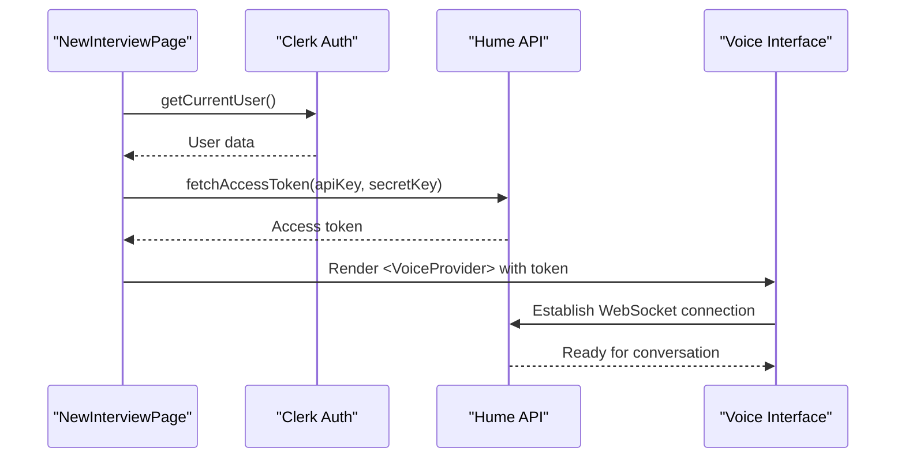
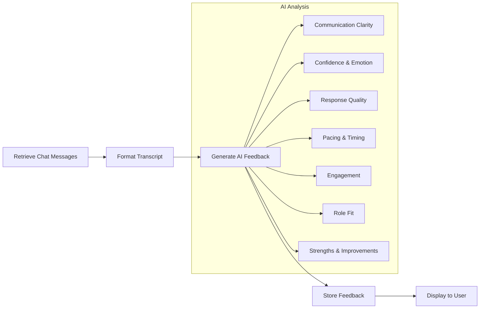

# Interview Management

<cite>
**Referenced Files in This Document**  
- [interview.ts](file://src/drizzle/schema/interview.ts)
- [jobinfo.ts](file://src/drizzle/schema/jobinfo.ts)
- [actions.ts](file://src/features/interviews/actions.ts)
- [permissions.ts](file://src/features/interviews/permissions.ts)
- [api.ts](file://src/services/hume/lib/api.ts)
- [interviews.ts](file://src/services/ai/interviews.ts)
- [db.ts](file://src/features/interviews/db.ts)
- [new/page.tsx](file://src/app/app/job-infos/[jobInfoId]/interviews/new/page.tsx)
- [page.tsx](file://src/app/app/job-infos/[jobInfoId]/interviews/[interviewId]/page.tsx)
</cite>

## Table of Contents
1. [Introduction](#introduction)
2. [Data Model and Schema Relationships](#data-model-and-schema-relationships)
3. [Interview Lifecycle Orchestration](#interview-lifecycle-orchestration)
4. [Permission Enforcement System](#permission-enforcement-system)
5. [Hume AI Voice Session Integration](#hume-ai-voice-session-integration)
6. [Feedback Generation Pipeline](#feedback-generation-pipeline)
7. [Configuration and Rate Limiting](#configuration-and-rate-limiting)
8. [Common Issues and Troubleshooting](#common-issues-and-troubleshooting)

## Introduction

The Interview Management system provides a comprehensive solution for conducting, tracking, and analyzing job interviews within the application. It orchestrates the complete interview lifecycle from initiation to feedback generation, leveraging Drizzle ORM for data persistence and Hume AI for voice session management. The system is designed with strict permission controls, rate limiting, and seamless integration between frontend components and server actions.

**Section sources**
- [actions.ts](file://src/features/interviews/actions.ts#L1-L178)
- [interview.ts](file://src/drizzle/schema/interview.ts#L1-L22)

## Data Model and Schema Relationships

The interview system is built around two core database models: `InterviewTable` and `JobInfoTable`. These models are defined using Drizzle ORM and establish a parent-child relationship where interviews belong to specific job information records.

The `InterviewTable` contains essential fields including:
- `id`: Unique identifier for the interview
- `jobInfoId`: Foreign key referencing the associated job information
- `duration`: String representation of interview duration
- `humeChatId`: Reference to the Hume AI chat session
- `feedback`: Generated AI feedback content
- Timestamps for creation and updates



**Diagram sources**
- [interview.ts](file://src/drizzle/schema/interview.ts#L5-L15)
- [jobinfo.ts](file://src/drizzle/schema/jobinfo.ts#L14-L25)

The foreign key constraint on `jobInfoId` enforces referential integrity with cascade delete behavior, ensuring that when a job information record is deleted, all associated interviews are automatically removed. The schema also defines relations using Drizzle's relations API, enabling efficient querying of related data.

**Section sources**
- [interview.ts](file://src/drizzle/schema/interview.ts#L1-L22)
- [jobinfo.ts](file://src/drizzle/schema/jobinfo.ts#L1-L35)

## Interview Lifecycle Orchestration

The interview lifecycle is managed through server actions that handle creation, updating, and state transitions. The process begins with interview initiation and progresses through execution to completion and feedback generation.

### Interview Creation

Interviews are created through the `createInterview` server action, which performs several validation steps before persisting the record:

```mermaid
sequenceDiagram
participant Client as "Frontend"
participant Actions as "Server Actions"
participant Permissions as "Permissions System"
participant DB as "Database"
participant Arcjet as "Rate Limiter"
Client->>Actions : createInterview(jobInfoId)
Actions->>Permissions : canCreateInterview()
Permissions-->>Actions : Permission status
alt Permission denied
Actions-->>Client : {error : true, message : PLAN_LIMIT_MESSAGE}
stop
end
Actions->>Arcjet : Check rate limit
Arcjet-->>Actions : Decision
alt Rate limited
Actions-->>Client : {error : true, message : RATE_LIMIT_MESSAGE}
stop
end
Actions->>DB : getJobInfo(jobInfoId, userId)
DB-->>Actions : JobInfo or null
alt No access
Actions-->>Client : {error : true, message : "No permission"}
stop
end
Actions->>DB : insertInterview({jobInfoId, duration : "00 : 00 : 00"})
DB-->>Actions : New interview ID
Actions-->>Client : {error : false, id : interviewId}
```

**Diagram sources**
- [actions.ts](file://src/features/interviews/actions.ts#L29-L72)
- [db.ts](file://src/features/interviews/db.ts#L1-L17)

The initial duration is set to "00:00:00" and updated during the interview session. The action validates user permissions, checks rate limits using Arcjet, verifies ownership of the associated job information, and creates the interview record.

### Interview Updates

During and after the interview, the `updateInterview` action allows modification of key fields such as `humeChatId` and `duration`. This action enforces permission checks by verifying that the authenticated user owns the parent `JobInfo` record through the foreign key relationship.

**Section sources**
- [actions.ts](file://src/features/interviews/actions.ts#L74-L100)
- [db.ts](file://src/features/interviews/db.ts#L18-L31)

## Permission Enforcement System

The system implements a multi-layered permission model that combines feature-based access control with data ownership verification.

### Plan-Based Permissions

The `canCreateInterview` function determines whether a user can initiate new interviews based on their subscription plan:



**Diagram sources**
- [permissions.ts](file://src/features/interviews/permissions.ts#L8-L47)

The system first checks for unlimited interview permissions, falling back to a limited allowance of two interviews for users with basic plans. The count only includes completed interviews (those with a `humeChatId`), preventing users from circumventing limits by creating multiple incomplete sessions.

### Data Access Control

All interview-related operations enforce data ownership by joining with the `JobInfoTable` and verifying that the current user matches the `userId` field. This ensures users can only access interviews associated with job information they own.

**Section sources**
- [permissions.ts](file://src/features/interviews/permissions.ts#L8-L47)
- [actions.ts](file://src/features/interviews/actions.ts#L144-L178)

## Hume AI Voice Session Integration

The system integrates with Hume AI to provide real-time voice conversation capabilities for mock interviews.

### Session Initialization

When starting a new interview, the frontend component `_StartCall` receives an access token generated from Hume API credentials stored in environment variables. The `VoiceProvider` component from Hume's React library establishes the connection to the voice API.



**Diagram sources**
- [new/page.tsx](file://src/app/app/job-infos/[jobInfoId]/interviews/new/page.tsx#L45-L64)
- [api.ts](file://src/services/hume/lib/api.ts#L7-L20)

### Message Retrieval

After the interview concludes, the system retrieves the complete conversation history using the `fetchChatMessages` function, which paginates through all events in the Hume chat session. This data is then processed for feedback generation.

**Section sources**
- [api.ts](file://src/services/hume/lib/api.ts#L7-L20)
- [page.tsx](file://src/app/app/job-infos/[jobInfoId]/interviews/[interviewId]/page.tsx#L120-L154)

## Feedback Generation Pipeline

The AI-powered feedback system analyzes interview transcripts and generates structured performance evaluations.

### Processing Workflow



**Diagram sources**
- [interviews.ts](file://src/services/ai/interviews.ts#L1-L113)
- [actions.ts](file://src/features/interviews/actions.ts#L102-L142)

### Feedback Generation Process

The `generateAiInterviewFeedback` function orchestrates the analysis by:
1. Fetching the complete chat transcript from Hume AI
2. Formatting messages with speaker roles and emotional features
3. Submitting the structured data to Google's Gemini model via the AI SDK
4. Applying a detailed system prompt that guides the evaluation across seven categories
5. Storing the generated feedback in the interview record

The system prompt provides comprehensive instructions for evaluating communication clarity, confidence, response quality, pacing, engagement, role fit, and overall performance, ensuring consistent and actionable feedback.

**Section sources**
- [interviews.ts](file://src/services/ai/interviews.ts#L1-L113)
- [actions.ts](file://src/features/interviews/actions.ts#L102-L142)

## Configuration and Rate Limiting

The interview system incorporates several configuration mechanisms to manage usage and prevent abuse.

### Environment Configuration

Key services are configured through environment variables:
- `HUME_API_KEY` and `HUME_SECRET_KEY` for Hume AI authentication
- `ARCJET_KEY` for rate limiting service
- Feature flags for plan-based permissions

### Rate Limiting Strategy

The system uses Arcjet with a token bucket algorithm configured as:
- Capacity: 12 tokens
- Refill rate: 4 tokens per day
- Interval: 1 day
- Mode: LIVE (enforces limits in production)

This configuration allows users to conduct multiple interviews while preventing excessive usage. The rate limiter considers the user ID as a characteristic, ensuring limits are applied per user.

**Section sources**
- [actions.ts](file://src/features/interviews/actions.ts#L15-L27)
- [env/server.ts](file://src/data/env/server.ts)

## Common Issues and Troubleshooting

### Session Timeouts

Issue: Interviews may fail to start due to expired Hume access tokens.

Solution: The system automatically refreshes tokens on each interview initiation. Ensure Hume API credentials are valid and have appropriate permissions.

### Failed API Integrations

Issue: Hume AI or Google AI services return errors during interview processing.

Symptoms:
- Unable to start interviews
- Feedback generation fails
- Empty or partial transcripts

Troubleshooting steps:
1. Verify API keys in environment variables are correct
2. Check service status for Hume AI and Google Cloud
3. Validate network connectivity from the server environment
4. Review error logs for specific failure messages

### Permission Errors

Common causes:
- User lacks required feature permissions
- Attempting to access interviews for unowned job information
- Rate limit exceeded

Resolution:
- Upgrade subscription plan if on free tier
- Verify correct job information is selected
- Wait for rate limit reset period

**Section sources**
- [actions.ts](file://src/features/interviews/actions.ts#L1-L178)
- [permissions.ts](file://src/features/interviews/permissions.ts#L1-L47)