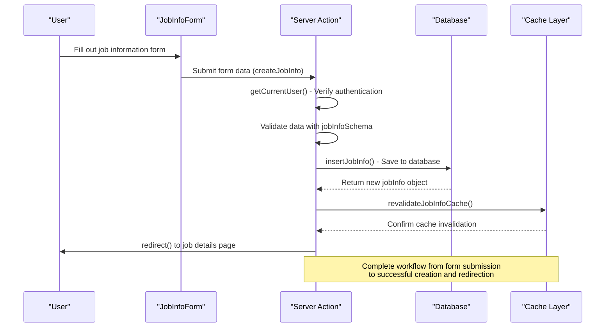
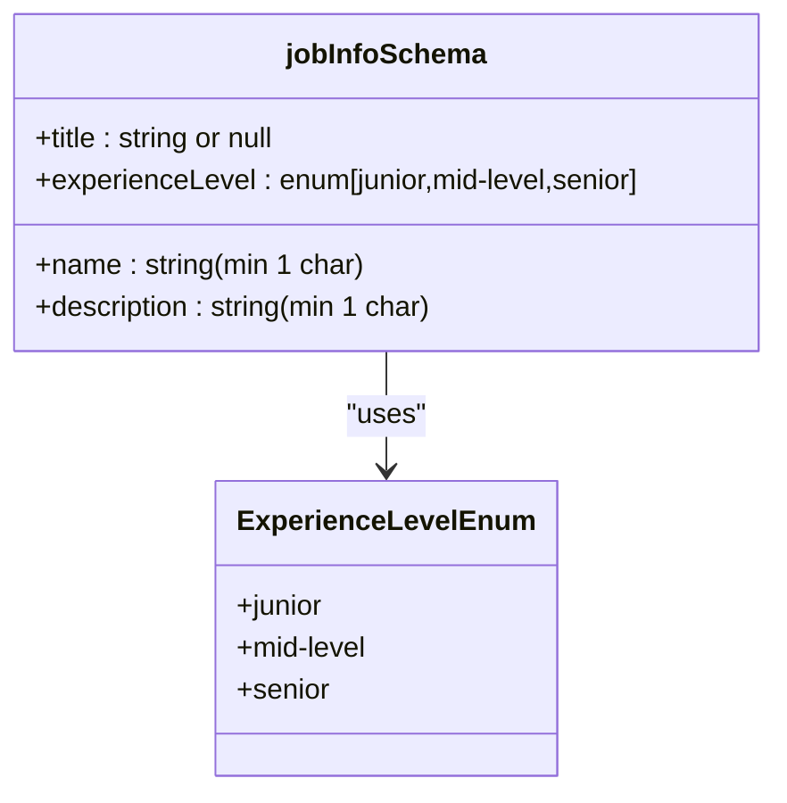
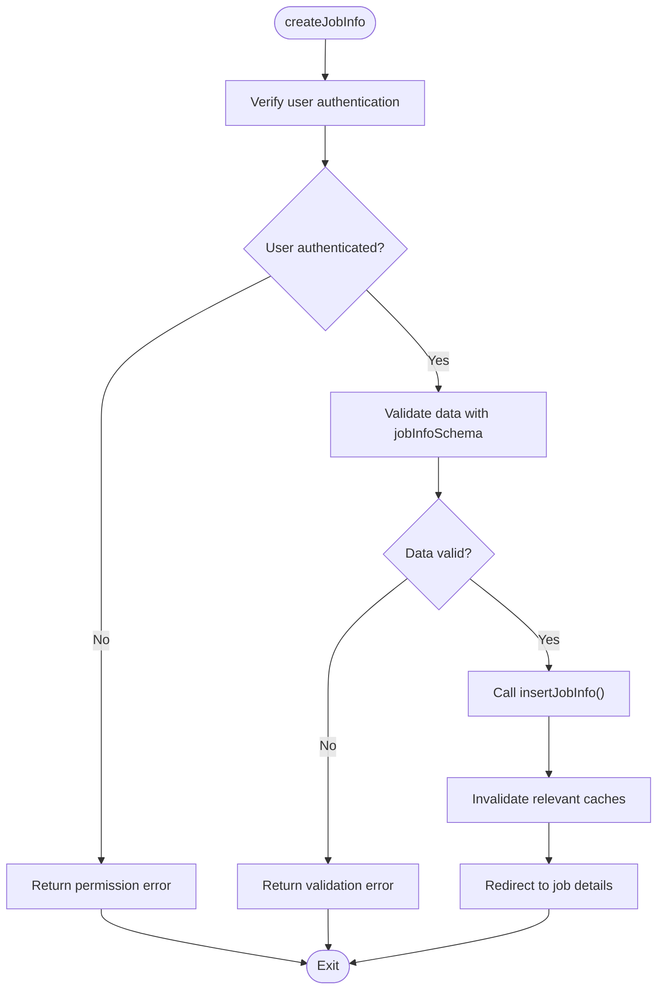

# Job Information Management

<cite>
**Referenced Files in This Document**  
- [actions.ts](file://src/features/jobInfos/actions.ts)
- [db.ts](file://src/features/jobInfos/db.ts)
- [schemas.ts](file://src/features/jobInfos/schemas.ts)
- [JobInfoForm.tsx](file://src/features/jobInfos/components/JobInfoForm.tsx)
- [getCurrentUser.ts](file://src/services/clerk/lib/getCurrentUser.ts)
- [jobinfo.ts](file://src/drizzle/schema/jobinfo.ts)
- [dbCache.ts](file://src/features/jobInfos/dbCache.ts)
</cite>

## Table of Contents
1. [Introduction](#introduction)
2. [Core Components](#core-components)
3. [Workflow Overview](#workflow-overview)
4. [Data Validation with Zod](#data-validation-with-zod)
5. [Server Actions Implementation](#server-actions-implementation)
6. [Database Operations](#database-operations)
7. [Cache Invalidation Strategy](#cache-invalidation-strategy)
8. [Error Handling and Security](#error-handling-and-security)
9. [Extending the Schema](#extending-the-schema)
10. [Troubleshooting Guide](#troubleshooting-guide)

## Introduction

The Job Information Management feature enables users to create, update, and manage job postings within the application. This module follows a structured workflow from UI form submission through server-side processing, database persistence, and cache management. The system ensures data integrity through schema validation, enforces user permissions via authentication checks, and maintains performance through strategic cache invalidation.

**Section sources**
- [actions.ts](file://src/features/jobInfos/actions.ts#L1-L121)
- [JobInfoForm.tsx](file://src/features/jobInfos/components/JobInfoForm.tsx#L1-L165)

## Core Components

The Job Information Management system consists of several key components working together:
- **JobInfoForm**: Client-side React component for collecting job information
- **createJobInfo/updateJobInfo**: Server Actions handling form submission
- **jobInfoSchema**: Zod schema defining valid job data structure
- **insertJobInfo/updateJobInfo**: Database operations layer
- **revalidateJobInfoCache**: Cache management utility
- **getCurrentUser**: Authentication and permission verification

These components follow a clear separation of concerns, with the client handling presentation, server actions managing business logic, and database functions handling persistence.

**Section sources**
- [actions.ts](file://src/features/jobInfos/actions.ts#L1-L121)
- [db.ts](file://src/features/jobInfos/db.ts#L1-L54)
- [schemas.ts](file://src/features/jobInfos/schemas.ts#L1-L8)
- [JobInfoForm.tsx](file://src/features/jobInfos/components/JobInfoForm.tsx#L1-L165)
- [getCurrentUser.ts](file://src/services/clerk/lib/getCurrentUser.ts#L1-L24)

## Workflow Overview



**Diagram sources**
- [JobInfoForm.tsx](file://src/features/jobInfos/components/JobInfoForm.tsx#L33-L164)
- [actions.ts](file://src/features/jobInfos/actions.ts#L17-L37)
- [db.ts](file://src/features/jobInfos/db.ts#L10-L19)
- [dbCache.ts](file://src/features/jobInfos/dbCache.ts#L15-L25)

## Data Validation with Zod

The system uses Zod schema validation to ensure data integrity before processing. The `jobInfoSchema` defines the required structure and constraints for job information:



The schema requires:
- Name: Non-empty string (required)
- Title: String or null (optional)
- Experience Level: One of three predefined values
- Description: Non-empty string (required)

Validation occurs on both client and server sides, providing immediate feedback to users while ensuring server-side data integrity.

**Section sources**
- [schemas.ts](file://src/features/jobInfos/schemas.ts#L3-L8)
- [jobinfo.ts](file://src/drizzle/schema/jobinfo.ts#L1-L35)
- [JobInfoForm.tsx](file://src/features/jobInfos/components/JobInfoForm.tsx#L33-L164)

## Server Actions Implementation

The server actions (`createJobInfo` and `updateJobInfo`) serve as the entry point for job information operations. These actions follow a consistent pattern:

1. Authenticate the current user using `getCurrentUser`
2. Validate input data against the `jobInfoSchema`
3. Delegate to appropriate database function
4. Handle redirection upon success

The actions return structured error responses when validation fails or permissions are insufficient, which are then displayed to users through toast notifications.



**Diagram sources**
- [actions.ts](file://src/features/jobInfos/actions.ts#L17-L37)
- [getCurrentUser.ts](file://src/services/clerk/lib/getCurrentUser.ts#L7-L15)

**Section sources**
- [actions.ts](file://src/features/jobInfos/actions.ts#L17-L37)
- [getCurrentUser.ts](file://src/services/clerk/lib/getCurrentUser.ts#L7-L15)

## Database Operations

Database operations are encapsulated in the `db.ts` file, providing a clean interface between server actions and the Drizzle ORM. The operations include:

- `insertJobInfo`: Creates a new job record and returns basic identifier information
- `updateJobInfo`: Modifies existing job records based on ID
- `deleteJobInfo`: Removes job records with cascade behavior

Each database operation automatically triggers cache invalidation through `revalidateJobInfoCache`, ensuring that stale data is not served to subsequent requests.

**Section sources**
- [db.ts](file://src/features/jobInfos/db.ts#L1-L54)
- [actions.ts](file://src/features/jobInfos/actions.ts#L17-L37)

## Cache Invalidation Strategy

The system implements a comprehensive cache invalidation strategy to maintain data consistency across different access patterns:

```mermaid
classDiagram
class dbCache {
+getJobInfoGlobalTag()
+getJobInfoUserTag(userId)
+getJobInfoIdTag(id)
+revalidateJobInfoCache(id, userId)
}
class DataCache {
+getGlobalTag(type)
+getUserTag(type, userId)
+getIdTag(type, id)
}
dbCache --> DataCache : "extends"
class CacheTags {
+jobInfos_global
+jobInfos_user_{userId}
+jobInfos_{id}
}
dbCache --> CacheTags : "generates"
```

When a job is created, updated, or deleted, the system invalidates three cache tags:
- Global job information tag
- User-specific job information tag
- Specific job ID tag

This multi-layered approach ensures that all relevant cached data is refreshed, preventing stale content from being displayed.

**Diagram sources**
- [dbCache.ts](file://src/features/jobInfos/dbCache.ts#L1-L25)
- [dataCache.ts](file://src/lib/dataCache.ts#L1-L20)

**Section sources**
- [dbCache.ts](file://src/features/jobInfos/dbCache.ts#L1-L25)
- [db.ts](file://src/features/jobInfos/db.ts#L10-L19)

## Error Handling and Security

The system implements robust error handling and security measures:

- **Authentication Checks**: Every action verifies the user's authentication status using `getCurrentUser`
- **Authorization Verification**: Operations confirm that users can only modify their own job information
- **Input Validation**: Comprehensive schema validation prevents malformed data from being processed
- **Error Feedback**: Structured error responses provide meaningful feedback to users

Unauthorized access attempts result in consistent error messages without exposing system details, following security best practices.

**Section sources**
- [actions.ts](file://src/features/jobInfos/actions.ts#L17-L37)
- [getCurrentUser.ts](file://src/services/clerk/lib/getCurrentUser.ts#L7-L15)
- [db.ts](file://src/features/jobInfos/db.ts#L1-L54)

## Extending the Schema

To extend the job information schema with new fields:

1. Update the `jobInfoSchema` in `schemas.ts` with the new field and validation rules
2. Add the corresponding column to the `JobInfoTable` schema in `drizzle/schema/jobinfo.ts`
3. Ensure database migrations are generated and applied
4. Update the `JobInfoFormData` type if needed
5. Modify the `JobInfoForm` component to include the new field

When adding optional fields, consider using `.nullable()` or providing default values to maintain backward compatibility with existing data.

**Section sources**
- [schemas.ts](file://src/features/jobInfos/schemas.ts#L3-L8)
- [jobinfo.ts](file://src/drizzle/schema/jobinfo.ts#L1-L35)
- [JobInfoForm.tsx](file://src/features/jobInfos/components/JobInfoForm.tsx#L33-L164)

## Troubleshooting Guide

Common issues and solutions:

- **Invalid Input Handling**: If users encounter "Invalid job data" errors, verify that all required fields are filled and meet validation criteria (non-empty strings, valid experience level)
- **Unauthorized Access**: "You don't have permission to do this" errors typically indicate authentication issues or attempts to access another user's data
- **Form Submission Failures**: Check network connectivity and ensure the server actions are properly configured
- **Cache Issues**: If stale data appears, verify that `revalidateJobInfoCache` is being called correctly after mutations
- **Type Errors**: When extending the schema, ensure type definitions in `JobInfoFormData` remain synchronized with the Zod schema

For debugging, examine the structured error responses returned by server actions and check browser console logs for client-side issues.

**Section sources**
- [actions.ts](file://src/features/jobInfos/actions.ts#L17-L37)
- [JobInfoForm.tsx](file://src/features/jobInfos/components/JobInfoForm.tsx#L33-L164)
- [db.ts](file://src/features/jobInfos/db.ts#L1-L54)