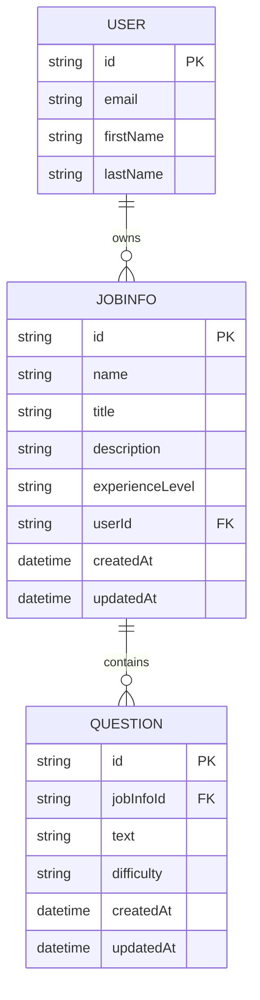
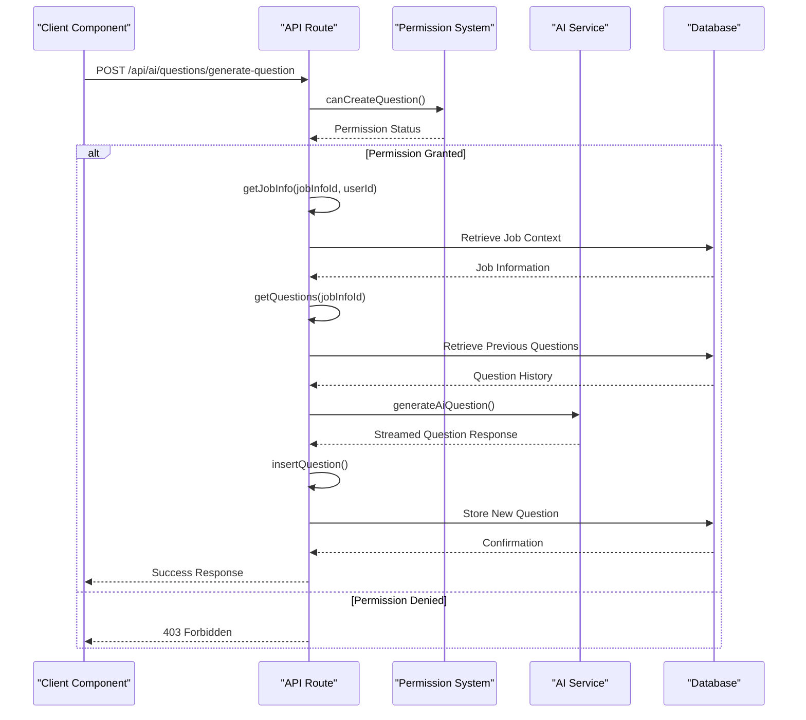
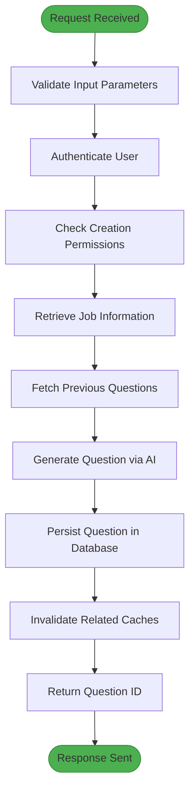
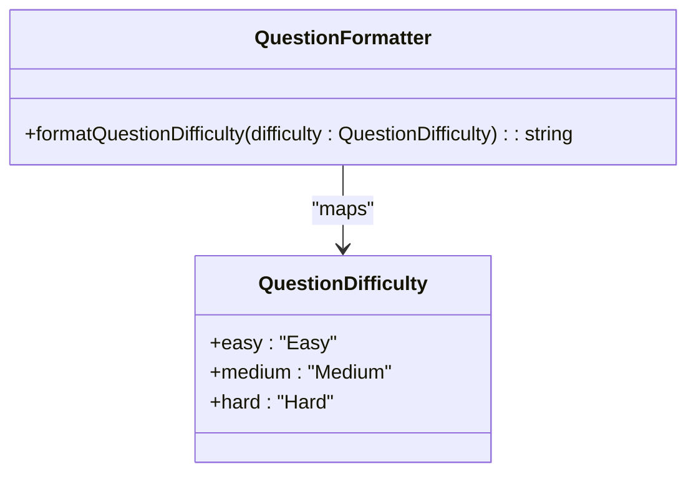

# Question Generation System

<cite>
**Referenced Files in This Document**   
- [generate-question/route.ts](file://src/app/api/ai/questions/generate-question/route.ts)
- [questions.ts](file://src/services/ai/questions.ts)
- [db.ts](file://src/features/questions/db.ts)
- [formatters.ts](file://src/features/questions/formatters.ts)
- [question.ts](file://src/drizzle/schema/question.ts)
- [jobinfo.ts](file://src/drizzle/schema/jobinfo.ts)
</cite>

## Table of Contents
1. [Introduction](#introduction)
2. [Domain Model Relationships](#domain-model-relationships)
3. [Question Generation Workflow](#question-generation-workflow)
4. [AI-Powered Question Creation](#ai-powered-question-creation)
5. [Client-Server Interaction](#client-server-interaction)
6. [Formatting and Display Consistency](#formatting-and-display-consistency)
7. [Data Storage and Retrieval](#data-storage-and-retrieval)
8. [Common Issues and Solutions](#common-issues-and-solutions)
9. [Extensibility and Customization](#extensibility-and-customization)

## Introduction

The Question Generation System is a core feature that enables dynamic creation of technical interview questions tailored to specific job contexts. This system leverages AI augmentation to generate relevant questions based on job descriptions, experience levels, and difficulty requirements. The implementation supports seamless interaction between client components and server-side actions for storing and retrieving questions, ensuring consistency through formatting utilities. This documentation provides comprehensive insight into the system architecture, data relationships, and operational workflows.

## Domain Model Relationships

The system's data model establishes clear relationships between key entities, with the `JobInfo` entity serving as the central context for question generation. Questions are directly linked to specific job information records, creating a hierarchical structure where each question belongs to exactly one job context.

**Diagram sources**
- [jobinfo.ts](file://src/drizzle/schema/jobinfo.ts#L14-L25)
- [question.ts](file://src/drizzle/schema/question.ts#L12-L21)

**Section sources**
- [jobinfo.ts](file://src/drizzle/schema/jobinfo.ts#L1-L35)
- [question.ts](file://src/drizzle/schema/question.ts#L1-L28)

## Question Generation Workflow

The question generation process follows a structured workflow that begins with client requests and concludes with persistent storage of generated content. When a user initiates question generation, the system validates permissions, retrieves relevant job context, and processes the request through an AI service before storing the result.

**Diagram sources**
- [generate-question/route.ts](file://src/app/api/ai/questions/generate-question/route.ts#L1-L89)
- [db.ts](file://src/features/questions/db.ts#L4-L21)

**Section sources**
- [generate-question/route.ts](file://src/app/api/ai/questions/generate-question/route.ts#L1-L89)

## AI-Powered Question Creation

The AI augmentation component uses contextual information from job descriptions and previous questions to generate relevant technical interview questions. The system employs a stateful approach by incorporating historical interactions, allowing the AI to avoid repetition and maintain appropriate difficulty progression.

**Diagram sources**
- [questions.ts](file://src/services/ai/questions.ts#L8-L63)
- [generate-question/route.ts](file://src/app/api/ai/questions/generate-question/route.ts#L1-L89)

**Section sources**
- [questions.ts](file://src/services/ai/questions.ts#L1-L107)

## Client-Server Interaction

The interaction between client components and server actions follows a RESTful pattern with streaming capabilities for real-time feedback. Client components initiate requests to the API endpoint, which processes the generation logic and returns identifiers for newly created questions, enabling immediate UI updates without full page reloads.

**Section sources**
- [generate-question/route.ts](file://src/app/api/ai/questions/generate-question/route.ts#L1-L89)
- [db.ts](file://src/features/questions/db.ts#L4-L21)

## Formatting and Display Consistency

The system maintains display consistency through dedicated formatting utilities that standardize the presentation of question attributes across the application. These utilities ensure uniform rendering of difficulty levels and other metadata, contributing to a cohesive user experience.

**Diagram sources**
- [formatters.ts](file://src/features/questions/formatters.ts#L3-L15)

**Section sources**
- [formatters.ts](file://src/features/questions/formatters.ts#L1-L15)

## Data Storage and Retrieval

The data persistence layer implements efficient storage and retrieval mechanisms for questions, leveraging database relationships and caching strategies to optimize performance. Questions are stored with references to their parent job information records, enabling quick access to contextually relevant content during practice sessions.

**Section sources**
- [question.ts](file://src/drizzle/schema/question.ts#L1-L28)
- [db.ts](file://src/features/questions/db.ts#L4-L21)

## Common Issues and Solutions

### Duplicate Questions
The system may occasionally generate similar questions due to overlapping job contexts or insufficient historical data. This is mitigated by the AI service considering previous questions in its context window, reducing repetition through awareness of already-generated content.

### Formatting Inconsistencies
Display inconsistencies can occur when different components format difficulty levels independently. The centralized `formatQuestionDifficulty` utility resolves this by providing a single source of truth for difficulty label formatting across all UI components.

**Section sources**
- [formatters.ts](file://src/features/questions/formatters.ts#L3-L15)
- [questions.ts](file://src/services/ai/questions.ts#L8-L63)

## Extensibility and Customization

The modular design allows for easy extension of the question generation system. Additional difficulty levels can be incorporated by updating the `questionDifficulties` array and corresponding enum definition. The AI prompt template can be enhanced to support new question types or specialized domains by modifying the system message in the `generateAiQuestion` function.

**Section sources**
- [question.ts](file://src/drizzle/schema/question.ts#L4-L6)
- [questions.ts](file://src/services/ai/questions.ts#L40-L60)