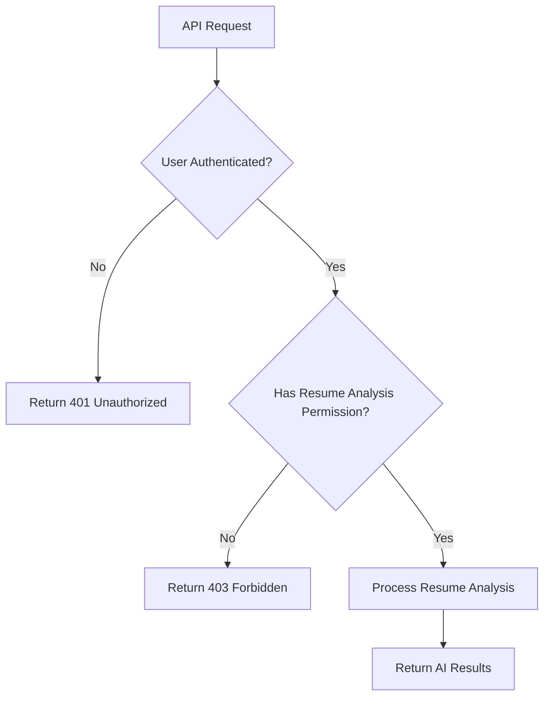
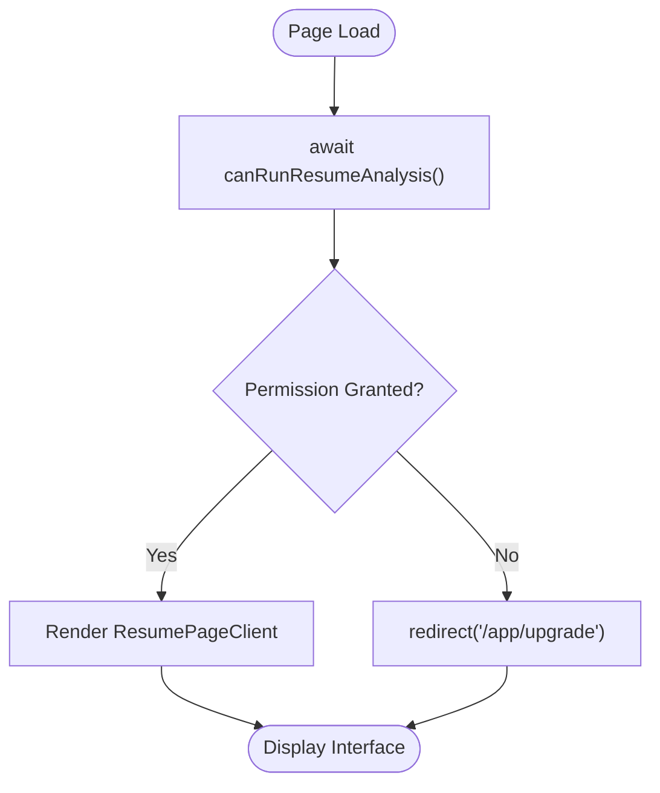
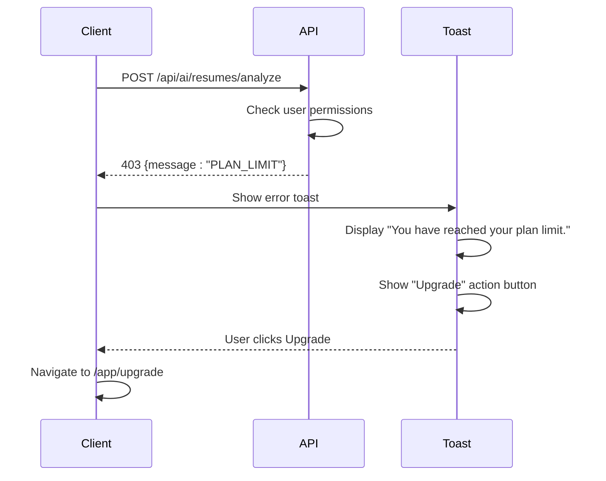
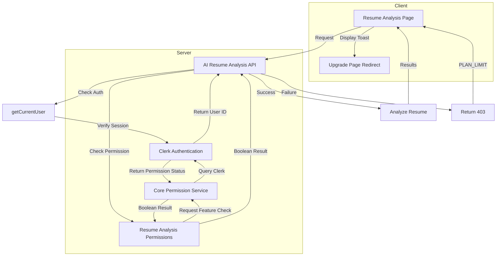

# Resume Analysis Permissions

<cite>
**Referenced Files in This Document**  
- [src/features/resumeAnalysis/permissions.ts](file://src/features/resumeAnalysis/permissions.ts)
- [src/services/clerk/lib/hasPermission.ts](file://src/services/clerk/lib/hasPermission.ts)
- [src/app/api/ai/resumes/analyze/route.ts](file://src/app/api/ai/resumes/analyze/route.ts)
- [src/app/app/job-infos/[jobInfoId]/resume/page.tsx](file://src/app/app/job-infos/[jobInfoId]/resume/page.tsx)
- [src/lib/errorToast.tsx](file://src/lib/errorToast.tsx)
- [src/services/clerk/lib/getCurrentUser.ts](file://src/services/clerk/lib/getCurrentUser.ts)
</cite>

## Table of Contents
1. [Introduction](#introduction)
2. [Core Permission Architecture](#core-permission-architecture)
3. [Implementation Details](#implementation-details)
4. [Client-Side Enforcement](#client-side-enforcement)
5. [Error Handling and User Feedback](#error-handling-and-user-feedback)
6. [Security Considerations](#security-considerations)
7. [Common Issues and Mitigation Strategies](#common-issues-and-mitigation-strategies)
8. [Integration Flow Diagram](#integration-flow-diagram)

## Introduction

The Resume Analysis Permissions sub-component implements a robust authorization system that controls access to AI-powered resume analysis features based on user subscription status and roles. This document details the implementation of permission checks that prevent unauthorized access to premium functionality, ensuring that only users with appropriate subscriptions can utilize the resume analysis service. The system employs both server-side validation and client-side guidance to create a secure and user-friendly experience.

## Core Permission Architecture

The permission system is built around a feature-based authorization model using Clerk's permission framework. It defines specific permission keys that correspond to premium features, with `unlimited_resume_analysis` serving as the gatekeeper for resume analysis capabilities. The architecture follows a layered approach with distinct components handling authentication, permission evaluation, and feature-specific access control.

**Diagram sources**
- [src/app/api/ai/resumes/analyze/route.ts](file://src/app/api/ai/resumes/analyze/route.ts#L15-L68)
- [src/features/resumeAnalysis/permissions.ts](file://src/features/resumeAnalysis/permissions.ts#L3-L4)

## Implementation Details

The permission checking mechanism is implemented through a modular hierarchy of functions that abstract the underlying authentication provider details. At the foundation, the `hasPermission` function in the Clerk service layer interfaces with the authentication provider to evaluate feature flags associated with the user's subscription plan.

The `canRunResumeAnalysis` function serves as the feature-specific permission checker, acting as a wrapper that requests the `unlimited_resume_analysis` permission from the core permission service. This abstraction allows for easy modification of permission requirements without changing the calling code throughout the application.

In the API route handler, permission checks are implemented as guard clauses that perform early returns when authorization fails. This pattern ensures that unauthorized requests are rejected before any resource-intensive processing begins, improving both security and performance.

**Section sources**
- [src/features/resumeAnalysis/permissions.ts](file://src/features/resumeAnalysis/permissions.ts#L1-L5)
- [src/services/clerk/lib/hasPermission.ts](file://src/services/clerk/lib/hasPermission.ts#L11-L14)
- [src/app/api/ai/resumes/analyze/route.ts](file://src/app/api/ai/resumes/analyze/route.ts#L34-L40)

## Client-Side Enforcement

While server-side validation provides the primary security boundary, the system also implements client-side enforcement to improve user experience. In the resume analysis page component, the `canRunResumeAnalysis` function is called during server-side rendering to determine whether to display the analysis interface or redirect the user to the upgrade page.

This preemptive check prevents users from accessing the resume analysis interface when they lack the necessary permissions, guiding them toward upgrading their subscription instead of encountering an error after attempting to use the feature. The use of Next.js `redirect` function ensures that the redirection occurs before any client-side JavaScript execution, maintaining a seamless user experience.

**Diagram sources**
- [src/app/app/job-infos/[jobInfoId]/resume/page.tsx](file://src/app/app/job-infos/[jobInfoId]/resume/page.tsx#L25-L30)

**Section sources**
- [src/app/app/job-infos/[jobInfoId]/resume/page.tsx](file://src/app/app/job-infos/[jobInfoId]/resume/page.tsx#L1-L30)

## Error Handling and User Feedback

The system implements a structured error handling approach that provides meaningful feedback to users while maintaining security boundaries. When permission checks fail, the API returns HTTP 403 Forbidden responses with standardized error messages. The `PLAN_LIMIT_MESSAGE` constant is used to indicate subscription limitations, allowing the frontend to present consistent messaging.

The error toast utility translates these technical error codes into user-friendly notifications with actionable guidance. For plan limit errors, the system displays a toast notification with an "Upgrade" button that directs users to the subscription upgrade page, creating a smooth path from error to resolution.

**Diagram sources**
- [src/app/api/ai/resumes/analyze/route.ts](file://src/app/api/ai/resumes/analyze/route.ts#L38-L40)
- [src/lib/errorToast.tsx](file://src/lib/errorToast.tsx#L3-L19)

**Section sources**
- [src/lib/errorToast.tsx](file://src/lib/errorToast.tsx#L1-L33)
- [src/app/api/ai/resumes/analyze/route.ts](file://src/app/api/ai/resumes/analyze/route.ts#L38-L40)

## Security Considerations

The permission system follows security best practices by implementing defense in depth. All permission checks occur on the server side, preventing client-side manipulation of authorization logic. The use of guard clauses with early returns ensures that unauthorized requests cannot proceed to sensitive operations.

The system validates both authentication status and specific permissions, protecting against both unauthenticated access and authenticated users exceeding their privilege boundaries. File type and size validation are performed before permission checks, preventing denial-of-service attacks through large file uploads.

Critical security patterns implemented include:
- Server-side only permission evaluation
- Early return pattern for failed authorization
- Separation of authentication and authorization concerns
- Use of standardized error messages to avoid information leakage
- Validation of user ownership of referenced resources (jobInfo)

**Section sources**
- [src/app/api/ai/resumes/analyze/route.ts](file://src/app/api/ai/resumes/analyze/route.ts#L15-L68)
- [src/services/clerk/lib/hasPermission.ts](file://src/services/clerk/lib/hasPermission.ts#L11-L14)

## Common Issues and Mitigation Strategies

### Issue 1: Permission Check Bypass
**Description**: Potential vulnerability where clients might attempt to bypass client-side redirects.
**Mitigation**: The system relies on server-side permission checks as the authoritative source, making client-side enforcement purely advisory. All API endpoints independently verify permissions regardless of client behavior.

### Issue 2: Role Evaluation Errors
**Description**: Incorrect evaluation of user roles or subscription status due to caching or synchronization delays.
**Mitigation**: The system uses Clerk's real-time authentication state and implements proper cache tagging for user data retrieval, ensuring up-to-date permission evaluation.

### Issue 3: Feature Flag Mismatch
**Description**: Discrepancy between permission key names in code and those configured in the authentication provider.
**Mitigation**: The code includes comments acknowledging potential naming mismatches and uses clear, descriptive permission keys. The `hasPermission` function accepts a union type of possible permission values to handle variations.

### Issue 4: Error Message Leakage
**Description**: Risk of exposing internal system details through error messages.
**Mitigation**: The system uses generic error messages like "PLAN_LIMIT" that are translated into user-friendly notifications without revealing implementation details.

## Integration Flow Diagram

The following diagram illustrates the complete integration flow for resume analysis permission checks, showing the interaction between API routes, permission services, and client components:

**Diagram sources**
- [src/app/api/ai/resumes/analyze/route.ts](file://src/app/api/ai/resumes/analyze/route.ts)
- [src/features/resumeAnalysis/permissions.ts](file://src/features/resumeAnalysis/permissions.ts)
- [src/services/clerk/lib/hasPermission.ts](file://src/services/clerk/lib/hasPermission.ts)
- [src/services/clerk/lib/getCurrentUser.ts](file://src/services/clerk/lib/getCurrentUser.ts)