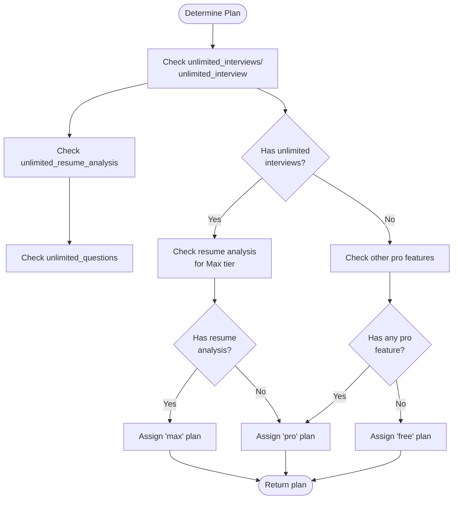
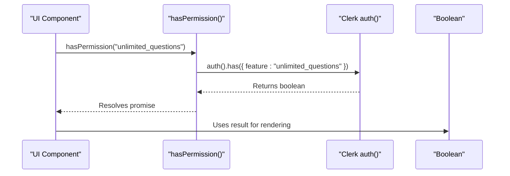
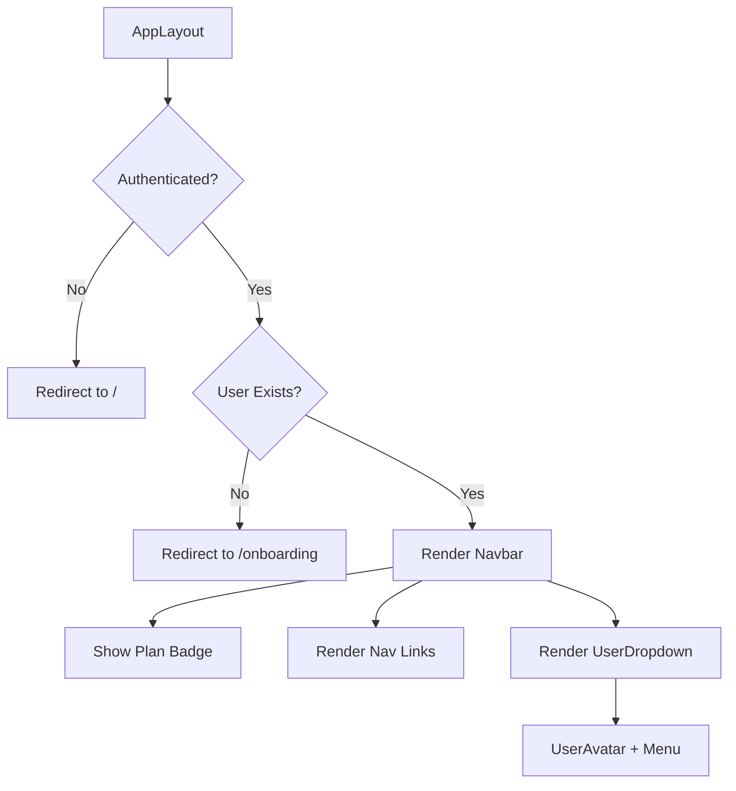

# User Management & Permissions

<cite>
**Referenced Files in This Document**
- [getCurrentUser.ts](file://src/services/clerk/lib/getCurrentUser.ts)
- [hasPermission.ts](file://src/services/clerk/lib/hasPermission.ts)
- [plan.ts](file://src/features/users/plan.ts)
- [_UserDropdown.tsx](file://src/app/_UserDropdown.tsx)
- [UserAvatar.tsx](file://src/features/users/components/UserAvatar.tsx)
- [_Navbar.tsx](file://src/app/app/_Navbar.tsx)
- [user.ts](file://src/drizzle/schema/user.ts)
</cite>

## Table of Contents
1. [Introduction](#introduction)
2. [Core Components Overview](#core-components-overview)
3. [User Profile Handling](#user-profile-handling)
4. [Subscription Plan Logic](#subscription-plan-logic)
5. [Role-Based Access Control](#role-based-access-control)
6. [Authentication Integration with Clerk](#authentication-integration-with-clerk)
7. [UI Components and Navigation Integration](#ui-components-and-navigation-integration)
8. [Common Issues and Resolutions](#common-issues-and-resolutions)
9. [Extensibility and Customization](#extensibility-and-customization)

## Introduction
This document provides a comprehensive overview of the User Management & Permissions system within the Darasa application. It details how user profiles are managed, subscription plans are determined, and access control is enforced through integration with Clerk authentication. The system supports tiered access based on feature permissions, enables personalized UI rendering (such as avatars), and integrates seamlessly with navigation and protected routes. Designed for both beginners and advanced developers, this guide explains implementation details while offering practical insights into troubleshooting and extending functionality.

## Core Components Overview
The user management system is composed of several key components that work together to manage identity, permissions, and user experience:
- `getCurrentUser`: Retrieves authenticated user data from Clerk and database
- `getUserPlan`: Determines user's subscription level based on feature flags
- `hasPermission`: Checks if current user has specific feature access
- `UserAvatar`: Renders user profile images or initials fallback
- `_UserDropdown` and `_Navbar`: UI components displaying user status and plan

These components interact across services, features, and presentation layers to deliver a cohesive user experience.

**Section sources**
- [getCurrentUser.ts](file://src/services/clerk/lib/getCurrentUser.ts#L1-L25)
- [plan.ts](file://src/features/users/plan.ts#L1-L34)
- [hasPermission.ts](file://src/services/clerk/lib/hasPermission.ts#L1-L16)

## User Profile Handling
User profiles are stored in the PostgreSQL database using Drizzle ORM with the `UserTable` schema. Each user record includes essential fields such as `id`, `name`, `email`, and `imageUrl`. The `imageUrl` field stores avatar URLs provided by Clerk upon authentication, enabling consistent cross-platform identity representation.

Profile data is retrieved via the `getCurrentUser` function, which combines Clerk session information with database records. When requested with `{ allData: true }`, it fetches the full user object from the database using the authenticated user ID. This separation ensures secure handling of authentication state while allowing flexible access to extended profile data.

The `UserAvatar` component renders user identities using the ShadCN Avatar component. It displays the image from `imageUrl` when available; otherwise, it generates initials from the user's name. This fallback mechanism guarantees visual consistency even when profile images aren't set.

```mermaid
classDiagram
class UserTable {
+string id PK
+string name
+string email UK
+string imageUrl?
+datetime createdAt
+datetime updatedAt
}
class getCurrentUser {
+Promise<{ userId, redirectToSignIn, user }>
+allData : boolean
}
class UserAvatar {
+user : { name, imageUrl }
+render() : JSX.Element
}
UserAvatar --> UserTable : "displays"
getCurrentUser --> UserTable : "queries"
```

**Diagram sources**
- [user.ts](file://src/drizzle/schema/user.ts#L5-L12)
- [getCurrentUser.ts](file://src/services/clerk/lib/getCurrentUser.ts#L7-L15)
- [UserAvatar.tsx](file://src/features/users/components/UserAvatar.tsx#L7-L25)

**Section sources**
- [user.ts](file://src/drizzle/schema/user.ts#L5-L12)
- [getCurrentUser.ts](file://src/services/clerk/lib/getCurrentUser.ts#L7-L25)
- [UserAvatar.tsx](file://src/features/users/components/UserAvatar.tsx#L7-L25)

## Subscription Plan Logic
Subscription plans are determined dynamically through feature flag evaluation in `plan.ts`. The system defines three tiers: `free`, `pro`, and `max`. Unlike traditional role-based systems, plan levels are derived from actual permissions granted by Clerk, making the approach more flexible and scalable.

The `getUserPlan()` function evaluates four key permissions:
- `unlimited_resume_analysis`
- `unlimited_interviews` (and its singular variant for compatibility)
- `unlimited_questions`

Plan determination follows priority rules:
- **Max**: Has unlimited interviews AND resume analysis
- **Pro**: Has any one of unlimited interviews, resume analysis, or questions
- **Free**: None of the above

This logic allows granular control over feature access without hardcoding plan definitions. The `isProOrMax()` helper simplifies conditional rendering for premium features.



**Diagram sources**
- [plan.ts](file://src/features/users/plan.ts#L10-L30)

**Section sources**
- [plan.ts](file://src/features/users/plan.ts#L1-L34)

## Role-Based Access Control
Access control is implemented through Clerk's permission system rather than traditional roles. The `hasPermission` function serves as the primary interface for checking feature access, accepting typed permission strings like `"unlimited_resume_analysis"` or `"5_questions"`.

Permissions are evaluated server-side using Clerk's `auth().has()` method, ensuring security cannot be bypassed client-side. The type-safe `Permission` union guarantees valid checks at compile time, reducing runtime errors.

This approach enables fine-grained control where individual features can be toggled independently. For example, a user might have `unlimited_questions` but not `unlimited_interviews`, creating hybrid access patterns not possible with rigid role hierarchies.



**Diagram sources**
- [hasPermission.ts](file://src/services/clerk/lib/hasPermission.ts#L11-L14)

**Section sources**
- [hasPermission.ts](file://src/services/clerk/lib/hasPermission.ts#L1-L16)

## Authentication Integration with Clerk
The system integrates tightly with Clerk for authentication and session management. The `getCurrentUser` function acts as the central entry point, combining Clerk's `auth()` with database lookups to provide complete user context.

During layout initialization in `AppLayout`, the system performs two critical checks:
1. Redirects to home if no `userId` exists (unauthenticated)
2. Redirects to onboarding if user record is missing (new user setup)

This ensures only properly authenticated and initialized users access protected content. The integration uses server-side functions marked with `"use server"` to prevent client-side exposure of sensitive operations.

Session data flows from Clerk to the application through structured objects containing both authentication state (`redirectToSignIn`) and enriched user data. This pattern separates concerns between authentication provider and application logic while maintaining security.

**Section sources**
- [getCurrentUser.ts](file://src/services/clerk/lib/getCurrentUser.ts#L7-L15)
- [AppLayout.tsx](file://src/app/app/layout.tsx#L6-L20)

## UI Components and Navigation Integration
User interface elements reflect permission states and subscription levels in real time. The `_Navbar` component displays the current plan badge with visual differentiation:
- **Free**: Gray badge with "Free" label
- **Pro/Max**: Gradient cyan badge with sparkles icon and "Pro"/"Max" label

Navigation links are conditionally rendered based on route parameters, ensuring context-aware menus. The `_UserDropdown` component provides access to user profile and logout functionality, wrapping the `UserAvatar` for consistent identity presentation.

Protected routes leverage the authentication flow automatically—any page requiring user data calls `getCurrentUser` during server-side rendering, triggering redirects when necessary. This eliminates the need for manual guard clauses in individual pages.



**Diagram sources**
- [AppLayout.tsx](file://src/app/app/layout.tsx#L6-L20)
- [_Navbar.tsx](file://src/app/app/_Navbar.tsx#L35-L116)
- [_UserDropdown.tsx](file://src/app/_UserDropdown.tsx#L12-L38)

**Section sources**
- [AppLayout.tsx](file://src/app/app/layout.tsx#L6-L20)
- [_Navbar.tsx](file://src/app/app/_Navbar.tsx#L1-L116)
- [_UserDropdown.tsx](file://src/app/_UserDropdown.tsx#L1-L38)

## Common Issues and Resolutions
### Expired Sessions
When sessions expire, `getCurrentUser` returns `userId: null`, triggering automatic redirect to the homepage. To improve UX, consider implementing silent refresh or proactive session expiry warnings.

### Permission Mismatches
If users don't receive expected features despite plan upgrades, verify:
- Clerk dashboard feature flags are correctly assigned
- No caching issues in `getUserPlan` (uses server actions)
- Proper error handling in `hasPermission` (catch blocks prevent failures)

### Missing User Records
New users may lack database entries after sign-up. The system handles this by redirecting to `/onboarding` when `user == null`. Ensure onboarding flow creates corresponding database records.

### Avatar Rendering Failures
When `imageUrl` is invalid or slow-loading, browsers may fail to display images. The `UserAvatar` component mitigates this with text fallbacks showing user initials, maintaining visual consistency.

## Extensibility and Customization
The architecture supports easy extension:
- **New Plans**: Add conditions in `getUserPlan` based on additional permissions
- **Custom Permissions**: Define new `Permission` types and use `hasPermission`
- **Enhanced Profiles**: Extend `UserTable` schema and update formatters
- **Tiered Features**: Implement gradual feature rollouts using permission gates

To customize behavior:
- Modify badge styling in `_Navbar` for different