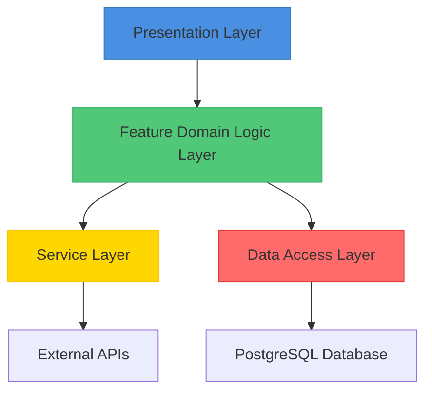
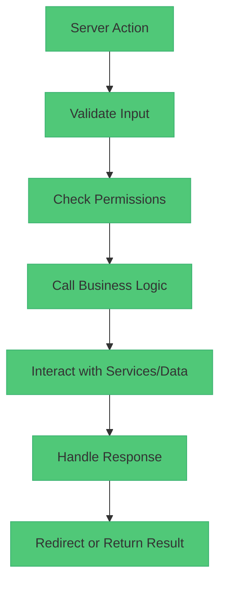
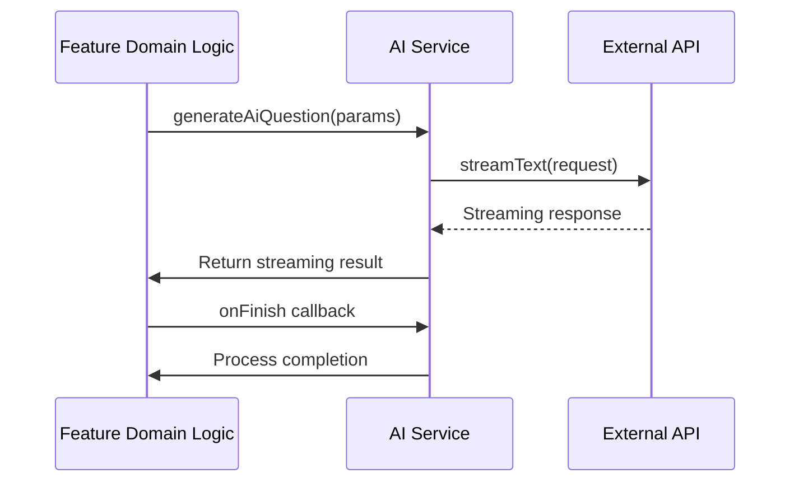
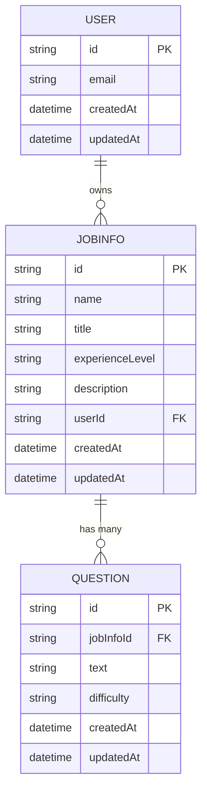
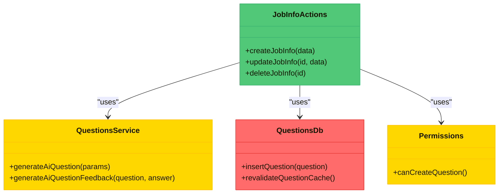
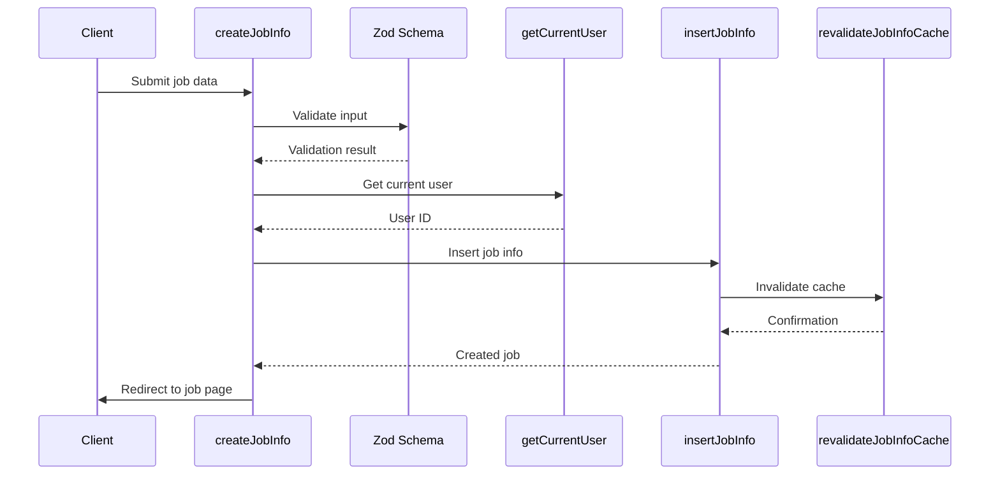

# Layered Architecture

<cite>
**Referenced Files in This Document**   
- [src/app/api/ai/questions/generate-question/route.ts](file://src/app/api/ai/questions/generate-question/route.ts)
- [src/features/jobInfos/actions.ts](file://src/features/jobInfos/actions.ts)
- [src/features/questions/db.ts](file://src/features/questions/db.ts)
- [src/services/ai/questions.ts](file://src/services/ai/questions.ts)
- [src/drizzle/schema.ts](file://src/drizzle/schema.ts)
- [src/drizzle/db.ts](file://src/drizzle/db.ts)
- [src/features/questions/permissions.ts](file://src/features/questions/permissions.ts)
- [src/features/questions/dbCache.ts](file://src/features/questions/dbCache.ts)
</cite>

## Table of Contents
1. [Introduction](#introduction)
2. [Layered Architecture Overview](#layered-architecture-overview)
3. [Presentation Layer](#presentation-layer)
4. [Feature Domain Logic Layer](#feature-domain-logic-layer)
5. [Service Layer](#service-layer)
6. [Data Access Layer](#data-access-layer)
7. [Dependency Flow and Inversion](#dependency-flow-and-inversion)
8. [Request Flow Analysis](#request-flow-analysis)
9. [Conclusion](#conclusion)

## Introduction

The darasa application implements a clean layered architecture that separates concerns across presentation, business logic, external services, and data persistence. This documentation details the four primary layers: the presentation layer built with Next.js App Router and React Server Components, the feature domain logic layer containing business rules and actions, the service layer managing external integrations, and the data access layer powered by Drizzle ORM with PostgreSQL. The architecture emphasizes well-defined interfaces and dependency inversion to maintain loose coupling between components.

## Layered Architecture Overview

The application follows a strict unidirectional dependency flow from higher-level components to lower-level services. Each layer has a specific responsibility and interacts with adjacent layers through clearly defined contracts. The architecture enables independent development, testing, and scaling of each component while maintaining a cohesive system structure.



**Diagram sources**
- [src/app/api/ai/questions/generate-question/route.ts](file://src/app/api/ai/questions/generate-question/route.ts#L1-L90)
- [src/features/jobInfos/actions.ts](file://src/features/jobInfos/actions.ts#L1-L121)
- [src/services/ai/questions.ts](file://src/services/ai/questions.ts#L1-L107)

## Presentation Layer

The presentation layer is implemented using Next.js App Router with React Server Components, providing a server-first approach to UI rendering. This layer handles user interface rendering, form submissions, and client-side interactions while leveraging server-side capabilities for data fetching and mutations.

Key characteristics of the presentation layer include:
- Utilization of Next.js Server Actions for form handling and state mutations
- Implementation of React Server Components for efficient server-side rendering
- Integration with UI components from the shared components library
- Handling of API routes for external integrations and webhook processing

The layer serves as the entry point for all user interactions and orchestrates calls to the feature domain logic layer for business operations.

**Section sources**
- [src/app/api/ai/questions/generate-question/route.ts](file://src/app/api/ai/questions/generate-question/route.ts#L1-L90)
- [src/app/api/ai/resumes/analyze/route.ts](file://src/app/api/ai/resumes/analyze/route.ts#L1-L68)

## Feature Domain Logic Layer

The feature domain logic layer contains the core business rules, workflows, and application-specific logic organized by feature domains such as jobInfos, interviews, questions, and users. This layer acts as the intermediary between the presentation layer and lower-level services, coordinating operations and enforcing business constraints.

Each feature directory (e.g., src/features/jobInfos) typically includes:
- **actions.ts**: Server Actions that serve as the public interface for the feature
- **db.ts**: Data access functions specific to the feature
- **dbCache.ts**: Cache invalidation logic for data consistency
- **permissions.ts**: Authorization and access control logic
- **schemas.ts**: Data validation schemas

This layer implements the use case pattern where high-level modules define the contracts used by lower layers, exemplifying the dependency inversion principle.



**Diagram sources**
- [src/features/jobInfos/actions.ts](file://src/features/jobInfos/actions.ts#L1-L121)
- [src/features/questions/permissions.ts](file://src/features/questions/permissions.ts#L1-L33)

**Section sources**
- [src/features/jobInfos/actions.ts](file://src/features/jobInfos/actions.ts#L1-L121)
- [src/features/questions/permissions.ts](file://src/features/questions/permissions.ts#L1-L33)

## Service Layer

The service layer encapsulates interactions with external systems and third-party APIs, providing a consistent interface to the rest of the application. Located in src/services, this layer abstracts the complexity of external integrations and provides reusable utilities for AI processing, authentication, and other cross-cutting concerns.

Key service modules include:
- **ai**: Integration with AI models (Google Gemini) for question generation and resume analysis
- **clerk**: Authentication and user management via Clerk
- **hume**: Integration with Hume for emotional intelligence analysis

Services in this layer are designed to be stateless and focused on specific integration points, allowing the feature domain logic layer to consume their functionality without knowledge of the underlying implementation details.



**Diagram sources**
- [src/services/ai/questions.ts](file://src/services/ai/questions.ts#L1-L107)
- [src/app/api/ai/questions/generate-question/route.ts](file://src/app/api/ai/questions/generate-question/route.ts#L1-L90)

**Section sources**
- [src/services/ai/questions.ts](file://src/services/ai/questions.ts#L1-L107)

## Data Access Layer

The data access layer provides a type-safe interface to the PostgreSQL database using Drizzle ORM. This layer abstracts database operations and ensures consistent data access patterns across the application. The schema is defined in src/drizzle/schema with individual files for each entity (user, jobinfo, interview, question).

Key components of the data access layer include:
- **schema.ts**: Central export of all database schemas
- **db.ts**: Database connection configuration with Neon PostgreSQL
- **migrations**: Version-controlled database migration files
- **schemaHelpers.ts**: Reusable column definitions and utilities

The layer implements repository patterns through feature-specific db modules (e.g., src/features/jobInfos/db.ts) that provide curated data access methods tailored to specific use cases.



**Diagram sources**
- [src/drizzle/schema.ts](file://src/drizzle/schema.ts#L1-L5)
- [src/drizzle/schema/jobinfo.ts](file://src/drizzle/schema/jobinfo.ts#L1-L35)
- [src/drizzle/schema/question.ts](file://src/drizzle/schema/question.ts#L1-L28)

**Section sources**
- [src/drizzle/db.ts](file://src/drizzle/db.ts#L1-L9)
- [src/features/questions/db.ts](file://src/features/questions/db.ts#L1-L21)

## Dependency Flow and Inversion

The architecture demonstrates clear dependency flow from higher-level components to lower-level services while implementing dependency inversion principles. Higher-level modules define the contracts (interfaces) that lower-level modules implement, reducing coupling and improving testability.

Key dependency patterns include:
- Feature actions depending on service utilities rather than direct API calls
- Data access functions being imported into feature modules rather than vice versa
- Permission checks being performed at the feature layer using service utilities
- Cache invalidation logic being encapsulated within feature boundaries

This approach allows for easy substitution of implementations (e.g., different AI providers) without affecting the core business logic, and enables comprehensive unit testing through mocking of service dependencies.



**Diagram sources**
- [src/features/jobInfos/actions.ts](file://src/features/jobInfos/actions.ts#L1-L121)
- [src/services/ai/questions.ts](file://src/services/ai/questions.ts#L1-L107)
- [src/features/questions/db.ts](file://src/features/questions/db.ts#L1-L21)
- [src/features/questions/permissions.ts](file://src/features/questions/permissions.ts#L1-L33)

## Request Flow Analysis

This section analyzes the request/response flow for key operations across the layered architecture, demonstrating how components interact to fulfill user requests.

### Job Creation Flow

When a user creates a new job description, the request flows through multiple layers:



**Diagram sources**
- [src/features/jobInfos/actions.ts](file://src/features/jobInfos/actions.ts#L1-L121)
- [src/features/jobInfos/db.ts](file://src/features/jobInfos/db.ts#L1-L21)

### Interview Feedback Generation Flow

The process of generating AI-powered interview feedback illustrates the integration of multiple services:

```mermaid
sequenceDiagram
    participant Client as Client
    participant Route as API Route
    participant Permission