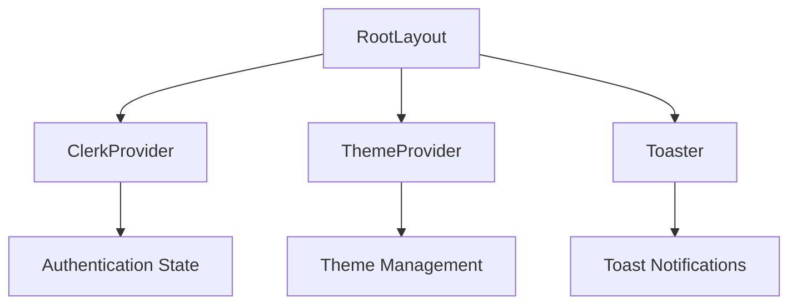
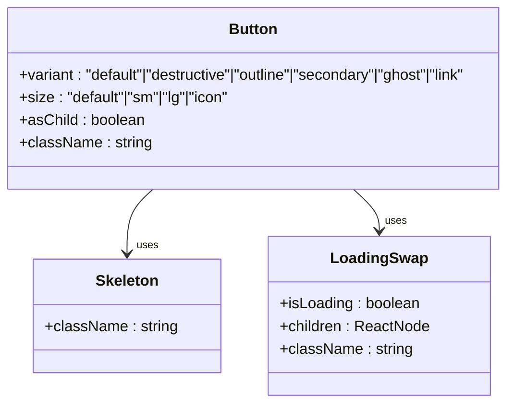
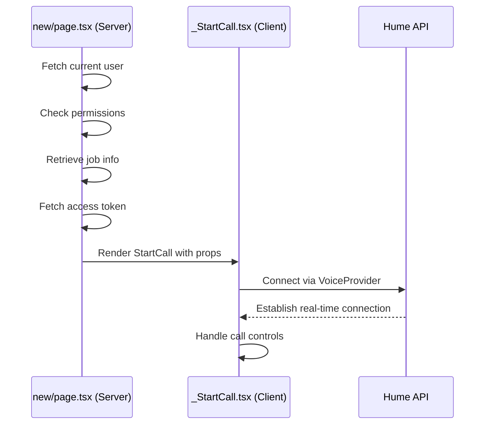
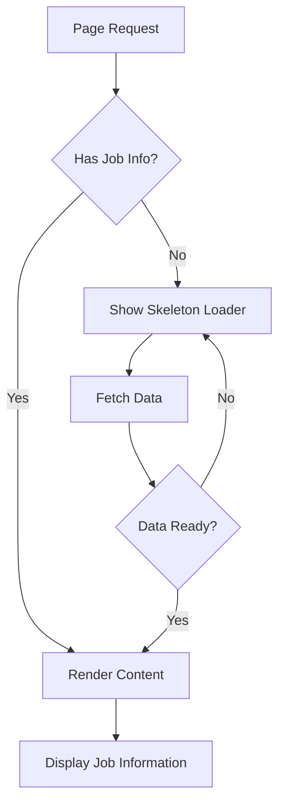

# Presentation Layer

<cite>
**Referenced Files in This Document**   
- [layout.tsx](file://src/app/layout.tsx)
- [ClerkProvider.tsx](file://src/services/clerk/components/ClerkProvider.tsx)
- [button.tsx](file://src/components/ui/button.tsx)
- [loading-swap.tsx](file://src/components/ui/loading-swap.tsx)
- [Skeleton.tsx](file://src/components/Skeleton.tsx)
- [_JobInfosGrid.tsx](file://src/app/app/_JobInfosGrid.tsx)
- [_StartCall.tsx](file://src/app/app/job-infos/[jobInfoId]/interviews/new/_StartCall.tsx)
- [new/page.tsx](file://src/app/app/job-infos/[jobInfoId]/interviews/new/page.tsx)
- [interviewId/page.tsx](file://src/app/app/job-infos/[jobInfoId]/interviews/[interviewId]/page.tsx)
</cite>

## Table of Contents
1. [Introduction](#introduction)
2. [Root Layout and Providers](#root-layout-and-providers)
3. [Shared UI Components](#shared-ui-components)
4. [Component Composition Patterns](#component-composition-patterns)
5. [Dynamic Routing and Data Streaming](#dynamic-routing-and-data-streaming)
6. [Client Interaction Management](#client-interaction-management)
7. [Performance Optimizations](#performance-optimizations)
8. [Conclusion](#conclusion)

## Introduction

The presentation layer of darasa is built on the Next.js App Router architecture with React Server Components (RSC) as its foundation. This document details how the UI system orchestrates authentication, theming, component reusability, and dynamic interactions through a modern full-stack framework. The architecture leverages server-side rendering for performance while enabling rich client-side experiences where needed.

## Root Layout and Providers

The root shell of the application is defined in `layout.tsx`, which serves as the universal wrapper for all pages within the app directory. This layout establishes the foundational providers that manage global state and services across the entire application.

**Diagram sources**
- [layout.tsx](file://src/app/layout.tsx#L1-L45)
- [ClerkProvider.tsx](file://src/services/clerk/components/ClerkProvider.tsx#L4-L55)

**Section sources**
- [layout.tsx](file://src/app/layout.tsx#L1-L45)

The `ClerkProvider` manages user authentication state and session handling throughout the application, while the `ThemeProvider` from next-themes enables dynamic light/dark mode switching based on user preference or system settings. These providers ensure consistent behavior and appearance across all routes without requiring per-page configuration.

## Shared UI Components

The UI component library resides in `src/components/ui/` and consists of reusable primitives built on top of Radix UI and styled with Tailwind CSS. These components follow the headless UI pattern, providing accessible interactive elements without dictating visual design.

**Diagram sources**
- [button.tsx](file://src/components/ui/button.tsx#L1-L60)
- [loading-swap.tsx](file://src/components/ui/loading-swap.tsx#L1-L38)
- [Skeleton.tsx](file://src/components/Skeleton.tsx#L1-L17)

**Section sources**
- [button.tsx](file://src/components/ui/button.tsx#L1-L60)
- [loading-swap.tsx](file://src/components/ui/loading-swap.tsx#L1-L38)
- [Skeleton.tsx](file://src/components/Skeleton.tsx#L1-L17)

Components like `Button` use `cva` (Class Variance Authority) to define consistent styling variants, ensuring visual harmony across the application. The `Skeleton` component provides loading placeholders, while `LoadingSwap` enables smooth transitions between loading and loaded states by swapping visibility between content and spinner icons.

## Component Composition Patterns

The application employs a composition pattern where server components fetch and stream data, which is then passed to client components that handle interactive behaviors. This separation of concerns allows for optimal performance while maintaining interactivity.

For example, in the interview creation flow, the server component `new/page.tsx` retrieves job information and authentication state before passing data to the client component `_StartCall.tsx`:

**Diagram sources**
- [new/page.tsx](file://src/app/app/job-infos/[jobInfoId]/interviews/new/page.tsx#L1-L65)
- [_StartCall.tsx](file://src/app/app/job-infos/[jobInfoId]/interviews/new/_StartCall.tsx#L17-L124)

**Section sources**
- [new/page.tsx](file://src/app/app/job-infos/[jobInfoId]/interviews/new/page.tsx#L1-L65)
- [_StartCall.tsx](file://src/app/app/job-infos/[jobInfoId]/interviews/new/_StartCall.tsx#L17-L124)

This pattern ensures that sensitive operations like permission checks and token generation occur securely on the server, while interactive features like voice call controls run on the client where they can respond to user input in real time.

## Dynamic Routing and Data Streaming

The application uses Next.js dynamic routing with the `[jobInfoId]` parameter to create personalized experiences for different job descriptions. Routes are structured hierarchically under `app/job-infos/[jobInfoId]/` to organize related functionality.

Data streaming is implemented through React's `Suspense` boundary, allowing parts of the page to render while waiting for asynchronous data:

**Diagram sources**
- [interviewId/page.tsx](file://src/app/app/job-infos/[jobInfoId]/interviews/[interviewId]/page.tsx#L1-L155)
- [_JobInfosGrid.tsx](file://src/app/app/_JobInfosGrid.tsx#L44-L124)

**Section sources**
- [interviewId/page.tsx](file://src/app/app/job-infos/[jobInfoId]/interviews/[interviewId]/page.tsx#L1-L155)
- [_JobInfosGrid.tsx](file://src/app/app/_JobInfosGrid.tsx#L44-L124)

The `SuspendedItem` component wraps async data, displaying skeleton loaders until the actual content is available. This creates a seamless user experience even when dealing with potentially slow database queries or external API calls.

## Client Interaction Management

Stateful client interactions, such as starting an interview call, are managed through dedicated client components that use React hooks to maintain local state. The `_StartCall.tsx` component demonstrates this pattern by managing the voice call lifecycle:

- It uses `useVoice()` to access the Hume AI voice SDK
- Maintains connection state with `readyState`
- Stores interview ID in local state for reference
- Handles side effects like duration tracking and chat ID synchronization through `useEffect`

When the user clicks "Start Interview", the component initiates a secure connection to the Hume API using a temporary access token generated server-side. Throughout the call, it periodically syncs the current duration back to the database and automatically redirects to the interview results page when the call ends.

## Performance Optimizations

The presentation layer implements several performance optimizations to enhance user experience:

### Streaming and Partial Prerendering
Server components stream HTML to the browser incrementally, allowing users to see meaningful content faster. Critical sections like headers render immediately while less important content loads progressively.

### Loading Skeletons
The application uses skeleton screens extensively during data loading phases. Components like `Skeleton` and `SkeletonButton` provide realistic placeholders that maintain layout stability and reduce perceived load times.

### Caching Strategy
The `use cache` directive and `cacheTag` function enable intelligent caching of database queries. When retrieving job information or interview details, the system caches results based on user ID and resource ID, preventing unnecessary重复 queries.

### Code Splitting
Next.js automatically splits code by route, ensuring that users only download JavaScript required for their current view. Interactive components are isolated as client components, minimizing bundle size for primarily static pages.

## Conclusion

The presentation layer of darasa effectively combines the strengths of React Server Components with targeted client-side interactivity. By establishing a solid foundation with proper provider setup, creating a cohesive component library, and implementing smart composition patterns, the application delivers a fast, responsive, and secure user experience. The architecture balances server-side efficiency with client-side richness, making strategic use of streaming, suspense, and caching to optimize performance across various network conditions.