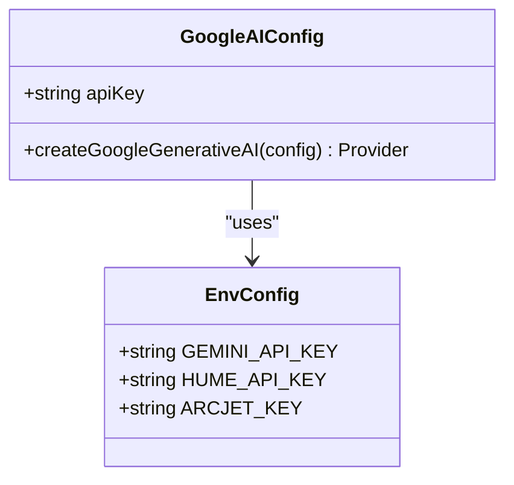
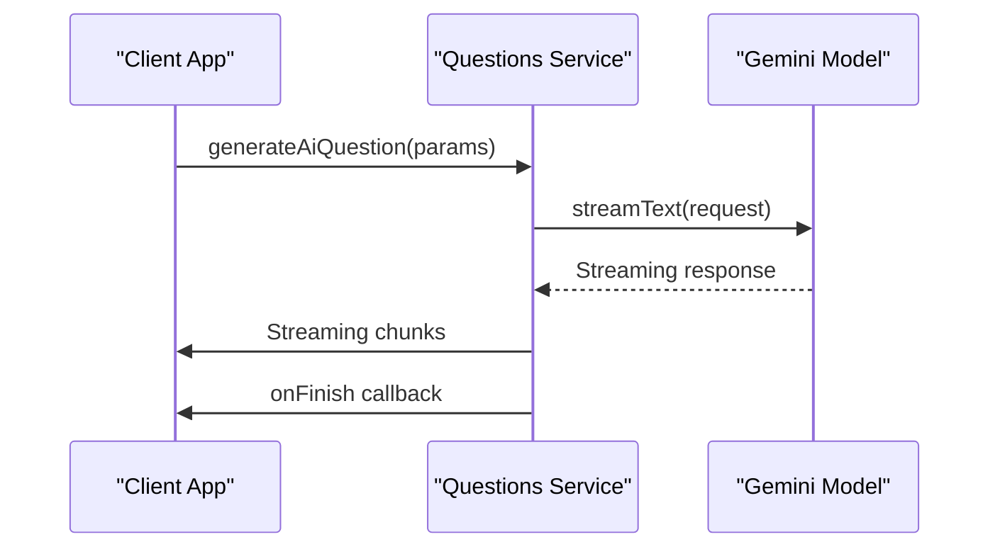
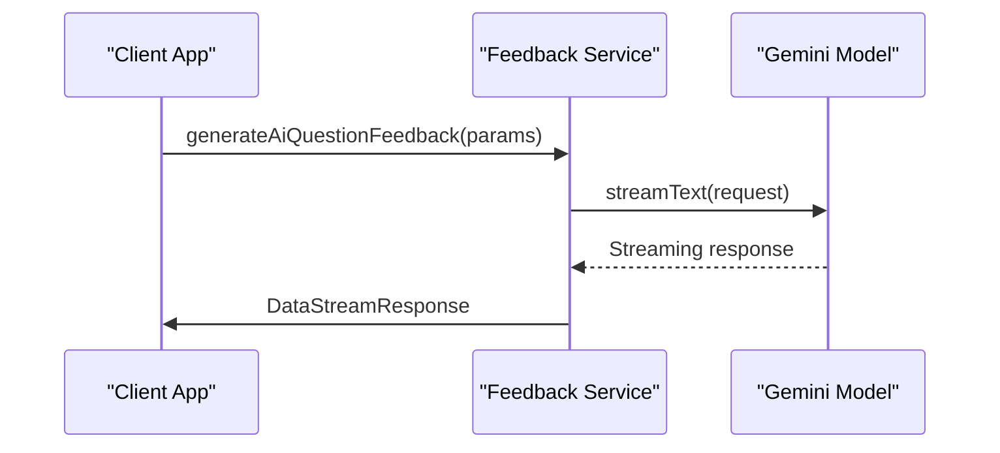
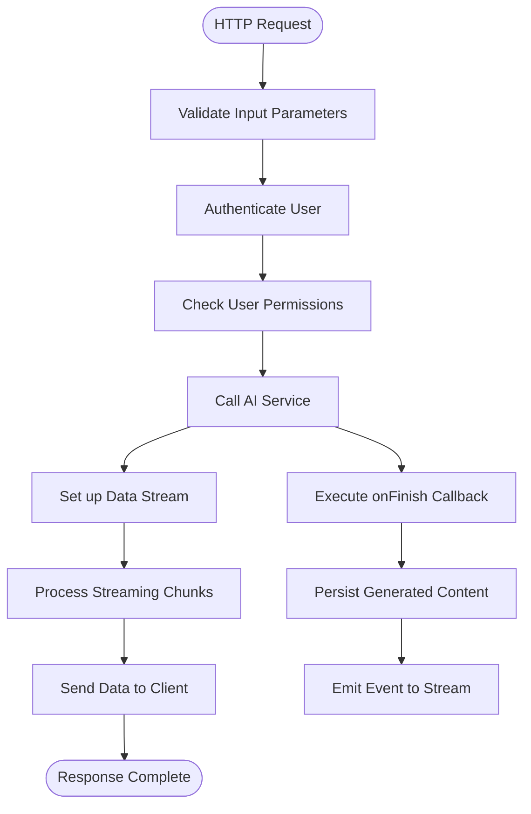
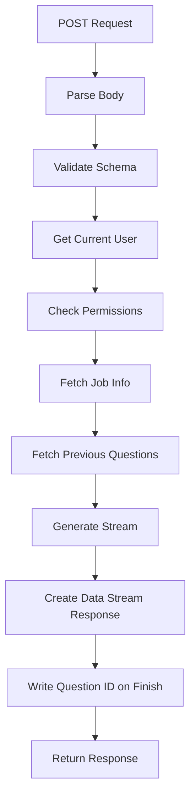

# AI Provider Integration

<cite>
**Referenced Files in This Document**   
- [google.ts](file://src/services/ai/models/google.ts)
- [questions.ts](file://src/services/ai/questions.ts)
- [interviews.ts](file://src/services/ai/interviews.ts)
- [generate-question/route.ts](file://src/app/api/ai/questions/generate-question/route.ts)
- [generate-feedback/route.ts](file://src/app/api/ai/questions/generate-feedback/route.ts)
- [_NewQuestionClientPage.tsx](file://src/app/app/job-infos/[jobInfoId]/questions/_NewQuestionClientPage.tsx)
- [server.ts](file://src/data/env/server.ts)
</cite>

## Table of Contents
1. [Introduction](#introduction)
2. [AI Provider Configuration](#ai-provider-configuration)
3. [Service Interface Contracts](#service-interface-contracts)
4. [Streaming Response Implementation](#streaming-response-implementation)
5. [API Route Architecture](#api-route-architecture)
6. [Client-Side Integration](#client-side-integration)
7. [Performance and Error Considerations](#performance-and-error-considerations)

## Introduction

The AI provider integration layer enables seamless communication with Google Gemini models through the `@ai-sdk/google` library. This system supports two primary use cases: generating technical interview questions based on job requirements and providing feedback on candidate responses. The architecture leverages streaming capabilities to deliver real-time responses while maintaining a clean separation between service logic, API routes, and client components.

**Section sources**
- [google.ts](file://src/services/ai/models/google.ts)
- [questions.ts](file://src/services/ai/questions.ts)
- [interviews.ts](file://src/services/ai/interviews.ts)

## AI Provider Configuration

The integration uses Google's Generative AI platform via the `@ai-sdk/google` library, configured with environment-specific settings. The core configuration establishes a connection to the Gemini API using credentials from the server environment.

**Diagram sources**
- [google.ts](file://src/services/ai/models/google.ts#L1-L6)
- [server.ts](file://src/data/env/server.ts#L1-L59)

### Environment Configuration

The system retrieves the GEMINI_API_KEY from server environment variables through a validated configuration schema. This approach ensures secure credential management and type safety across the application.

**Section sources**
- [server.ts](file://src/data/env/server.ts#L1-L59)
- [google.ts](file://src/services/ai/models/google.ts#L1-L6)

## Service Interface Contracts

The AI service layer exposes well-defined interfaces for question generation and feedback analysis. These contracts specify input parameters, response formats, and error conditions to ensure consistent behavior across the application.

### Question Generation Service

The `ai.questions.generate()` function creates technical interview questions tailored to specific job roles and difficulty levels.

**Diagram sources**
- [questions.ts](file://src/services/ai/questions.ts#L10-L107)

#### Input Parameters
- **jobInfo**: Object containing job title, description, and experience level
- **previousQuestions**: Array of previously generated questions to avoid repetition
- **difficulty**: String value from enum (easy, medium, hard)
- **onFinish**: Callback function executed when generation completes

#### Response Format
- Returns a readable stream of text chunks
- Emits completion events via onFinish callback
- Provides question ID through data stream after persistence

#### Error Conditions
- Invalid input parameters (validated via Zod schema)
- Authentication failures (missing or invalid API key)
- Rate limiting by provider
- Plan limitations (user quota exceeded)

### Feedback Analysis Service

The `ai.interviews.generateFeedback()` function evaluates candidate answers against original questions and provides structured feedback.

**Diagram sources**
- [questions.ts](file://src/services/ai/questions.ts#L72-L107)

#### Input Parameters
- **question**: Original interview question text
- **answer**: Candidate's response to be evaluated

#### Response Format
- Structured markdown output with:
  - Performance rating (1-10 scale)
  - Constructive feedback addressing strengths and weaknesses
  - Full correct answer for reference
- Strict adherence to specified output format

#### Error Conditions
- Missing or malformed input data
- Unauthorized access to question records
- Provider API errors during processing

**Section sources**
- [questions.ts](file://src/services/ai/questions.ts#L10-L107)
- [interviews.ts](file://src/services/ai/interviews.ts#L10-L113)

## Streaming Response Implementation

The integration leverages the `@ai-sdk/react` library to implement streaming responses, enabling real-time content delivery without blocking the user interface.

### Server-Side Streaming

The API routes utilize `createDataStreamResponse` to transform AI model streams into HTTP responses that can be consumed by clients incrementally.

**Diagram sources**
- [generate-question/route.ts](file://src/app/api/ai/questions/generate-question/route.ts#L36-L89)
- [generate-feedback/route.ts](file://src/app/api/ai/questions/generate-feedback/route.ts#L44-L59)

### Client-Side Consumption

The frontend components use the `useCompletion` hook from `@ai-sdk/react` to handle streaming responses and update the UI in real time.

**Section sources**
- [_NewQuestionClientPage.tsx](file://src/app/app/job-infos/[jobInfoId]/questions/_NewQuestionClientPage.tsx#L36-L86)

## API Route Architecture

The API routes serve as the bridge between client requests and AI service functionality, handling authentication, validation, and response formatting.

### Generate Question Route

The `/api/ai/questions/generate-question` endpoint handles question generation requests with the following workflow:

1. Parse and validate incoming JSON payload
2. Authenticate the requesting user
3. Verify user permissions and plan limits
4. Retrieve relevant job information and previous questions
5. Initiate streaming response with completion callback
6. Persist generated question upon completion

**Diagram sources**
- [generate-question/route.ts](file://src/app/api/ai/questions/generate-question/route.ts)

### Generate Feedback Route

The `/api/ai/questions/generate-feedback` endpoint processes feedback requests through:

1. Input validation and user authentication
2. Question authorization check
3. AI service invocation with question and answer
4. Direct streaming response to client

**Section sources**
- [generate-question/route.ts](file://src/app/api/ai/questions/generate-question/route.ts)
- [generate-feedback/route.ts](file://src/app/api/ai/questions/generate-feedback/route.ts)

## Client-Side Integration

The client components integrate with the AI services through standardized patterns that handle loading states, errors, and user interactions.

### Component Structure

The `_NewQuestionClientPage.tsx` component orchestrates the question-generation workflow with distinct sections for:
- Question display (with copy functionality)
- Answer input (textarea with copy capability)
- Feedback presentation (markdown rendering)
- Control buttons (difficulty selection and actions)

### State Management

The component maintains several state variables to track:
- Current workflow status (initial, awaiting answer, awaiting difficulty)
- Generated question text
- User's answer
- Feedback response
- Loading indicators for both generation processes

### Responsive Design

The interface adapts to different screen sizes:
- Desktop: Resizable panels for question/feedback and answer sections
- Mobile: Vertical stack with scrollable areas
- Hover effects for copy buttons that appear on interaction

**Section sources**
- [_NewQuestionClientPage.tsx](file://src/app/app/job-infos/[jobInfoId]/questions/_NewQuestionClientPage.tsx)

## Performance and Error Considerations

The integration includes several mechanisms to optimize performance and handle potential issues gracefully.

### Latency Optimization

- Utilizes fast inference model (gemini-2.5-flash)
- Implements efficient streaming to reduce perceived latency
- Employs caching for frequently accessed data (job info, questions)
- Minimizes round trips through batched operations where possible

### Token Usage Monitoring

While explicit token counting isn't implemented, the system controls usage through:
- Limited maxSteps parameter (10 steps per generation)
- Constrained input sizes via validation
- Clear system prompts that guide concise output
- Experimental continue steps flag for multi-turn scenarios

### Fallback Strategies

The system handles provider outages and errors through:
- Comprehensive error boundaries in React components
- User-friendly error messages via errorToast utility
- Graceful degradation when AI services are unavailable
- Client-side state preservation during retries

### Security and Rate Limiting

- API keys are securely stored in environment variables
- All endpoints require authentication
- Input validation prevents injection attacks
- Plan-based access control limits