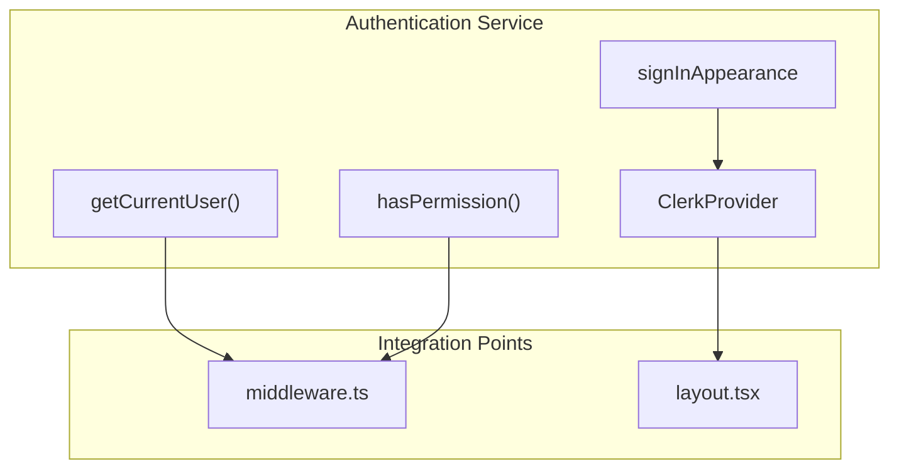
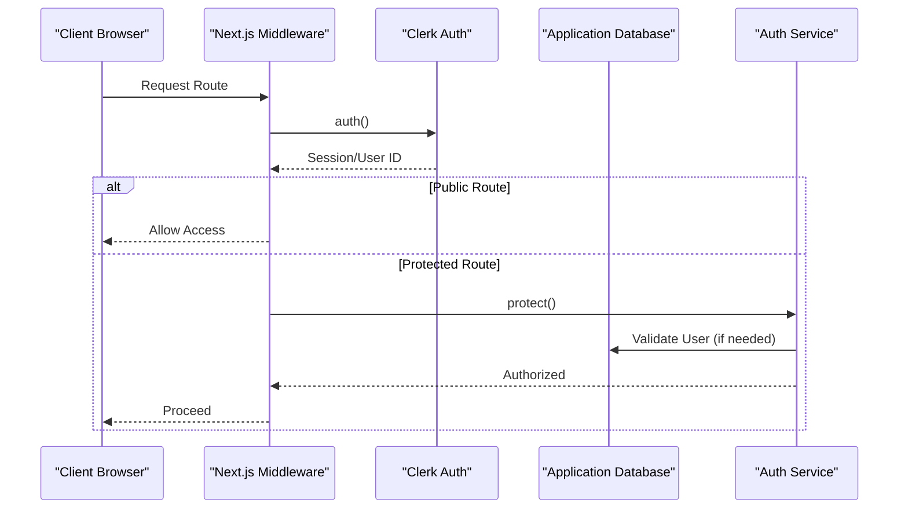
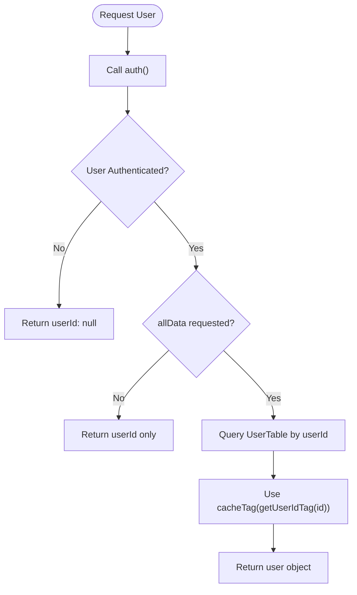
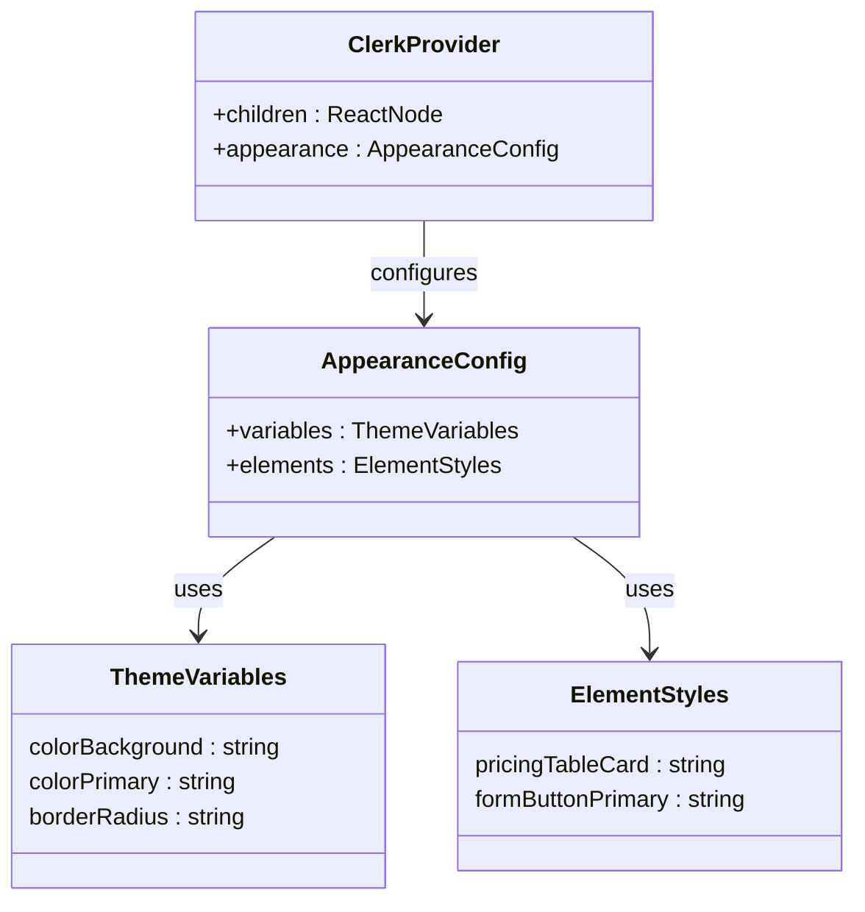
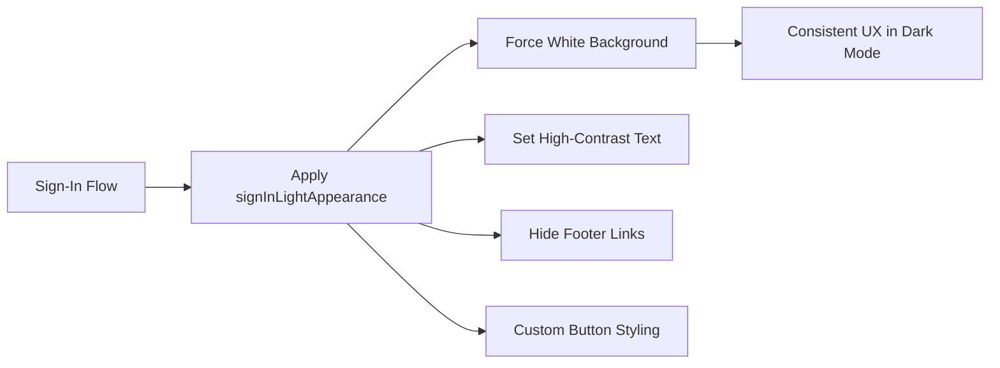
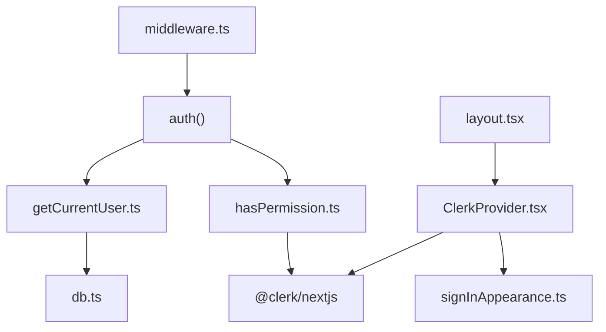

<cite>
**Referenced Files in This Document**   
- [getCurrentUser.ts](file://src/services/clerk/lib/getCurrentUser.ts)
- [hasPermission.ts](file://src/services/clerk/lib/hasPermission.ts)
- [ClerkProvider.tsx](file://src/services/clerk/components/ClerkProvider.tsx)
- [signInAppearance.ts](file://src/services/clerk/lib/signInAppearance.ts)
- [middleware.ts](file://src/middleware.ts)
- [layout.tsx](file://src/app/layout.tsx)
</cite>

## Table of Contents
1. [Introduction](#introduction)
2. [Project Structure](#project-structure)
3. [Core Components](#core-components)
4. [Architecture Overview](#architecture-overview)
5. [Detailed Component Analysis](#detailed-component-analysis)
6. [Dependency Analysis](#dependency-analysis)
7. [Performance Considerations](#performance-considerations)
8. [Troubleshooting Guide](#troubleshooting-guide)
9. [Conclusion](#conclusion)

## Introduction

This document provides a comprehensive analysis of the authentication service implementation using Clerk within a Next.js application. The service abstracts user authentication, session management, and permission checking through dedicated helper functions and centralized configuration. It integrates with the Next.js App Router to enforce server-side authentication checks, manage protected routes, and securely retrieve user data. The documentation covers core components such as `getCurrentUser()` and `hasPermission()`, the integration pattern via `ClerkProvider`, role-based access control, UI customization through `signInAppearance`, and handling of common edge cases like session expiration.

## Project Structure

The authentication service is organized under the `src/services/clerk` directory, which contains two main subdirectories: `components` and `lib`. The `lib` directory houses utility functions for user context resolution and permission validation, while the `components` directory includes wrappers for Clerk's provider to customize appearance and behavior. Key files include:

- `lib/getCurrentUser.ts`: Retrieves authenticated user information from both Clerk and the application database.
- `lib/hasPermission.ts`: Evaluates feature-based permissions for the current user.
- `lib/signInAppearance.ts`: Defines a consistent light-theme appearance for sign-in components.
- `components/ClerkProvider.tsx`: Wraps Clerk’s provider to apply global styling and theming.

Authentication is enforced at the middleware level and integrated into the application layout, ensuring consistent behavior across all routes.



**Diagram sources**
- [getCurrentUser.ts](file://src/services/clerk/lib/getCurrentUser.ts)
- [hasPermission.ts](file://src/services/clerk/lib/hasPermission.ts)
- [signInAppearance.ts](file://src/services/clerk/lib/signInAppearance.ts)
- [ClerkProvider.tsx](file://src/services/clerk/components/ClerkProvider.tsx)
- [middleware.ts](file://src/middleware.ts)
- [layout.tsx](file://src/app/layout.tsx)

**Section sources**
- [src/services/clerk](file://src/services/clerk)

## Core Components

The authentication system relies on several key functions that encapsulate complex logic into simple interfaces. These components enable secure, reusable, and maintainable authentication patterns throughout the application.

### getCurrentUser Function

The `getCurrentUser()` function abstracts the process of retrieving the currently authenticated user. It combines Clerk’s built-in `auth()` method with internal database queries to return both identity metadata and enriched user data when requested. This abstraction allows components to safely access user context without directly managing authentication state or database interactions.

**Section sources**
- [getCurrentUser.ts](file://src/services/clerk/lib/getCurrentUser.ts#L7-L15)

### hasPermission Function

The `hasPermission()` function enables fine-grained access control by evaluating whether the current user possesses a specific feature flag or permission. It leverages Clerk’s feature-based authorization model, allowing the backend to dynamically control access to premium features such as unlimited resume analysis or interviews based on subscription status.

**Section sources**
- [hasPermission.ts](file://src/services/clerk/lib/hasPermission.ts#L11-L14)

## Architecture Overview

The authentication architecture follows a layered approach where Clerk handles identity verification and session management, while the application layer extends this foundation with custom logic for permissions, UI consistency, and database integration.



**Diagram sources**
- [middleware.ts](file://src/middleware.ts#L10-L54)
- [getCurrentUser.ts](file://src/services/clerk/lib/getCurrentUser.ts#L7-L15)

## Detailed Component Analysis

### getCurrentUser Implementation

The `getCurrentUser()` function uses `@clerk/nextjs/server`'s `auth()` method to extract the `userId` and `redirectToSignIn` handler. If the caller requests full user data (`allData = true`) and a valid user ID exists, it fetches the corresponding record from the application’s database using Drizzle ORM. The function also implements caching via `cacheTag` to optimize repeated reads of the same user data.

#### Data Flow Diagram


**Diagram sources**
- [getCurrentUser.ts](file://src/services/clerk/lib/getCurrentUser.ts#L7-L24)

**Section sources**
- [getCurrentUser.ts](file://src/services/clerk/lib/getCurrentUser.ts#L7-L24)

### Permission Checking with hasPermission

The `hasPermission()` function evaluates whether the current user has a specified feature enabled. It supports a predefined set of permission strings related to usage limits (e.g., `"unlimited_interviews"`, `"5_questions"`). This design enables flexible role-based access control where different subscription tiers grant access to various features.

#### Supported Permissions Table
| Permission | Description |
|-----------|-------------|
| `unlimited_resume_analysis` | Allows unlimited resume analysis |
| `unlimited_interviews` | Grants unlimited interview attempts |
| `unlimited_questions` | Enables generation of unlimited questions |
| `1_interview` | Grants access to one interview session |
| `5_questions` | Allows creation of up to five AI-generated questions |

**Section sources**
- [hasPermission.ts](file://src/services/clerk/lib/hasPermission.ts#L3-L14)

### ClerkProvider Integration

The `ClerkProvider` component wraps the original Clerk provider to enforce consistent styling aligned with the application’s design system. It maps CSS variables to Tailwind theme tokens and customizes UI elements such as pricing tables to match the app’s visual language.

#### Custom Styling Mapping


**Diagram sources**
- [ClerkProvider.tsx](file://src/services/clerk/components/ClerkProvider.tsx#L4-L55)

**Section sources**
- [ClerkProvider.tsx](file://src/services/clerk/components/ClerkProvider.tsx#L4-L55)

### signInAppearance Configuration

To ensure a consistent user experience regardless of the site’s dark/light mode, the `signInLightAppearance` object enforces a white-themed interface for all sign-in flows. This prevents contrast issues and maintains brand consistency during authentication.

#### Light Theme Enforcement


**Diagram sources**
- [signInAppearance.ts](file://src/services/clerk/lib/signInAppearance.ts#L5-L36)

**Section sources**
- [signInAppearance.ts](file://src/services/clerk/lib/signInAppearance.ts#L5-L36)

## Dependency Analysis

The authentication service forms a critical dependency layer for the entire application. Its components are consumed across multiple layers including middleware, layout, and feature modules.



**Diagram sources**
- [middleware.ts](file://src/middleware.ts#L10-L54)
- [layout.tsx](file://src/app/layout.tsx#L1-L44)
- [getCurrentUser.ts](file://src/services/clerk/lib/getCurrentUser.ts)
- [hasPermission.ts](file://src/services/clerk/lib/hasPermission.ts)
- [ClerkProvider.tsx](file://src/services/clerk/components/ClerkProvider.tsx)
- [signInAppearance.ts](file://src/services/clerk/lib/signInAppearance.ts)

**Section sources**
- [middleware.ts](file://src/middleware.ts#L10-L54)
- [layout.tsx](file://src/app/layout.tsx#L1-L44)

## Performance Considerations

The authentication service incorporates several performance optimizations:

- **Caching**: The `getUser()` function uses `use cache` and `cacheTag` to prevent redundant database queries for the same user within a request lifecycle.
- **Selective Data Loading**: The `allData` parameter in `getCurrentUser()` ensures that database queries are only executed when necessary.
- **Styling Efficiency**: The `ClerkProvider` applies appearance settings once at the root level, avoiding per-component style recalculations.

These practices minimize latency and reduce load on both the database and Clerk API.

## Troubleshooting Guide

Common issues in the authentication flow typically involve session handling, redirect logic, and permission mismatches.

### Session Expiration Handling

When a session expires, `auth()` returns a `redirectToSignIn` function instead of a `userId`. Applications must check for this condition and trigger appropriate navigation:
```ts
const { userId, redirectToSignIn } = await auth();
if (!userId) return redirectToSignIn();
```

### Redirect Logic Issues

Ensure that public routes are correctly defined in `createRouteMatcher()` in `middleware.ts`. Misconfigured route patterns can lead to unintended redirects.

### User Context Resolution Edge Cases

If `getCurrentUser({ allData: true })` returns `undefined` despite a valid session, verify that:
- The `userId` exists in the application’s `UserTable`
- Database connectivity is functional
- Caching is not serving stale or incorrect data

**Section sources**
- [middleware.ts](file://src/middleware.ts#L10-L54)
- [getCurrentUser.ts](file://src/services/clerk/lib/getCurrentUser.ts#L7-L24)

## Conclusion

The Clerk-based authentication service provides a robust, scalable foundation for user management in the Next.js application. By abstracting authentication logic into reusable utilities like `getCurrentUser()` and `hasPermission()`, the system promotes consistency and security across features. The integration with middleware ensures server-side protection of routes, while the customized `ClerkProvider` and `signInAppearance` guarantee a cohesive user experience. With proper caching and permission modeling, the service efficiently balances functionality, performance, and maintainability.