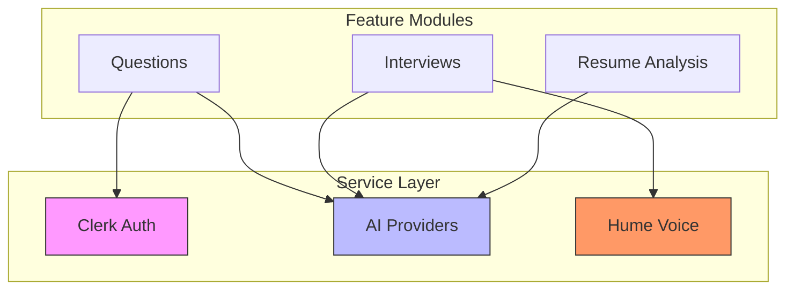
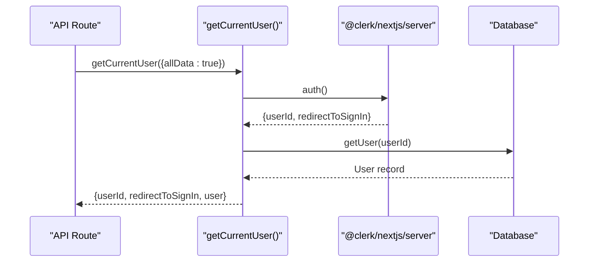
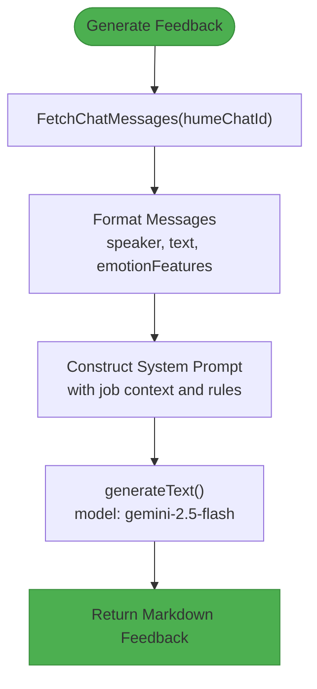
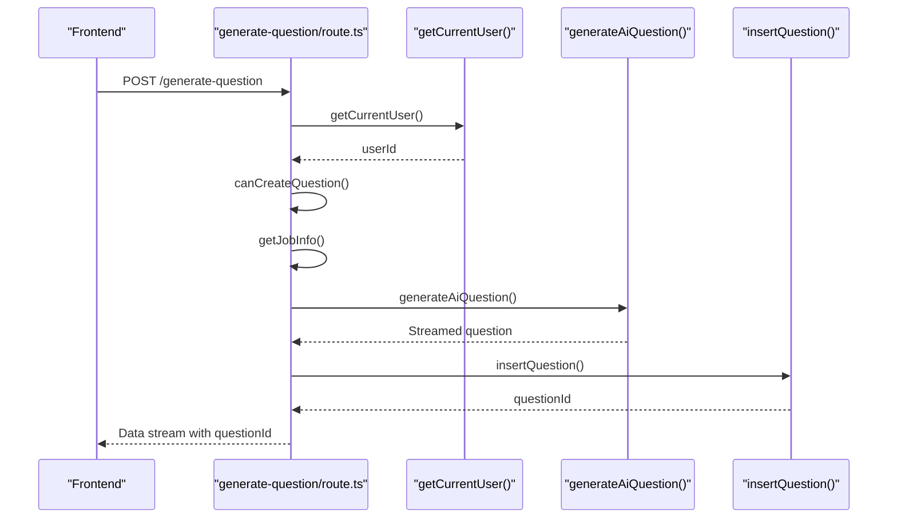

# Service Layer

<cite>
**Referenced Files in This Document**   
- [getCurrentUser.ts](file://src/services/clerk/lib/getCurrentUser.ts)
- [google.ts](file://src/services/ai/models/google.ts)
- [interviews.ts](file://src/services/ai/interviews.ts)
- [questions.ts](file://src/services/ai/questions.ts)
- [api.ts](file://src/services/hume/lib/api.ts)
- [generate-feedback/route.ts](file://src/app/api/ai/questions/generate-feedback/route.ts)
- [generate-question/route.ts](file://src/app/api/ai/questions/generate-question/route.ts)
</cite>

## Table of Contents
1. [Introduction](#introduction)
2. [Service Abstraction Overview](#service-abstraction-overview)
3. [Authentication Service: Clerk Integration](#authentication-service-clerk-integration)
4. [AI Services: Google Gemini and OpenAI](#ai-services-google-gemini-and-openai)
5. [Voice Interview Service: Hume AI](#voice-interview-service-hume-ai)
6. [Service Invocation Relationships](#service-invocation-relationships)
7. [Error Handling and Retry Strategies](#error-handling-and-retry-strategies)
8. [Environment-Based Configuration](#environment-based-configuration)
9. [Conclusion](#conclusion)

## Introduction

The service layer in darasa provides a clean abstraction over external integrations, enabling feature-level components to execute business logic without coupling to implementation details. This document details the architecture and contracts of key services handling authentication (Clerk), AI processing (Google Gemini), and voice interviews (Hume AI). Each service exposes well-defined interfaces that encapsulate third-party dependencies, manage configuration, and handle errors consistently across deployment environments.

**Section sources**
- [getCurrentUser.ts](file://src/services/clerk/lib/getCurrentUser.ts)
- [google.ts](file://src/services/ai/models/google.ts)
- [interviews.ts](file://src/services/ai/interviews.ts)
- [questions.ts](file://src/services/ai/questions.ts)

## Service Abstraction Overview

The service layer follows a dependency inversion principle, where high-level modules depend on abstractions rather than concrete implementations. Services are organized under `/src/services` with dedicated directories for each integration:

- `clerk/`: Handles user authentication and session management
- `ai/`: Orchestrates AI-powered features using multiple providers
- `hume/`: Manages voice interview data from Hume AI

Each service exports functions that abstract away API keys, request formatting, error handling, and retry logic. Feature modules interact with these services through simple function calls, receiving processed results without awareness of underlying network operations or provider-specific behaviors.



**Diagram sources**
- [getCurrentUser.ts](file://src/services/clerk/lib/getCurrentUser.ts)
- [questions.ts](file://src/services/ai/questions.ts)
- [interviews.ts](file://src/services/ai/interviews.ts)
- [api.ts](file://src/services/hume/lib/api.ts)

## Authentication Service: Clerk Integration

The Clerk service abstracts user authentication through a single entry point: `getCurrentUser()`. This function resolves the current user context by leveraging Clerk's Next.js server SDK while enriching it with application-specific data from the database.

### Interface Contract

```typescript
export async function getCurrentUser({ allData = false } = {})
```

Returns an object containing:
- `userId`: The authenticated user's ID from Clerk
- `redirectToSignIn`: A function to redirect unauthenticated users
- `user`: Full user data from the database (when `allData=true`)

The service handles both authentication state resolution and optional database lookup, caching results using Next.js cache tags for optimal performance.

### Implementation Details

When `allData=true`, the service performs a database query to retrieve the full user record, applying proper access control by verifying ownership. Results are cached using `cacheTag(getUserIdTag(id))` to enable efficient invalidation when user data changes.



**Diagram sources**
- [getCurrentUser.ts](file://src/services/clerk/lib/getCurrentUser.ts)

**Section sources**
- [getCurrentUser.ts](file://src/services/clerk/lib/getCurrentUser.ts)

## AI Services: Google Gemini and OpenAI

The AI service layer provides unified access to multiple AI providers through standardized interfaces. Currently implemented with Google Gemini via `@ai-sdk/google`, the architecture supports future expansion to other providers like OpenAI.

### Model Configuration

The core model configuration is centralized in `google.ts`, which creates a configured client instance using environment variables:

```typescript
export const google = createGoogleGenerativeAI({
  apiKey: env.GEMINI_API_KEY,
})
```

This pattern ensures API keys never appear in business logic and can be easily rotated or changed per environment.

### Question Generation Service

The `generateAiQuestion()` function creates technical interview questions tailored to job requirements:

#### Interface Contract
```typescript
function generateAiQuestion({
  jobInfo,
  previousQuestions,
  difficulty,
  onFinish
}: {
  jobInfo: Pick<JobInfo, "title" | "description" | "experienceLevel">
  previousQuestions: Pick<Question, "text" | "difficulty">[]
  difficulty: QuestionDifficulty
  onFinish: (question: string) => void
})
```

Returns a streamable response that invokes `onFinish` with the generated question ID upon completion.

#### System Prompt Design
The service uses a comprehensive system prompt that incorporates:
- Job description and experience level
- Difficulty constraints (easy/medium/hard)
- Formatting requirements (markdown output)
- Content guidelines (practical challenges over trivia)
- Output constraints (single question, no answers)

The prompt engineering ensures consistent, relevant question generation aligned with role requirements.

### Interview Feedback Service

The `generateAiInterviewFeedback()` function analyzes voice interview transcripts to provide structured performance feedback:

#### Interface Contract
```typescript
async function generateAiInterviewFeedback({
  humeChatId,
  jobInfo,
  userName
}: {
  humeChatId: string
  jobInfo: Pick<JobInfo, "title" | "description" | "experienceLevel">
  userName: string
})
```

Returns formatted markdown feedback evaluating seven dimensions of interview performance.

#### Processing Pipeline
1. Fetch transcript from Hume AI
2. Format messages with speaker labels and emotion features
3. Submit to Gemini with structured evaluation criteria
4. Return rich feedback with ratings and improvement suggestions



**Diagram sources**
- [interviews.ts](file://src/services/ai/interviews.ts)
- [questions.ts](file://src/services/ai/questions.ts)
- [google.ts](file://src/services/ai/models/google.ts)

**Section sources**
- [interviews.ts](file://src/services/ai/interviews.ts)
- [questions.ts](file://src/services/ai/questions.ts)
- [google.ts](file://src/services/ai/models/google.ts)

## Voice Interview Service: Hume AI

The Hume AI service abstracts voice interview data retrieval through a simple interface that handles authentication and pagination.

### Interface Contract

```typescript
export async function fetchChatMessages(humeChatId: string)
```

Returns an array of chat events from the specified Hume conversation, automatically handling:
- API client instantiation with environment key
- Pagination for long conversations
- Cache optimization via `"use cache"` directive

### Implementation Strategy

The service uses Hume's streaming iterator to efficiently retrieve all chat events regardless of conversation length. Results are cached at the function level using Next.js' caching primitives, reducing redundant API calls during subsequent requests.

**Section sources**
- [api.ts](file://src/services/hume/lib/api.ts)

## Service Invocation Relationships

Feature-level actions depend on multiple services to execute complete workflows. The API routes demonstrate how services are composed to deliver end-to-end functionality.

### Question Generation Workflow

The `/api/ai/questions/generate-question` route orchestrates three services:
1. **Authentication**: `getCurrentUser()` verifies session
2. **Authorization**: `canCreateQuestion()` checks plan limits
3. **AI Processing**: `generateAiQuestion()` creates content
4. **Persistence**: `insertQuestion()` saves result to database



**Diagram sources**
- [generate-question/route.ts](file://src/app/api/ai/questions/generate-question/route.ts)
- [getCurrentUser.ts](file://src/services/clerk/lib/getCurrentUser.ts)
- [questions.ts](file://src/services/ai/questions.ts)

### Feedback Generation Workflow

The `/api/ai/questions/generate-feedback` route combines:
1. **Authentication**: `getCurrentUser()` for identity
2. **Data Access**: Database queries with permission checks
3. **AI Analysis**: `generateAiQuestionFeedback()` for evaluation

The route validates both authentication and authorization before proceeding, ensuring users can only access their own data.

**Section sources**
- [generate-feedback/route.ts](file://src/app/api/ai/questions/generate-feedback/route.ts)
- [generate-question/route.ts](file://src/app/api/ai/questions/generate-question/route.ts)

## Error Handling and Retry Strategies

The service layer implements consistent error handling patterns across all integrations:

### Authentication Errors
- Returns 401 status for unauthenticated requests
- Uses `redirectToSignIn` helper for proper redirection
- Validates user ownership before data access

### AI Service Errors
- Wraps AI SDK calls in try-catch blocks
- Returns meaningful error messages (400 for validation)
- Implements client-side retry logic for transient failures

### Database Access Errors
- Uses safe parsing with Zod for input validation
- Returns 403 for permission violations
- Implements caching with proper tag invalidation

All services follow a fail-fast principle, validating inputs early and providing clear error responses that frontend components can display to users.

**Section sources**
- [generate-feedback/route.ts](file://src/app/api/ai/questions/generate-feedback/route.ts)
- [generate-question/route.ts](file://src/app/api/ai/questions/generate-question/route.ts)

## Environment-Based Configuration

The service layer uses environment variables to configure behavior across deployment stages:

### Configuration Management
- API keys stored in environment variables (`GEMINI_API_KEY`, `HUME_API_KEY`)
- Schema validation using Zod for runtime type safety
- Separate client and server environment files (`env/client.ts`, `env/server.ts`)

### Deployment Variations
- **Development**: Mock services could be injected
- **Staging**: Test API keys with limited quotas
- **Production**: Full-featured keys with monitoring

The configuration system ensures secrets are never committed to version control while allowing flexible overrides per environment.

**Section sources**
- [google.ts](file://src/services/ai/models/google.ts)
- [api.ts](file://src/services/hume/lib/api.ts)
- [env/server.ts](file://src/data/env/server.ts)

## Conclusion

The service layer in darasa effectively abstracts external integrations through well-defined interfaces that promote loose coupling and maintainability. By centralizing authentication, AI processing, and voice interview logic, the architecture enables feature development without exposing implementation complexity. The use of modern patterns like streaming responses, server-side caching, and environment-aware configuration ensures both performance and security across deployment scenarios. Future enhancements could include additional AI providers, enhanced error telemetry, and more sophisticated rate limiting strategies.