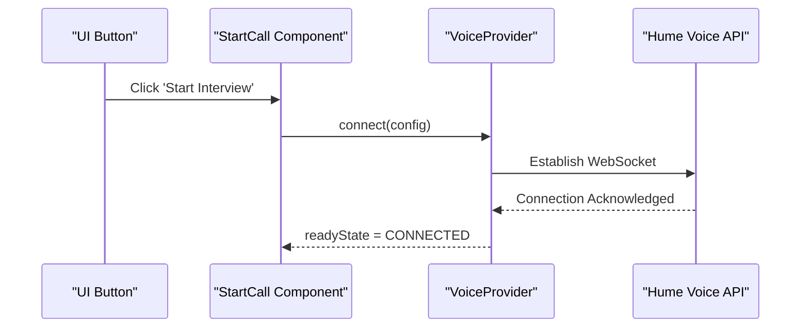
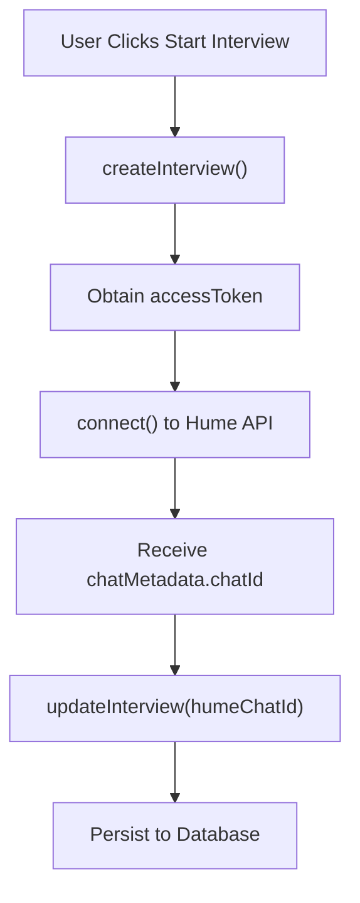
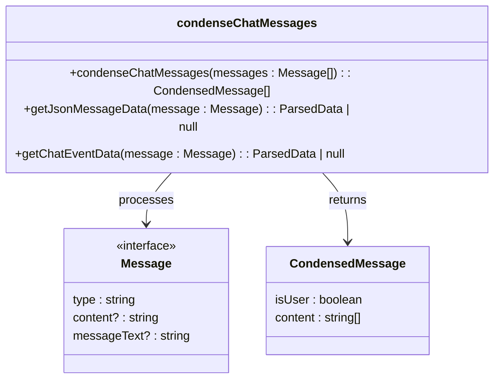
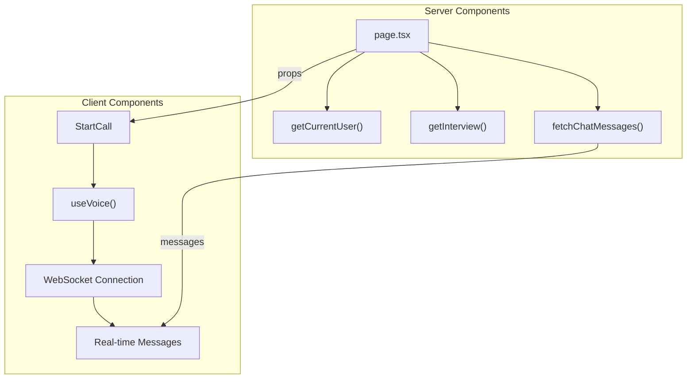
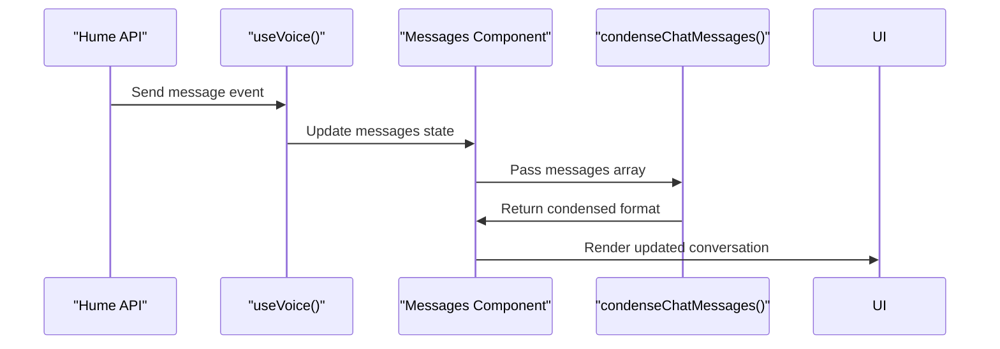
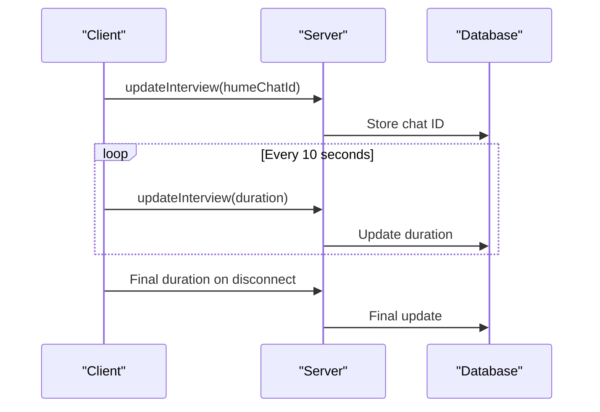

# Voice Interview Service

<cite>
**Referenced Files in This Document**
- [api.ts](file://src/services/hume/lib/api.ts)
- [condenseChatMessages.ts](file://src/services/hume/lib/condenseChatMessages.ts)
- [CondensedMessages.tsx](file://src/services/hume/components/CondensedMessages.tsx)
- [_StartCall.tsx](file://src/app/app/job-infos/[jobInfoId]/interviews/new/_StartCall.tsx)
- [page.tsx](file://src/app/app/job-infos/[jobInfoId]/interviews/[interviewId]/page.tsx)
</cite>

## Table of Contents
1. [Introduction](#introduction)
2. [WebSocket Connection Management](#websocket-connection-management)
3. [Chat Session and humeChatId Handling](#chat-session-and-humechatid-handling)
4. [Real-Time Audio Stream Processing](#real-time-audio-stream-processing)
5. [Message Optimization with condenseChatMessages](#message-optimization-with-condensechatmessages)
6. [React Server Component Integration](#react-server-component-integration)
7. [Live Transcription Data Handling](#live-transcription-data-handling)
8. [Connection Stability and Latency Mitigation](#connection-stability-and-latency-mitigation)
9. [State Synchronization Between Client and Server](#state-synchronization-between-client-and-server)
10. [Error Recovery and User Experience Continuity](#error-recovery-and-user-experience-continuity)

## Introduction
The Hume AI voice interview service enables real-time conversational interviews through WebSocket-based audio streaming and transcription. This document details the implementation of the service, focusing on connection management, message processing, and user experience optimization within a React application architecture.

## WebSocket Connection Management

The service establishes WebSocket connections to Hume's Voice API using the `@humeai/voice-react` SDK. The connection is initiated via the `useVoice()` hook, which provides access to voice session controls and state management.

**Diagram sources**
- [_StartCall.tsx](file://src/app/app/job-infos/[jobInfoId]/interviews/new/_StartCall.tsx#L79-L80)

**Section sources**
- [_StartCall.tsx](file://src/app/app/job-infos/[jobInfoId]/interviews/new/_StartCall.tsx#L38-L80)

## Chat Session and humeChatId Handling

Each interview session is uniquely identified by a `humeChatId`, which is synchronized between the client and server. Upon successful connection, the chat metadata containing the `chatId` is captured and persisted to the database.

The `humeChatId` serves as a reference for retrieving historical chat events and maintaining session continuity across page reloads or reconnections.

**Section sources**
- [_StartCall.tsx](file://src/app/app/job-infos/[jobInfoId]/interviews/new/_StartCall.tsx#L38-L45)
- [page.tsx](file://src/app/app/job-infos/[jobInfoId]/interviews/[interviewId]/page.tsx#L91-L153)

## Real-Time Audio Stream Processing

Audio streams are processed in real time using the Hume Empathic Voice API. The service captures microphone input, transmits it over the established WebSocket, and receives both transcribed text and emotional tone analysis.

Key components:
- Microphone input via browser Web Audio API
- FFT (Fast Fourier Transform) visualization for audio feedback
- Bidirectional message flow between client and AI agent
- Real-time transcription display

**Section sources**
- [_StartCall.tsx](file://src/app/app/job-infos/[jobInfoId]/interviews/new/_StartCall.tsx#L130-L197)

## Message Optimization with condenseChatMessages

The `condenseChatMessages()` utility function optimizes message payloads by grouping consecutive messages from the same sender, reducing redundancy and improving rendering efficiency.

This function handles multiple message types from both `@humeai/voice-react` and the Hume API, normalizing them into a unified format suitable for display.

**Diagram sources**
- [condenseChatMessages.ts](file://src/services/hume/lib/condenseChatMessages.ts#L0-L48)

**Section sources**
- [condenseChatMessages.ts](file://src/services/hume/lib/condenseChatMessages.ts#L0-L48)
- [CondensedMessages.tsx](file://src/services/hume/components/CondensedMessages.tsx#L0-L55)

## React Server Component Integration

The voice interview interface integrates with React Server Components through a hybrid client-server architecture. Server components handle data fetching and authentication, while client components manage real-time interactions.

The `VoiceProvider` component wraps client-side functionality, enabling access to voice session state throughout the component tree.

**Section sources**
- [page.tsx](file://src/app/app/job-infos/[jobInfoId]/interviews/[interviewId]/page.tsx#L0-L154)
- [_StartCall.tsx](file://src/app/app/job-infos/[jobInfoId]/interviews/new/_StartCall.tsx#L0-L197)

## Live Transcription Data Handling

Live transcription data flows through the `useVoice()` hook, which exposes the `messages` array and related state. The Messages component uses React's `useMemo` to efficiently process incoming messages:

Transcriptions are displayed with visual indicators showing speaker identity and real-time audio activity.

**Section sources**
- [_StartCall.tsx](file://src/app/app/job-infos/[jobInfoId]/interviews/new/_StartCall.tsx#L130-L197)

## Connection Stability and Latency Mitigation

The service implements several strategies to maintain connection stability and minimize latency:

- **Heartbeat Monitoring**: Regular pings to detect connection health
- **Reconnection Logic**: Automatic retry mechanisms for dropped connections
- **Buffering**: Temporary local storage of messages during network interruptions
- **Progressive Enhancement**: Graceful degradation when features fail

The system monitors `readyState` changes and provides visual feedback during connecting, connected, and closed states.

**Section sources**
- [_StartCall.tsx](file://src/app/app/job-infos/[jobInfoId]/interviews/new/_StartCall.tsx#L64-L78)

## State Synchronization Between Client and Server

Critical session state is synchronized between client and server to ensure data persistence and cross-device consistency:

- `humeChatId` synchronization upon connection
- Interview duration updates every 10 seconds
- Final duration capture on disconnect
- Database persistence of all session metadata

**Diagram sources**
- [_StartCall.tsx](file://src/app/app/job-infos/[jobInfoId]/interviews/new/_StartCall.tsx#L46-L63)

**Section sources**
- [_StartCall.tsx](file://src/app/app/job-infos/[jobInfoId]/interviews/new/_StartCall.tsx#L46-L63)

## Error Recovery and User Experience Continuity

The service prioritizes user experience continuity during network interruptions through:

- Persistent local state via React hooks
- Automated reconnection attempts
- Local caching of recent messages
- Clear error messaging with recovery options
- Session resumption from last known state

When disconnections occur, the system ensures interview duration is saved and redirects users to the appropriate session page, maintaining context and preventing data loss.

**Section sources**
- [_StartCall.tsx](file://src/app/app/job-infos/[jobInfoId]/interviews/new/_StartCall.tsx#L64-L78)
- [_StartCall.tsx](file://src/app/app/job-infos/[jobInfoId]/interviews/new/_StartCall.tsx#L79-L80)