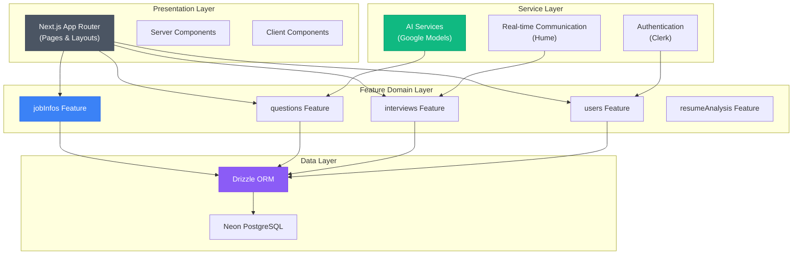
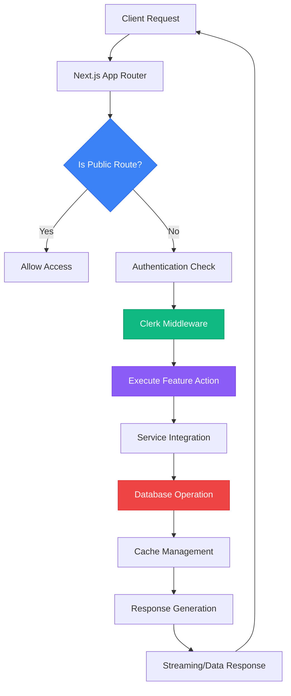
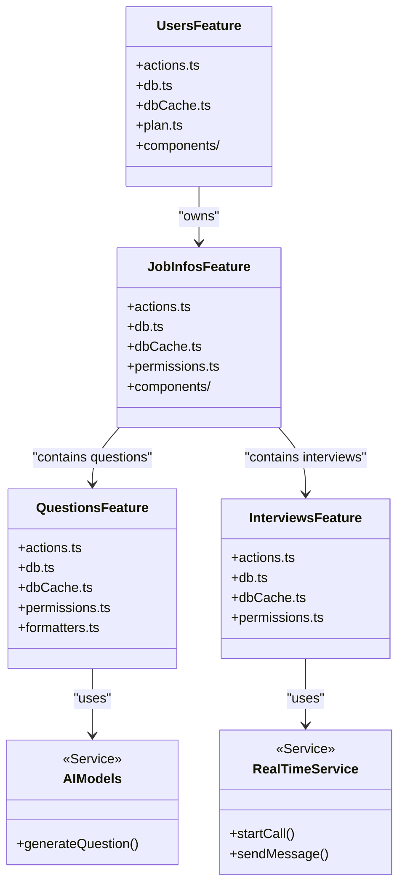
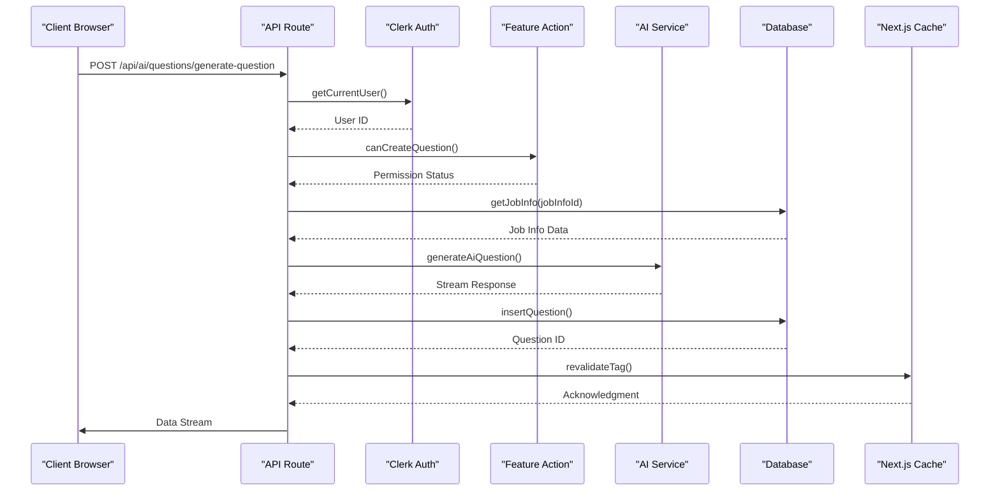
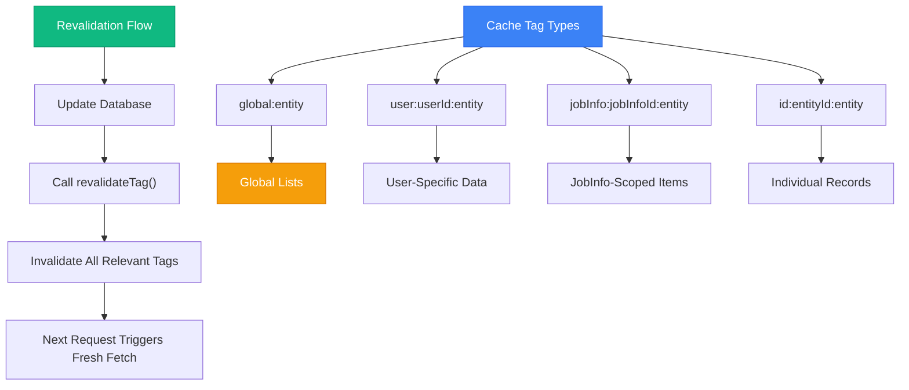

# Project Architecture

<cite>
**Referenced Files in This Document**   
- [middleware.ts](file://src/middleware.ts)
- [dataCache.ts](file://src/lib/dataCache.ts)
- [errorToast.tsx](file://src/lib/errorToast.tsx)
- [db.ts](file://src/drizzle/db.ts)
- [generate-question/route.ts](file://src/app/api/ai/questions/generate-question/route.ts)
- [jobInfos/dbCache.ts](file://src/features/jobInfos/dbCache.ts)
- [questions/dbCache.ts](file://src/features/questions/dbCache.ts)
- [interviews/dbCache.ts](file://src/features/interviews/dbCache.ts)
- [users/dbCache.ts](file://src/features/users/dbCache.ts)
</cite>

## Table of Contents
1. [Introduction](#introduction)
2. [Project Structure](#project-structure)
3. [Layered Architecture Overview](#layered-architecture-overview)
4. [Domain-Driven Design in src/features](#domain-driven-design-in-srcfeatures)
5. [Component Interactions and Data Flows](#component-interactions-and-data-flows)
6. [Key Architectural Decisions](#key-architectural-decisions)
7. [Cross-Cutting Concerns](#cross-cutting-concerns)
8. [System Context Diagram](#system-context-diagram)
9. [Conclusion](#conclusion)

## Introduction
The darasa application is a Next.js-based platform designed to support AI-powered job interview preparation through structured data management, intelligent question generation, and real-time user interactions. The architecture follows modern full-stack principles with a strong emphasis on separation of concerns, domain-driven organization, and performance optimization. This document provides a comprehensive overview of the system's high-level design, layered structure, component interactions, and key technical decisions that shape its scalability and maintainability.

## Project Structure
The project is organized using a feature-centric, domain-driven approach within the `src` directory. Key structural elements include:
- `app`: Contains the Next.js App Router pages, layouts, and API routes
- `components`: Reusable UI components, including both custom and ShadCN-based primitives
- `drizzle`: Database configuration, schema definitions, and ORM integration
- `features`: Domain-specific modules encapsulating business logic, permissions, and data access
- `lib`: Shared utilities, caching strategies, and error handling mechanisms
- `services`: External service integrations (AI, Clerk, Hume) and their abstractions
- Root configuration files for Next.js, Drizzle, ESLint, Tailwind, and Docker

This organization enables clear boundaries between concerns while promoting reusability and testability across domains.



**Diagram sources**
- [app/page.tsx](file://src/app/page.tsx)
- [features/jobInfos/actions.ts](file://src/features/jobInfos/actions.ts)
- [services/ai/models/google.ts](file://src/services/ai/models/google.ts)
- [drizzle/db.ts](file://src/drizzle/db.ts)

**Section sources**
- [src/app](file://src/app)
- [src/features](file://src/features)
- [src/services](file://src/services)
- [src/drizzle](file://src/drizzle)

## Layered Architecture Overview
The application implements a clean layered architecture that separates concerns across four primary layers:

### Presentation Layer (Next.js App Router)
The presentation layer leverages Next.js App Router for server-side rendering, route handling, and component composition. It distinguishes between Server Components (handling data fetching and business logic) and Client Components (managing interactivity). Pages are organized by feature domains (e.g., `/app/job-infos`, `/app/interviews`) with nested routing for complex workflows.

### Service Layer (src/services)
Located in `src/services`, this layer abstracts external integrations including:
- AI services using Google models for question generation
- Clerk for authentication and user management
- Hume for real-time communication during interviews

Each service provides a clean interface that decouples business logic from implementation details, enabling easier testing and future replacements.

### Feature Domain Logic (src/features)
The `src/features` directory contains domain-specific modules (`jobInfos`, `questions`, `interviews`, etc.) that encapsulate business rules, permissions, and use cases. Each feature follows a consistent internal structure with actions, database access, caching, and permission checks, promoting uniformity across domains.

### Data Layer (Drizzle ORM)
The data layer uses Drizzle ORM with Neon PostgreSQL for type-safe database interactions. The schema is defined in `src/drizzle/schema` with migrations managed through Drizzle Kit. Database connections are optimized with connection caching for serverless environments.



**Diagram sources**
- [middleware.ts](file://src/middleware.ts)
- [generate-question/route.ts](file://src/app/api/ai/questions/generate-question/route.ts)
- [db.ts](file://src/drizzle/db.ts)

**Section sources**
- [src/app](file://src/app)
- [src/middleware.ts](file://src/middleware.ts)
- [src/services](file://src/services)

## Domain-Driven Design in src/features
The `src/features` directory exemplifies domain-driven design principles by organizing code around business capabilities rather than technical layers. Each feature module (e.g., `jobInfos`, `questions`) represents a bounded context with well-defined responsibilities:

- **Encapsulation**: Each feature contains its own actions, database access, caching, and permissions
- **Consistency**: Uniform file naming and structure across features (actions.ts, db.ts, dbCache.ts, permissions.ts)
- **Separation**: Clear boundaries between domain logic and infrastructure concerns
- **Reusability**: Shared patterns like cache-tag based revalidation implemented consistently

For example, the `jobInfos` feature manages job information lifecycle operations, while `questions` handles question generation and storage—all with independent but coordinated data access patterns.



**Diagram sources**
- [features/jobInfos](file://src/features/jobInfos)
- [features/questions](file://src/features/questions)
- [features/interviews](file://src/features/interviews)
- [features/users](file://src/features/users)

**Section sources**
- [src/features](file://src/features)
- [features/jobInfos](file://src/features/jobInfos)
- [features/questions](file://src/features/questions)

## Component Interactions and Data Flows
Component interactions follow the Server Actions pattern prevalent throughout the application. Key interaction patterns include:

- **API Routes**: Handle external requests (e.g., AI question generation) with proper authentication and validation
- **Server Actions**: Perform mutations and queries on the server with automatic hydration
- **Data Streaming**: Utilize `createDataStreamResponse` for progressive content delivery (e.g., AI-generated questions)
- **Cache-Aware Queries**: Leverage `"use cache"` directives with tag-based invalidation for optimal performance

Data flows typically follow this path: API Route → Authentication → Permission Check → Business Logic → Service Integration → Database Operation → Cache Management → Response.



**Diagram sources**
- [generate-question/route.ts](file://src/app/api/ai/questions/generate-question/route.ts)
- [services/ai/questions.ts](file://src/services/ai/questions.ts)
- [features/questions/db.ts](file://src/features/questions/db.ts)

**Section sources**
- [src/app/api](file://src/app/api)
- [src/services/ai](file://src/services/ai)
- [src/features/questions](file://src/features/questions)

## Key Architectural Decisions
Several strategic architectural decisions shape the system's behavior and performance characteristics:

### Cache-Tag Based Revalidation Strategy
Implemented in `dataCache.ts` and feature-specific `dbCache.ts` files, this strategy uses hierarchical cache tags (`global:entity`, `user:userId:entity`, `id:entityId:entity`) to enable precise cache invalidation. When data changes, all relevant tags are revalidated, ensuring consistency while maximizing cache hit rates.

### Middleware-Based Authentication
The `middleware.ts` file implements authentication using Clerk's middleware with route matching to distinguish public and protected routes. Webhook endpoints are explicitly excluded from authentication requirements, allowing external services to communicate with the application.

### Modular Component Composition
UI components are organized in a modular fashion with reusable primitives in `components/ui` (based on ShadCN) and higher-level domain components within each feature. This promotes consistency while allowing domain-specific customization.



**Diagram sources**
- [dataCache.ts](file://src/lib/dataCache.ts)
- [jobInfos/dbCache.ts](file://src/features/jobInfos/dbCache.ts)
- [questions/dbCache.ts](file://src/features/questions/dbCache.ts)
- [middleware.ts](file://src/middleware.ts)

**Section sources**
- [src/lib/dataCache.ts](file://src/lib/dataCache.ts)
- [src/features/*/dbCache.ts](file://src/features)
- [src/middleware.ts](file://src/middleware.ts)

## Cross-Cutting Concerns
The architecture addresses several cross-cutting concerns through centralized implementations:

### Security
Security is handled through Clerk authentication in middleware, with additional permission checks in feature domains. API routes validate user ownership of resources before processing requests, preventing unauthorized access.

### Error Handling
Error handling is standardized through `errorToast.tsx`, which provides user-friendly feedback for common scenarios like plan limits and rate limiting. The `errorToast` function displays appropriate messages with contextual actions (e.g., upgrade prompts).

### Performance Optimization
Performance is enhanced through multiple strategies:
- Connection pooling with Neon's cache
- Selective data revalidation using cache tags
- Streaming responses for AI-generated content
- Server-side rendering for improved initial load times

```mermaid
flowchart TD
    A[Error Occurs] --> B{Error Type}
    B -->|PLAN_LIMIT_MESSAGE| C["Show Upgrade Prompt"]
    B -->|RATE_LIMIT_MESSAGE| D["Show Rate Limit Warning"]
    B -->|Other Error| E["Show Generic Error"]
    
    C --> F["Include Upgrade Button"]
    D --> G["Add Retry Instructions"]
    E --> H["Display Raw Message"]
    
    I[Performance Strategy] --> J["Connection Caching"]
    I --> K["Tag-Based Revalidation"]
    I --> L["Response Streaming"]
    I --> M["Server-Side Rendering"]
    
   