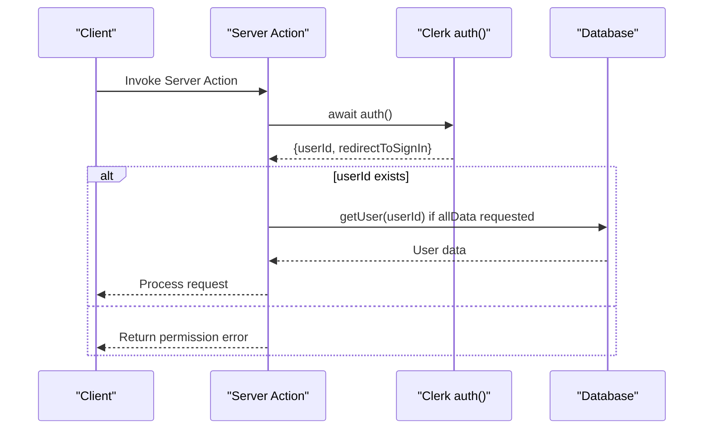
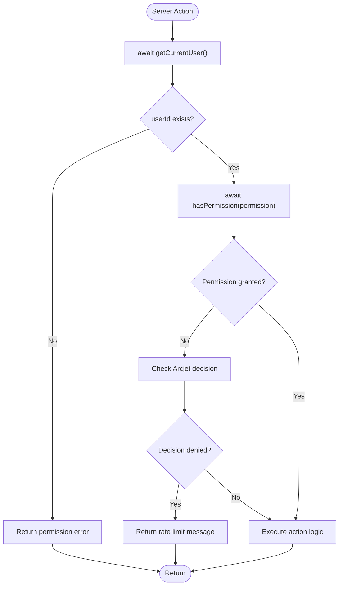
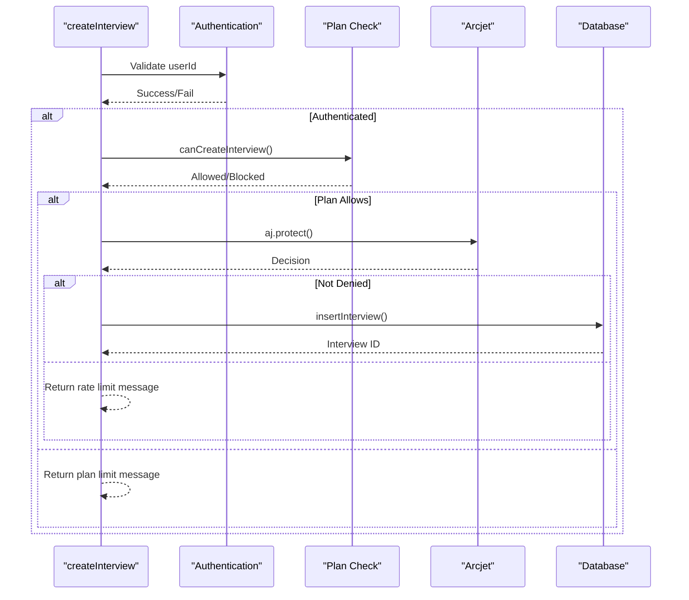
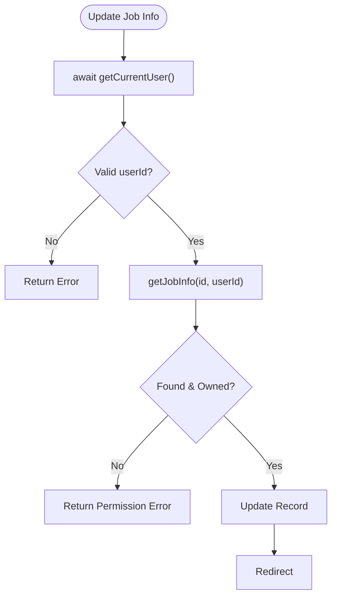

# Authentication and Authorization in Server Actions

<cite>
**Referenced Files in This Document**   
- [getCurrentUser.ts](file://src/services/clerk/lib/getCurrentUser.ts)
- [hasPermission.ts](file://src/services/clerk/lib/hasPermission.ts)
- [jobInfos/actions.ts](file://src/features/jobInfos/actions.ts)
- [interviews/actions.ts](file://src/features/interviews/actions.ts)
- [middleware.ts](file://src/middleware.ts)
</cite>

## Table of Contents
1. [Introduction](#introduction)
2. [Core Authentication Mechanism](#core-authentication-mechanism)
3. [Authorization and Permission Checks](#authorization-and-permission-checks)
4. [Server Action Protection Patterns](#server-action-protection-patterns)
5. [Resource Ownership Validation](#resource-ownership-validation)
6. [Error Handling and User Feedback](#error-handling-and-user-feedback)
7. [Security Best Practices](#security-best-practices)
8. [Integration with Next.js Utilities](#integration-with-nextjs-utilities)

## Introduction
This document details the authentication and authorization mechanisms implemented in server actions within the application. It explains how user identity is securely retrieved, validated, and enforced across protected operations, ensuring that only authenticated users with appropriate permissions can access specific functionality. The system leverages Clerk for authentication state management and implements a layered security approach through server-side validation.

## Core Authentication Mechanism

The foundation of the authentication system is built around the `getCurrentUser` function from the Clerk integration layer. This utility retrieves the current user's session state and provides essential identity information to server actions.



**Diagram sources**
- [getCurrentUser.ts](file://src/services/clerk/lib/getCurrentUser.ts#L7-L15)

**Section sources**
- [getCurrentUser.ts](file://src/services/clerk/lib/getCurrentUser.ts#L7-L24)

### getCurrentUser Implementation
The `getCurrentUser` function serves as the primary interface for retrieving authenticated user context. It returns three key pieces:
- `userId`: The unique identifier from Clerk's authentication system
- `redirectToSignIn`: A utility function for redirecting unauthenticated users
- `user`: Optional full user object when `allData = true` is specified

The function uses Clerk's `auth()` method to extract session information and conditionally fetches additional user data from the database when needed, leveraging caching via `cacheTag` for performance optimization.

## Authorization and Permission Checks

Beyond basic authentication, the system implements fine-grained authorization through feature-based permissions managed by Clerk's feature flags system.



**Diagram sources**
- [hasPermission.ts](file://src/services/clerk/lib/hasPermission.ts#L11-L14)
- [interviews/actions.ts](file://src/features/interviews/actions.ts#L20-L35)

**Section sources**
- [hasPermission.ts](file://src/services/clerk/lib/hasPermission.ts#L1-L15)

### Permission System Design
The `hasPermission` function enables feature-level access control by checking Clerk feature flags against predefined permission types:

- `unlimited_resume_analysis`
- `unlimited_interviews` (with tolerance for singular form `unlimited_interview`)
- `unlimited_questions`
- Tiered limits like `1_interview`, `5_questions`

This pattern allows flexible subscription-based access control where different user plans grant varying capabilities.

## Server Action Protection Patterns

All server actions follow a consistent security pattern that validates user authentication at entry points and enforces access controls before processing business logic.

### Standard Authentication Check
Every server action begins with retrieving the current user context:

```typescript
const { userId } = await getCurrentUser();
if (userId == null) {
  return { error: true, message: "You don't have permission to do this" };
}
```

This early return pattern prevents unauthorized execution and ensures minimal processing for unauthenticated requests.

### Combined Permission and Rate Limiting
For premium features like interview creation, multiple layers of protection are applied:



**Diagram sources**
- [interviews/actions.ts](file://src/features/interviews/actions.ts#L39-L65)

**Section sources**
- [interviews/actions.ts](file://src/features/interviews/actions.ts#L39-L85)

## Resource Ownership Validation

Beyond authentication, the system verifies resource ownership to prevent unauthorized access to specific records, implementing the principle of least privilege.

### Job Information Flow
When accessing job information, the system confirms both authentication and ownership:



**Diagram sources**
- [jobInfos/actions.ts](file://src/features/jobInfos/actions.ts#L30-L45)

**Section sources**
- [jobInfos/actions.ts](file://src/features/jobInfos/actions.ts#L25-L121)

### Interview Creation Flow
The interview creation process demonstrates multi-layered validation:

1. User authentication check
2. Subscription plan verification (`canCreateInterview`)
3. Rate limiting via Arcjet
4. Job information ownership validation

This ensures that users can only create interviews for their own job descriptions while respecting usage limits.

## Error Handling and User Feedback

The system implements consistent error messaging and handling patterns to provide clear feedback while maintaining security.

### Common Issues and Solutions
- **Null userId**: Handled uniformly across all actions with standardized error response
- **Permission denial**: Early returns prevent unnecessary processing
- **Ownership validation failures**: Treated as permission errors rather than exposing record existence
- **Rate limiting**: Distinct messaging separates plan limits from rate limits

Error messages avoid revealing sensitive information about record existence or system internals, adhering to security best practices.

**Section sources**
- [jobInfos/actions.ts](file://src/features/jobInfos/actions.ts#L30-L45)
- [interviews/actions.ts](file://src/features/interviews/actions.ts#L50-L60)

## Security Best Practices

The implementation follows several key security principles:

### Defense in Depth
Multiple layers of protection are applied:
- Middleware-level route protection
- Server action authentication checks
- Fine-grained permission validation
- Rate limiting and bot detection

### Secure Defaults
- All routes are private by default unless explicitly marked as public
- Database queries always include user ID filters
- Sensitive operations require explicit permission checks

### Data Protection
- User data exposure is minimized
- Error messages don't leak system information
- Direct object references are prevented through ownership validation

**Section sources**
- [middleware.ts](file://src/middleware.ts#L1-L53)
- [jobInfos/actions.ts](file://src/features/jobInfos/actions.ts#L25-L121)

## Integration with Next.js Utilities

The authentication system integrates seamlessly with Next.js features for optimal user experience.

### Redirect Management
Authenticated actions use Next.js `redirect()` for navigation after successful operations, while unauthenticated requests could utilize `redirectToSignIn` from Clerk (currently implemented through component-level checks).

### Middleware Configuration
The middleware configuration protects routes at the edge:

```typescript
const isPublicRoute = createRouteMatcher([
  "/sign-in(.*)",
  "/",
  "/api/webhooks(.*)",
]);
```

This ensures that only explicitly public routes are accessible without authentication, while all other paths require valid sessions.

**Section sources**
- [middleware.ts](file://src/middleware.ts#L1-L53)
- [jobInfos/actions.ts](file://src/features/jobInfos/actions.ts#L25-L121)