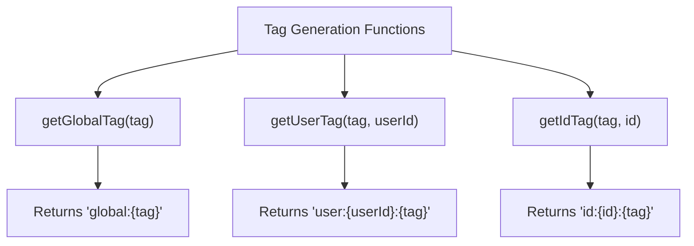
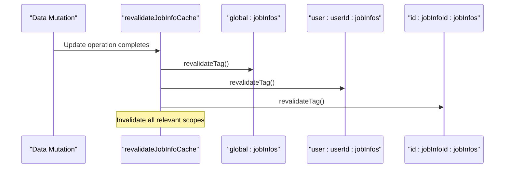
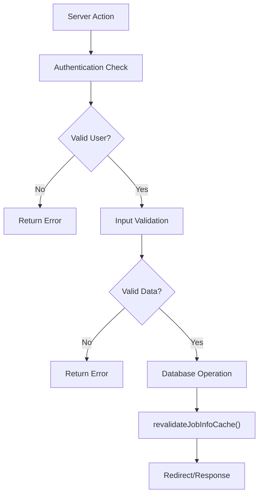
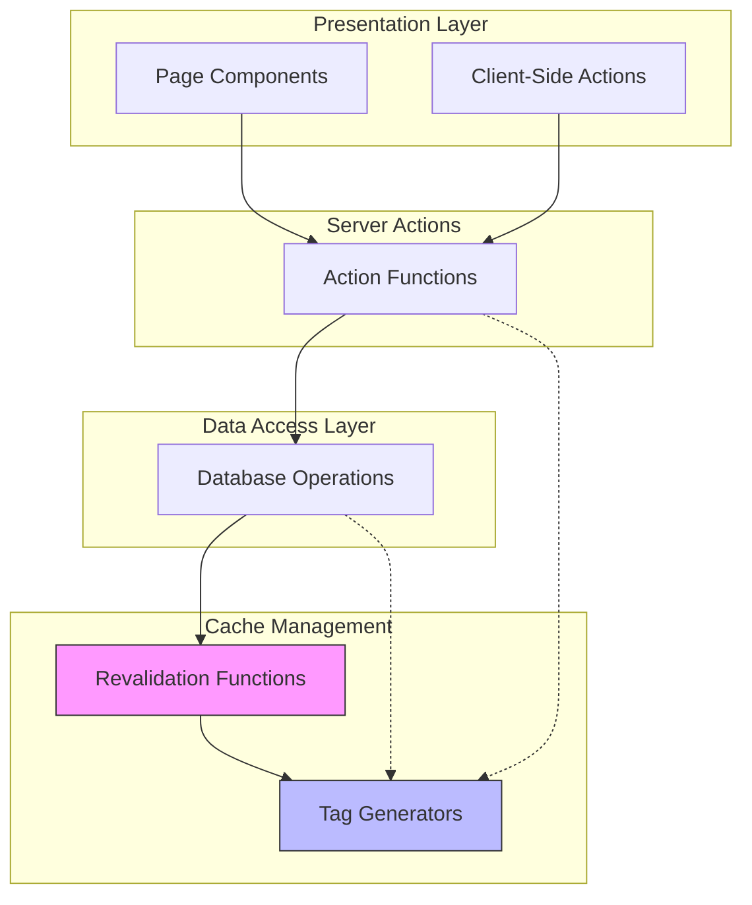

# Cache Tagging and Revalidation Strategy

<cite>
**Referenced Files in This Document**   
- [dataCache.ts](file://src/lib/dataCache.ts)
- [jobInfos/dbCache.ts](file://src/features/jobInfos/dbCache.ts)
- [jobInfos/actions.ts](file://src/features/jobInfos/actions.ts)
- [jobInfos/db.ts](file://src/features/jobInfos/db.ts)
</cite>

## Table of Contents
1. [Introduction](#introduction)
2. [Core Components](#core-components)
3. [Tag Generation Strategy](#tag-generation-strategy)
4. [Revalidation Mechanism](#revalidation-mechanism)
5. [Implementation in Server Actions](#implementation-in-server-actions)
6. [Cache Application in Data Retrieval](#cache-application-in-data-retrieval)
7. [Architecture Overview](#architecture-overview)
8. [Best Practices](#best-practices)
9. [Common Issues and Debugging](#common-issues-and-debugging)

## Introduction
This document details the cache management strategy implemented in the application using Next.js cache tags and revalidation utilities. The system employs a hierarchical tagging approach to enable selective cache invalidation, ensuring data consistency while maximizing performance benefits. The strategy revolves around three primary scopes: global, user-scoped, and resource-specific caching, coordinated through centralized helper functions.

## Core Components
The cache management system consists of several key components working in concert:
- **dataCache.ts**: Central utility for generating standardized cache tags
- **dbCache.ts**: Feature-specific revalidation functions that use tag generators
- **actions.ts**: Server actions that trigger mutations and subsequent revalidation
- **db.ts**: Database operations that invoke revalidation after persistence

These components form a cohesive system where data mutations automatically trigger appropriate cache invalidation across relevant scopes.

**Section sources**
- [dataCache.ts](file://src/lib/dataCache.ts#L1-L16)
- [jobInfos/dbCache.ts](file://src/features/jobInfos/dbCache.ts#L1-L25)
- [jobInfos/actions.ts](file://src/features/jobInfos/actions.ts#L1-L121)
- [jobInfos/db.ts](file://src/features/jobInfos/db.ts#L1-L54)

## Tag Generation Strategy
The application implements a systematic approach to cache tag generation through the `dataCache.ts` utility. This file defines a type-safe interface for creating consistent cache tags across different scopes:

- **Global tags**: Format `global:{resource}` (e.g., `global:jobInfos`) for application-wide data
- **User-scoped tags**: Format `user:{userId}:{resource}` for user-specific data collections
- **Resource-specific tags**: Format `id:{resourceId}:{resource}` for individual entity caching

The tag generation functions ensure naming consistency and prevent errors from manual string construction. Each function returns a const assertion to maintain type safety throughout the application.



**Diagram sources**
- [dataCache.ts](file://src/lib/dataCache.ts#L3-L16)

**Section sources**
- [dataCache.ts](file://src/lib/dataCache.ts#L3-L16)

## Revalidation Mechanism
The revalidation mechanism is implemented through feature-specific functions that invalidate multiple cache levels simultaneously. When a data mutation occurs, the system invalidates caches at all relevant scopes to ensure consistency:

- **Global scope**: Invalidates cached lists or summaries accessible to all users
- **User scope**: Invalidates user-specific collections or dashboards
- **Resource scope**: Invalidates the specific entity cache for direct access

The `revalidateJobInfoCache` function demonstrates this multi-level invalidation pattern, calling `revalidateTag` for each scope defined by the corresponding tag generator functions. This ensures that any cached representation of the affected data is refreshed on subsequent requests.



**Diagram sources**
- [jobInfos/dbCache.ts](file://src/features/jobInfos/dbCache.ts#L10-L25)

**Section sources**
- [jobInfos/dbCache.ts](file://src/features/jobInfos/dbCache.ts#L10-L25)

## Implementation in Server Actions
Server actions integrate cache revalidation directly into their workflow, ensuring that every successful mutation triggers appropriate cache invalidation. The action flow follows a consistent pattern:

1. Authentication and permission validation
2. Input validation using Zod schemas
3. Database operation execution
4. Automatic cache revalidation via db layer
5. Client redirection or response

The database operations in `db.ts` serve as the integration point, calling `revalidateJobInfoCache` after each successful insert, update, or delete operation. This separation of concerns keeps the action logic focused on business rules while ensuring cache consistency is maintained.



**Diagram sources**
- [jobInfos/actions.ts](file://src/features/jobInfos/actions.ts#L1-L121)
- [jobInfos/db.ts](file://src/features/jobInfos/db.ts#L1-L54)

**Section sources**
- [jobInfos/actions.ts](file://src/features/jobInfos/actions.ts#L1-L121)
- [jobInfos/db.ts](file://src/features/jobInfos/db.ts#L1-L54)

## Cache Application in Data Retrieval
Data retrieval functions apply cache tags to enable automatic invalidation when related data changes. The `getJobInfo` function in `actions.ts` demonstrates this pattern by using the `"use cache"` directive and applying a resource-specific cache tag:

```typescript
async function getJobInfo(id: string, userId: string) {
  "use cache";
  cacheTag(getJobInfoIdTag(id));
  // database query
}
```

This approach ensures that when `revalidateTag` is called with the same tag identifier, the cached result is invalidated and will be regenerated on the next request. The combination of cache tagging on reads and targeted revalidation on writes creates an efficient system that minimizes unnecessary data fetching while guaranteeing freshness.

**Section sources**
- [jobInfos/actions.ts](file://src/features/jobInfos/actions.ts#L105-L115)

## Architecture Overview
The cache management architecture follows a layered approach with clear separation of responsibilities:



**Diagram sources**
- [dataCache.ts](file://src/lib/dataCache.ts#L1-L16)
- [jobInfos/dbCache.ts](file://src/features/jobInfos/dbCache.ts#L1-L25)
- [jobInfos/actions.ts](file://src/features/jobInfos/actions.ts#L1-L121)
- [jobInfos/db.ts](file://src/features/jobInfos/db.ts#L1-L54)

## Best Practices
The implementation demonstrates several best practices for effective cache management:

- **Consistent naming**: Centralized tag generation ensures uniform tag formats
- **Multi-level invalidation**: Updates invalidate caches at all relevant scopes
- **Separation of concerns**: Cache logic is separated from business logic
- **Type safety**: Const assertions and typed parameters prevent runtime errors
- **Automatic integration**: Revalidation is triggered automatically by data operations

These practices ensure that the cache system is reliable, maintainable, and scalable as the application grows.

**Section sources**
- [dataCache.ts](file://src/lib/dataCache.ts#L1-L16)
- [jobInfos/dbCache.ts](file://src/features/jobInfos/dbCache.ts#L1-L25)

## Common Issues and Debugging
Several common issues can arise with cache tag implementations:

- **Missing tags**: Forgetting to apply `cacheTag` to data retrieval functions results in uncontrolled caching
- **Incorrect scope**: Using overly broad or narrow tags affects performance and data freshness
- **Inconsistent naming**: Manual tag construction can lead to typos and mismatched tags
- **Over-revalidation**: Invalidating too many tags impacts performance

To debug cache behavior, developers should:
1. Verify that all data retrieval functions use appropriate cache tags
2. Check that revalidation calls match tag generation exactly
3. Monitor Next.js server logs for cache hit/miss patterns
4. Use consistent tag formats across the application

The centralized tag generation in `dataCache.ts` mitigates many of these issues by providing a single source of truth for tag formats.

**Section sources**
- [dataCache.ts](file://src/lib/dataCache.ts#L1-L16)
- [jobInfos/dbCache.ts](file://src/features/jobInfos/dbCache.ts#L1-L25)
- [jobInfos/actions.ts](file://src/features/jobInfos/actions.ts#L1-L121)