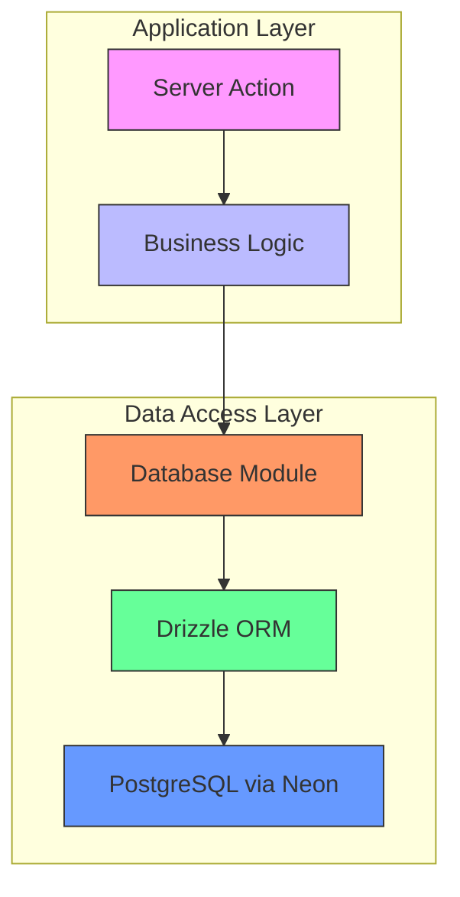
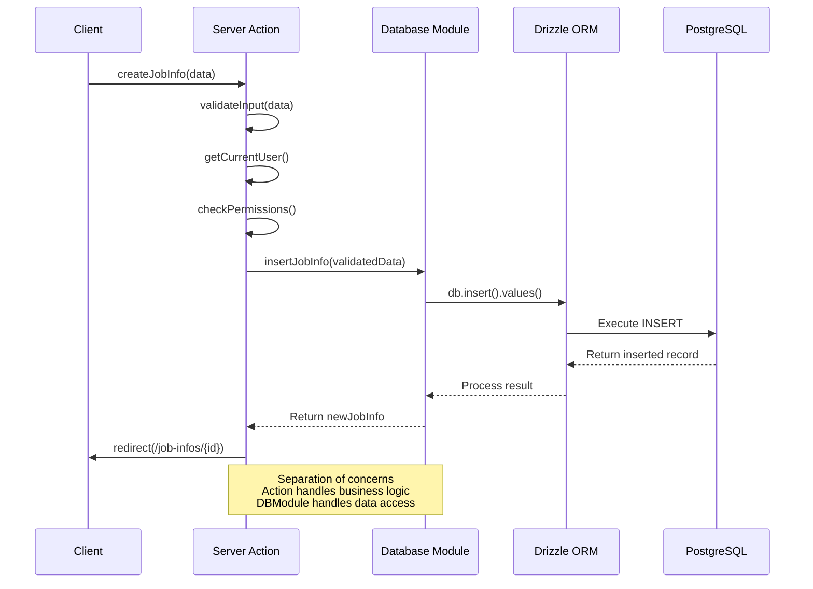
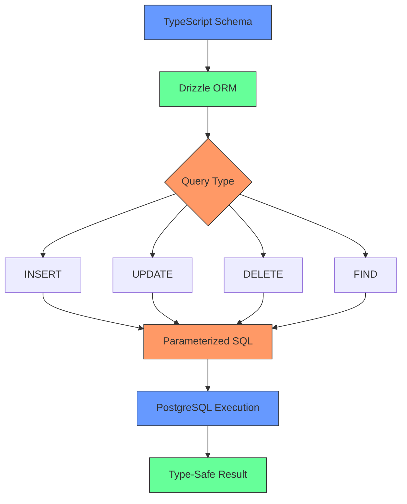
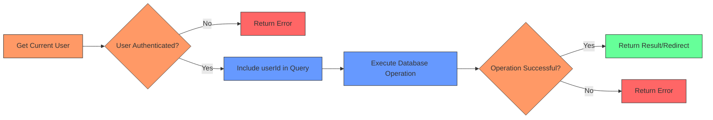
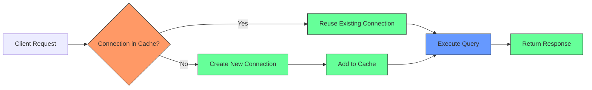

# Data Persistence and Database Operations

<cite>
**Referenced Files in This Document**  
- [src/features/jobInfos/db.ts](file://src/features/jobInfos/db.ts)
- [src/features/interviews/db.ts](file://src/features/interviews/db.ts)
- [src/features/jobInfos/actions.ts](file://src/features/jobInfos/actions.ts)
- [src/features/interviews/actions.ts](file://src/features/interviews/actions.ts)
- [src/drizzle/schema/jobinfo.ts](file://src/drizzle/schema/jobinfo.ts)
- [src/drizzle/schema/interview.ts](file://src/drizzle/schema/interview.ts)
- [src/drizzle/db.ts](file://src/drizzle/db.ts)
</cite>

## Table of Contents
1. [Introduction](#introduction)
2. [Data Persistence Architecture](#data-persistence-architecture)
3. [Database Module Design](#database-module-design)
4. [Server Actions and Database Interaction](#server-actions-and-database-interaction)
5. [Drizzle ORM Implementation](#drizzle-orm-implementation)
6. [Authorization and Security Patterns](#authorization-and-security-patterns)
7. [Error Handling and Transaction Integrity](#error-handling-and-transaction-integrity)
8. [Connection Management and Performance](#connection-management-and-performance)
9. [Type Safety with $inferInsert](#type-safety-with-inferinsert)
10. [Debugging Database Issues](#debugging-database-issues)

## Introduction

This document details the data persistence patterns implemented in the Server Actions architecture, focusing on how database operations are delegated to dedicated modules using Drizzle ORM. The system follows a clean separation of concerns between business logic in actions and data access in dedicated database modules. Key aspects include type-safe SQL queries, transactional integrity, proper authorization through userId filtering, and optimized connection management.

The implementation demonstrates best practices for handling job information and interview records, showing how validated input is mapped to database operations while maintaining security and performance.

## Data Persistence Architecture

The application implements a layered architecture for data persistence that separates concerns between server actions, business logic, and database operations. This pattern ensures that database interactions are encapsulated within dedicated modules, promoting reusability, testability, and maintainability.



**Diagram sources**
- [src/features/jobInfos/actions.ts](file://src/features/jobInfos/actions.ts)
- [src/features/jobInfos/db.ts](file://src/features/jobInfos/db.ts)
- [src/drizzle/db.ts](file://src/drizzle/db.ts)

**Section sources**
- [src/features/jobInfos/actions.ts](file://src/features/jobInfos/actions.ts)
- [src/features/jobInfos/db.ts](file://src/features/jobInfos/db.ts)

## Database Module Design

Database operations are encapsulated within dedicated `db.ts` modules in each feature directory, following the principle of separation of concerns. Each module exports CRUD operations as standalone functions that can be imported and used by server actions.

The design pattern includes:
- Dedicated insert, update, delete, and find operations
- Cache invalidation after mutations
- Minimal data return for redirection purposes
- Type safety through Drizzle's inference system

```mermaid
classDiagram
class JobInfoDB {
+insertJobInfo(jobInfo) : Promise~JobInfoIdentifier~
+updateJobInfo(id, jobInfo) : Promise~JobInfoIdentifier~
+deleteJobInfo(id) : Promise~JobInfoIdentifier~
}
class InterviewDB {
+insertInterview(interview) : Promise~InterviewIdentifier~
+updateInterview(id, interview) : Promise~InterviewIdentifier~
}
class CacheManager {
+revalidateJobInfoCache(identifier)
+revalidateInterviewCache(identifier)
}
JobInfoDB --> CacheManager : "invalidates"
InterviewDB --> CacheManager : "invalidates"
JobInfoDB ..> "Drizzle ORM" : "uses"
InterviewDB ..> "Drizzle ORM" : "uses"
```

**Diagram sources**
- [src/features/jobInfos/db.ts](file://src/features/jobInfos/db.ts#L10-L54)
- [src/features/interviews/db.ts](file://src/features/interviews/db.ts#L1-L31)
- [src/features/jobInfos/dbCache.ts](file://src/features/jobInfos/dbCache.ts)

**Section sources**
- [src/features/jobInfos/db.ts](file://src/features/jobInfos/db.ts)
- [src/features/interviews/db.ts](file://src/features/interviews/db.ts)

## Server Actions and Database Interaction

Server actions delegate database operations to the dedicated database modules rather than performing direct database queries. This separation allows actions to focus on business logic, authentication, and input validation while database modules handle data access concerns.

The interaction flow follows this pattern:
1. Server action receives and validates input
2. Authentication check for current user
3. Authorization check to ensure user owns the resource
4. Delegation to database module function
5. Redirection or response based on result



**Diagram sources**
- [src/features/jobInfos/actions.ts](file://src/features/jobInfos/actions.ts#L25-L45)
- [src/features/jobInfos/db.ts](file://src/features/jobInfos/db.ts#L10-L19)

**Section sources**
- [src/features/jobInfos/actions.ts](file://src/features/jobInfos/actions.ts)
- [src/features/interviews/actions.ts](file://src/features/interviews/actions.ts)

## Drizzle ORM Implementation

The application uses Drizzle ORM for type-safe SQL queries, leveraging its TypeScript-first approach to ensure database operations are compile-time checked. The implementation includes various query types:

### Insert Operations
```typescript
const [newJobInfo] = await db.insert(JobInfoTable).values(jobInfo).returning({
  id: JobInfoTable.id,
  userId: JobInfoTable.userId,
});
```

### Update Operations
```typescript
const [updatedJobInfo] = await db
  .update(JobInfoTable)
  .set(jobInfo)
  .where(eq(JobInfoTable.id, id))
  .returning({
    id: JobInfoTable.id,
    userId: JobInfoTable.userId,
  });
```

### Find Operations with Filtering
```typescript
return db.query.JobInfoTable.findFirst({
  where: and(eq(JobInfoTable.id, id), eq(JobInfoTable.userId, userId)),
});
```

The ORM provides several benefits:
- Type safety through inferred types from schema definitions
- SQL injection protection via parameterized queries
- Fluent API for building complex queries
- Proper TypeScript integration with autocomplete and error checking



**Diagram sources**
- [src/drizzle/schema/jobinfo.ts](file://src/drizzle/schema/jobinfo.ts)
- [src/features/jobInfos/db.ts](file://src/features/jobInfos/db.ts)
- [src/features/jobInfos/actions.ts](file://src/features/jobInfos/actions.ts)

**Section sources**
- [src/features/jobInfos/db.ts](file://src/features/jobInfos/db.ts)
- [src/drizzle/schema/jobinfo.ts](file://src/drizzle/schema/jobinfo.ts)

## Authorization and Security Patterns

All database operations implement strict authorization patterns by filtering queries based on the authenticated user's ID. This ensures that users can only access or modify their own data, preventing unauthorized access to other users' records.

The authorization flow includes:
1. Retrieving the current user's identity
2. Including userId in all WHERE clauses for data retrieval
3. Validating ownership before mutation operations
4. Returning minimal identifiers for redirection



Key security practices:
- All find operations include userId filtering
- Mutation operations verify ownership before execution
- Minimal data exposure in returned results
- Use of parameterized queries to prevent SQL injection

**Diagram sources**
- [src/features/jobInfos/actions.ts](file://src/features/jobInfos/actions.ts#L25-L35)
- [src/features/interviews/actions.ts](file://src/features/interviews/actions.ts#L74-L85)

**Section sources**
- [src/features/jobInfos/actions.ts](file://src/features/jobInfos/actions.ts)
- [src/features/interviews/actions.ts](file://src/features/interviews/actions.ts)

## Error Handling and Transaction Integrity

The database operations implement robust error handling to maintain data consistency and provide meaningful feedback. While the current implementation relies on Drizzle ORM's built-in transaction handling for individual operations, it includes several error management patterns:

- Try-catch blocks around database operations (implied by async/await)
- Validation of operation results before proceeding
- Cache invalidation only on successful operations
- Meaningful error messages returned to the client

For critical operations that require multiple database changes, the pattern would extend to explicit transactions:

```typescript
await db.transaction(async (tx) => {
  await tx.insert(JobInfoTable).values(jobInfo);
  await tx.insert(InterviewTable).values(interview);
});
```

The current implementation ensures transactional integrity at the statement level, with each insert, update, or delete operation being atomic. Error handling occurs at the server action level, where failures result in appropriate error responses rather than partial data updates.

**Section sources**
- [src/features/jobInfos/db.ts](file://src/features/jobInfos/db.ts)
- [src/features/interviews/db.ts](file://src/features/interviews/db.ts)

## Connection Management and Performance

The application optimizes database performance through connection reuse and caching strategies. The key performance optimization is enabled in the database configuration:

```typescript
// Reuse connections between invocations for better performance
neonConfig.fetchConnectionCache = true;
```

This setting enables connection pooling between serverless function invocations, significantly reducing the overhead of establishing new database connections for each request.

Additional performance considerations:
- Minimal data retrieval in queries (only required fields)
- Cache invalidation after mutations to ensure freshness
- Use of indexes on frequently queried columns (id, userId)
- Efficient query patterns with proper filtering

The connection reuse pattern is particularly important in serverless environments where cold starts and connection latency can impact performance. By caching connections, the application maintains responsiveness even under varying load conditions.



**Diagram sources**
- [src/drizzle/db.ts](file://src/drizzle/db.ts#L8-L10)

**Section sources**
- [src/drizzle/db.ts](file://src/drizzle/db.ts)

## Type Safety with $inferInsert

The application leverages Drizzle ORM's type inference system to ensure type safety throughout the