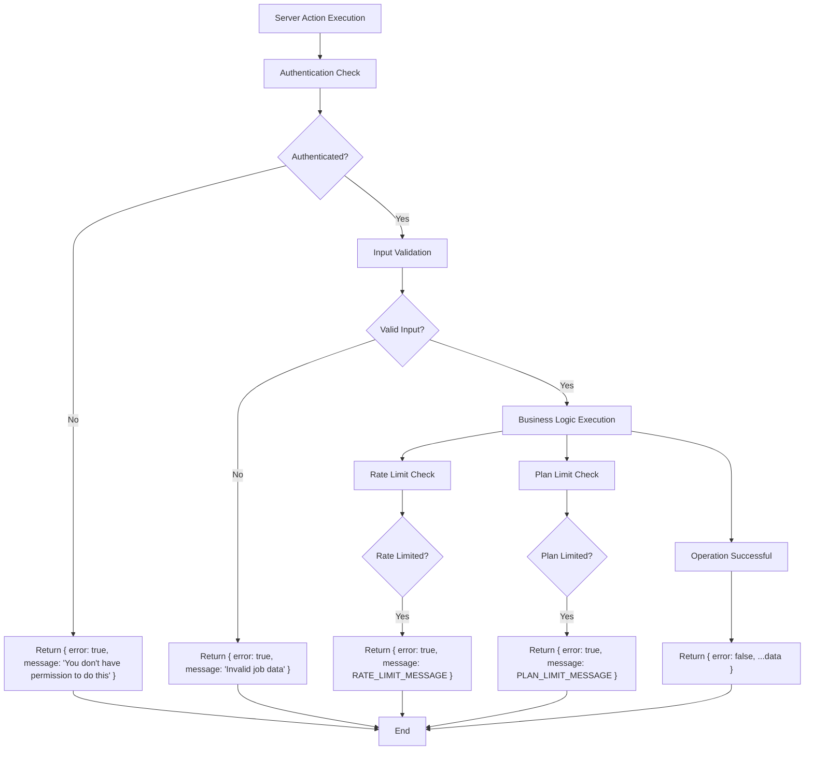
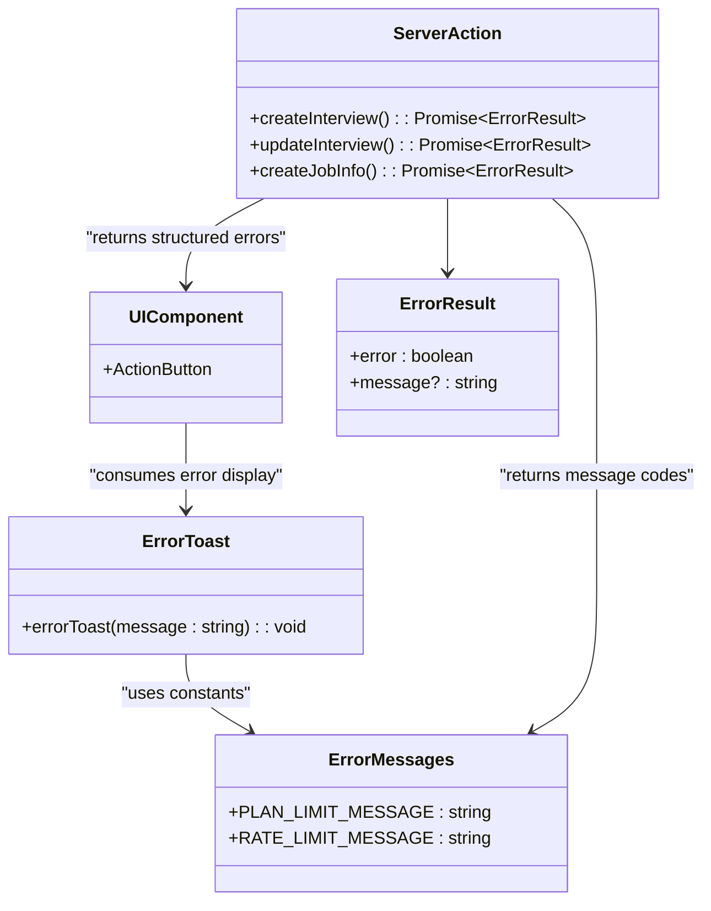
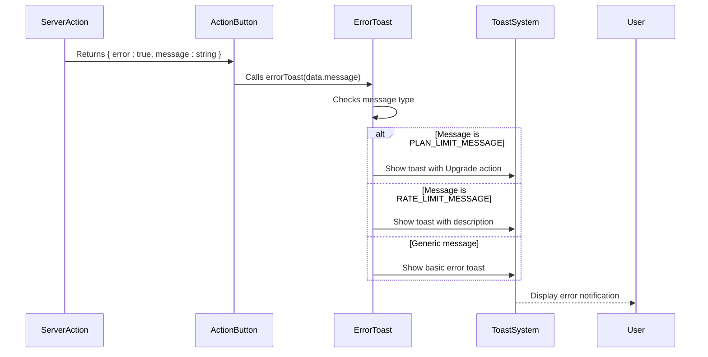

# Error Handling and User Feedback

<cite>
**Referenced Files in This Document**  
- [errorToast.tsx](file://src/lib/errorToast.tsx)
- [action-button.tsx](file://src/components/ui/action-button.tsx)
- [interviews/actions.ts](file://src/features/interviews/actions.ts)
- [jobInfos/actions.ts](file://src/features/jobInfos/actions.ts)
</cite>

## Table of Contents
1. [Introduction](#introduction)
2. [Error Handling Patterns in Server Actions](#error-handling-patterns-in-server-actions)
3. [Centralized Error Messaging System](#centralized-error-messaging-system)
4. [Integration with UI Feedback Mechanisms](#integration-with-ui-feedback-mechanisms)
5. [Domain-Specific Error Types](#domain-specific-error-types)
6. [Error Classification Strategy](#error-classification-strategy)
7. [Server-Side Logging and Client Information Exposure](#server-side-logging-and-client-information-exposure)
8. [Testing Error Code Paths](#testing-error-code-paths)
9. [Conclusion](#conclusion)

## Introduction

This document details the error handling architecture implemented across server actions in the application. The system prioritizes user experience through consistent, structured error responses that enable graceful recovery in the UI layer. Rather than throwing exceptions, server actions return standardized error objects that are consumed by client components to display appropriate feedback. This approach ensures predictable behavior, simplifies debugging, and supports localization readiness.

## Error Handling Patterns in Server Actions

The application employs a consistent pattern for error handling in server actions, where functions return structured objects instead of throwing exceptions. This enables the calling code to handle errors gracefully without disrupting execution flow.



**Diagram sources**
- [interviews/actions.ts](file://src/features/interviews/actions.ts#L30-L100)
- [jobInfos/actions.ts](file://src/features/jobInfos/actions.ts#L17-L50)

**Section sources**
- [interviews/actions.ts](file://src/features/interviews/actions.ts#L1-L179)
- [jobInfos/actions.ts](file://src/features/jobInfos/actions.ts#L1-L122)

## Centralized Error Messaging System

The application implements a centralized error messaging system that standardizes error communication across features. This ensures consistency in user-facing messages and simplifies maintenance and localization.



**Diagram sources**
- [errorToast.tsx](file://src/lib/errorToast.tsx#L5-L7)
- [interviews/actions.ts](file://src/features/interviews/actions.ts#L1-L179)

**Section sources**
- [errorToast.tsx](file://src/lib/errorToast.tsx#L1-L33)

## Integration with UI Feedback Mechanisms

Error handling is tightly integrated with the UI feedback system through the `errorToast` utility function and reusable components like `ActionButton`. This creates a cohesive user experience when errors occur.

### Toast Notification Integration

The `errorToast` function serves as the central mechanism for displaying error messages to users. It handles special cases like plan and rate limit errors with customized messaging and actions.



**Diagram sources**
- [errorToast.tsx](file://src/lib/errorToast.tsx#L7-L33)
- [action-button.tsx](file://src/components/ui/action-button.tsx#L25-L28)

**Section sources**
- [errorToast.tsx](file://src/lib/errorToast.tsx#L1-L33)
- [action-button.tsx](file://src/components/ui/action-button.tsx#L1-L80)

## Domain-Specific Error Types

The system defines domain-specific error types that address common constraints in the application's business logic. These include plan limits and rate limiting, which are handled consistently across features.

### Plan Limit Errors

When users exceed their subscription plan limits, the system returns the `PLAN_LIMIT_MESSAGE` constant. This triggers a specialized toast notification with an upgrade CTA.

**Section sources**
- [interviews/actions.ts](file://src/features/interviews/actions.ts#L39-L42)
- [errorToast.tsx](file://src/lib/errorToast.tsx#L10-L22)

### Rate Limiting Errors

The application uses Arcjet for rate limiting protection. When requests are denied due to rate limiting, the server action returns the `RATE_LIMIT_MESSAGE` constant, which is then displayed with contextual guidance.

**Section sources**
- [interviews/actions.ts](file://src/features/interviews/actions.ts#L50-L53)
- [errorToast.tsx](file://src/lib/errorToast.tsx#L24-L29)

## Error Classification Strategy

The application distinguishes between several categories of errors, each with its own handling strategy:

```mermaid
graph TD
A[Error Types] --> B[Authorization Errors]
A --> C[Validation Errors]
A --> D[Rate Limiting Errors]
A --> E[Plan Limit Errors]
A --> F[System Errors]
B --> G["Message: 'You don't have permission to do this'"]
C --> H["Message: 'Invalid job data'"]
D --> I["Message: RATE_LIMIT_MESSAGE"]
E --> J["Message: PLAN_LIMIT_MESSAGE"]
F --> K["Message: 'Failed to generate feedback'", "Message: 'Job description could not be deleted'"]
style B fill:#f9f,stroke:#333
style C fill:#ff9,stroke:#333
style D fill:#9ff,stroke:#333
style E fill:#9f9,stroke:#333
style F fill:#f99,stroke:#333
```

**Diagram sources**
- [jobInfos/actions.ts](file://src/features/jobInfos/actions.ts#L20-L22)
- [jobInfos/actions.ts](file://src/features/jobInfos/actions.ts#L32-L34)
- [interviews/actions.ts](file://src/features/interviews/actions.ts#L39-L42)
- [interviews/actions.ts](file://src/features/interviews/actions.ts#L50-L53)
- [interviews/actions.ts](file://src/features/interviews/actions.ts#L128-L130)

**Section sources**
- [jobInfos/actions.ts](file://src/features/jobInfos/actions.ts#L1-L122)
- [interviews/actions.ts](file://src/features/interviews/actions.ts#L1-L179)

## Server-Side Logging and Client Information Exposure

While the client receives user-friendly error messages, the server-side implementation can include more detailed logging for debugging purposes. The current pattern exposes minimal information to clients while maintaining the ability to log comprehensive details on the server.

Best practices suggest augmenting this system with server-side logging that captures:
- Full error context and stack traces (when applicable)
- User identifiers for audit trails
- Timestamps and request metadata
- Correlation IDs for tracing

This would allow developers to diagnose issues without exposing sensitive information to clients.

**Section sources**
- [interviews/actions.ts](file://src/features/interviews/actions.ts#L1-L179)

## Testing Error Code Paths

To ensure reliability, error code paths should be thoroughly tested. Strategies include:

1. **Unit Testing**: Mock dependencies to simulate error conditions
2. **Integration Testing**: Test complete server action flows with various failure modes
3. **End-to-End Testing**: Verify that UI components properly display different error types

Key test scenarios include:
- Authentication failures
- Invalid input validation
- Rate limit enforcement
- Plan limit restrictions
- Database operation failures

The structured error format makes testing straightforward, as assertions can check both the `error` flag and specific `message` content.

**Section sources**
- [interviews/actions.ts](file://src/features/interviews/actions.ts#L1-L179)
- [jobInfos/actions.ts](file://src/features/jobInfos/actions.ts#L1-L122)

## Conclusion

The application's error handling system demonstrates a well-structured approach to managing failures in server actions. By returning standardized error objects instead of throwing exceptions, it enables graceful UI recovery and consistent user feedback. The centralized `errorToast` utility ensures uniform presentation of errors across the application, while domain-specific error types address business constraints like plan and rate limits. This pattern supports future enhancements such as comprehensive server-side logging and improved test coverage, making it a robust foundation for reliable application behavior.