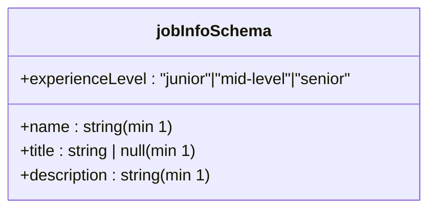
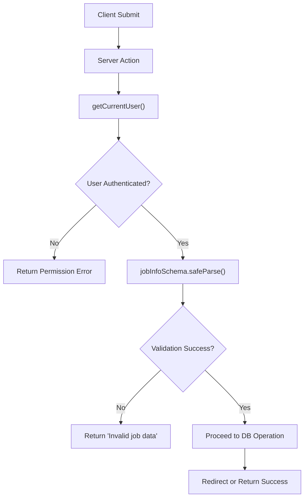

# Input Validation with Zod

<cite>
**Referenced Files in This Document**
- [schemas.ts](file://src/features/jobInfos/schemas.ts)
- [actions.ts](file://src/features/jobInfos/actions.ts)
- [JobInfoForm.tsx](file://src/features/jobInfos/components/JobInfoForm.tsx)
- [jobinfo.ts](file://src/drizzle/schema/jobinfo.ts)
</cite>

## Table of Contents
1. [Introduction](#introduction)
2. [Zod Schema Definition and Structure](#zod-schema-definition-and-structure)
3. [Server Action Integration](#server-action-integration)
4. [Validation Flow and Error Handling](#validation-flow-and-error-handling)
5. [Schema Composition and Refinement](#schema-composition-and-refinement)
6. [Error Message Customization](#error-message-customization)
7. [Common Pitfalls and Best Practices](#common-pitfalls-and-best-practices)
8. [Unit Testing Validation Logic](#unit-testing-validation-logic)

## Introduction
This document details the implementation of input validation using Zod within Server Actions in the application. It focuses on how Zod schemas are defined, imported, and used to ensure runtime type safety when processing client-submitted data. The analysis centers on the `jobInfoSchema` used in job information management, demonstrating validation patterns, error handling strategies, and integration between frontend forms and backend actions.

**Section sources**
- [schemas.ts](file://src/features/jobInfos/schemas.ts#L3-L8)
- [actions.ts](file://src/features/jobInfos/actions.ts#L17-L70)

## Zod Schema Definition and Structure
The `jobInfoSchema` is defined in the feature module under `src/features/jobInfos/schemas.ts`. It validates job-related data including name, title, experience level, and description. The schema leverages Zod's type system to enforce constraints such as minimum string length and nullable fields.

Experience levels are derived from a shared enum defined in the Drizzle schema, ensuring consistency between database constraints and validation rules. This approach promotes maintainability by centralizing domain-specific constants.

**Diagram sources**
- [schemas.ts](file://src/features/jobInfos/schemas.ts#L3-L8)
- [jobinfo.ts](file://src/drizzle/schema/jobinfo.ts#L3-L7)

**Section sources**
- [schemas.ts](file://src/features/jobInfos/schemas.ts#L3-L8)
- [jobinfo.ts](file://src/drizzle/schema/jobinfo.ts#L3-L7)

## Server Action Integration
Zod schemas are imported directly into Server Actions for runtime validation. In `createJobInfo` and `updateJobInfo`, the schema is used via `safeParse` to validate untrusted input before any business logic executes. This pattern ensures that only properly typed and validated data proceeds to database operations.

The `z.infer<typeof jobInfoSchema>` type is used in function signatures to provide TypeScript type safety while accepting potentially malformed data from clients. This enables strong typing without sacrificing runtime validation.

**Section sources**
- [actions.ts](file://src/features/jobInfos/actions.ts#L17-L37)
- [actions.ts](file://src/features/jobInfos/actions.ts#L39-L70)

## Validation Flow and Error Handling
The validation flow follows a consistent pattern across Server Actions:
1. Authenticate user context
2. Apply `safeParse` to incoming data
3. Destructure result into `success` flag and `data`
4. Return structured error response if validation fails
5. Proceed with business logic if successful

When validation fails, a standardized error object is returned with `error: true` and a descriptive message. This allows the frontend to handle errors uniformly without exposing internal validation details.

**Diagram sources**
- [actions.ts](file://src/features/jobInfos/actions.ts#L17-L37)
- [actions.ts](file://src/features/jobInfos/actions.ts#L39-L70)

**Section sources**
- [actions.ts](file://src/features/jobInfos/actions.ts#L17-L37)
- [actions.ts](file://src/features/jobInfos/actions.ts#L39-L70)

## Schema Composition and Refinement
While the current implementation uses a flat schema, Zod supports advanced composition patterns such as merging schemas, extending base definitions, and applying refinement rules. These capabilities allow building complex validation logic from reusable components.

Although not currently implemented, future enhancements could include field dependencies (e.g., conditional requirements based on experience level) or custom validators for specialized business rules. The modular structure of the feature-based architecture facilitates such extensions.

**Section sources**
- [schemas.ts](file://src/features/jobInfos/schemas.ts#L3-L8)

## Error Message Customization
Error messages are customized at the schema definition level using Zod's message parameter. For example, required fields display "Required" instead of generic validation failure text. This improves user experience by providing clear feedback.

The server actions return high-level messages like "Invalid job data" rather than detailed Zod error objects, maintaining security by not exposing schema internals. Detailed error information remains available during development but is abstracted in production responses.

**Section sources**
- [schemas.ts](file://src/features/jobInfos/schemas.ts#L3-L8)
- [actions.ts](file://src/features/jobInfos/actions.ts#L25-L28)

## Common Pitfalls and Best Practices
Key pitfalls to avoid include:
- **Incomplete schema coverage**: Ensure all expected fields are validated
- **Improper error handling**: Always check `success` flag before accessing `data`
- **Performance issues**: Complex validations should be optimized to minimize latency

Best practices demonstrated in the codebase:
- Centralize schemas in feature modules
- Use `safeParse` for graceful error handling
- Separate validation from business logic
- Maintain consistent error response structures

**Section sources**
- [schemas.ts](file://src/features/jobInfos/schemas.ts#L3-L8)
- [actions.ts](file://src/features/jobInfos/actions.ts#L17-L70)

## Unit Testing Validation Logic
Validation logic can be tested independently from business logic by importing the schema directly into test files. Tests should verify:
- Valid inputs pass validation
- Invalid inputs fail with appropriate messages
- Edge cases (null, empty strings, etc.) are handled correctly
- Type inference works as expected

This separation allows comprehensive validation testing without requiring full Server Action execution or database interactions, resulting in faster and more reliable tests.

**Section sources**
- [schemas.ts](file://src/features/jobInfos/schemas.ts#L3-L8)
- [actions.ts](file://src/features/jobInfos/actions.ts#L17-L70)