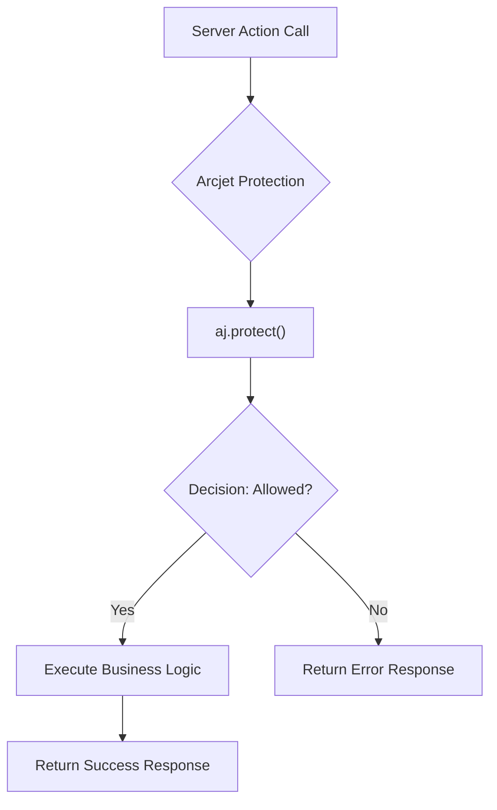
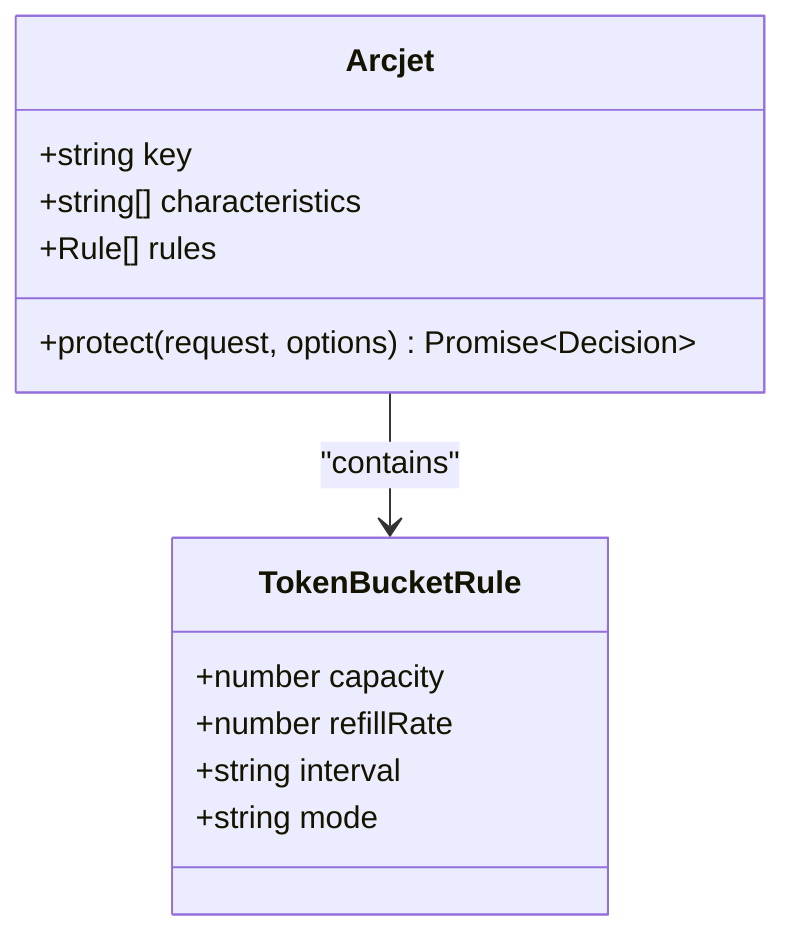
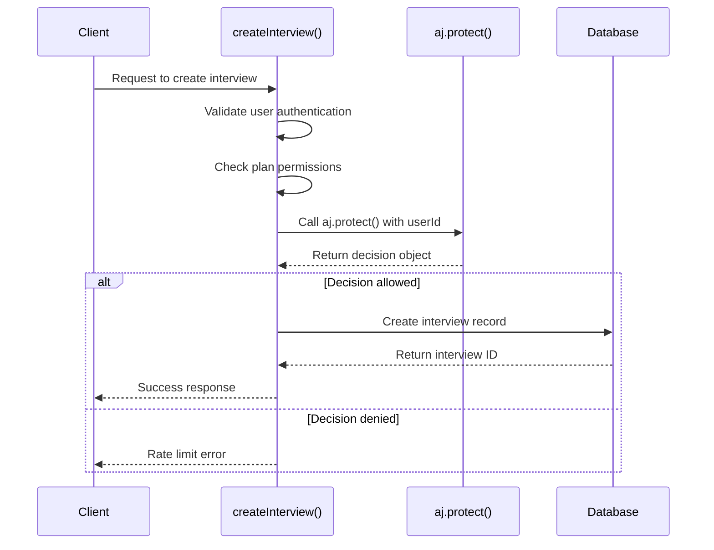
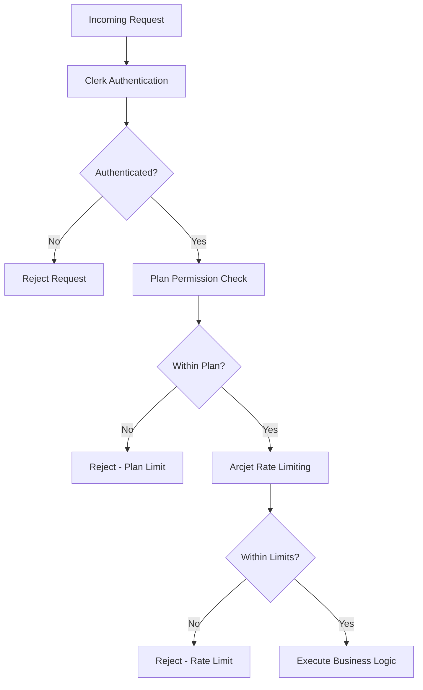

# Security Considerations and Rate Limiting

<cite>
**Referenced Files in This Document**   
- [src/features/interviews/actions.ts](file://src/features/interviews/actions.ts)
- [src/app/api/arcjet/route.ts](file://src/app/api/arcjet/route.ts)
- [src/data/env/server.ts](file://src/data/env/server.ts)
- [src/lib/errorToast.tsx](file://src/lib/errorToast.tsx)
</cite>

## Table of Contents
1. [Introduction](#introduction)
2. [Arcjet Integration Architecture](#arcjet-integration-architecture)
3. [Rate Limiting Implementation](#rate-limiting-implementation)
4. [Security Enforcement Flow](#security-enforcement-flow)
5. [Configuration and Environment Setup](#configuration-and-environment-setup)
6. [Defense-in-Depth Strategy](#defense-in-depth-strategy)
7. [Monitoring and Violation Handling](#monitoring-and-violation-handling)
8. [Mitigation Strategies for Abuse Scenarios](#mitigation-strategies-for-abuse-scenarios)
9. [Conclusion](#conclusion)

## Introduction

This document details the security enforcement mechanisms implemented in Server Actions, with a focus on rate limiting and request monitoring through Arcjet integration. The system combines automated protection rules with manual permission checks to create a robust defense-in-depth strategy. Key components include token-based rate limiting, environment-specific configuration, and coordinated fallback behaviors during protection triggers.

## Arcjet Integration Architecture

The application integrates Arcjet as a comprehensive security layer for server-side operations. Arcjet is initialized as a singleton instance (`aj`) that wraps around critical actions to provide consistent protection across the application. The integration follows a middleware-like pattern where `aj.protect()` is called before executing business logic in server actions.



**Diagram sources**
- [src/features/interviews/actions.ts](file://src/features/interviews/actions.ts#L29-L72)

**Section sources**
- [src/features/interviews/actions.ts](file://src/features/interviews/actions.ts#L1-L178)

## Rate Limiting Implementation

The application implements rate limiting using Arcjet's token bucket algorithm with specific parameters tailored to user behavior patterns. The rule configuration establishes a capacity of 12 tokens with a daily refill rate of 4 tokens, creating a sustainable usage pattern while preventing abuse.

### Token Bucket Configuration

| Parameter | Value | Description |
|---------|-------|-------------|
| Capacity | 12 | Maximum tokens available at any time |
| Refill Rate | 4 | Tokens replenished per interval |
| Interval | 1 day | Frequency of token replenishment |
| Mode | LIVE | Actively enforces limits (not dry-run) |

The rate limiting rule is defined during Arcjet initialization and applies globally to protected actions:



**Diagram sources**
- [src/features/interviews/actions.ts](file://src/features/interviews/actions.ts#L15-L25)

**Section sources**
- [src/features/interviews/actions.ts](file://src/features/interviews/actions.ts#L15-L25)

## Security Enforcement Flow

The security enforcement flow demonstrates how Arcjet protection is integrated into server actions, specifically the `createInterview` function. The process follows a sequential validation pattern that combines authentication, permission checks, and rate limiting before executing business logic.



**Diagram sources**
- [src/features/interviews/actions.ts](file://src/features/interviews/actions.ts#L29-L72)

**Section sources**
- [src/features/interviews/actions.ts](file://src/features/interviews/actions.ts#L29-L72)

## Configuration and Environment Setup

The security system relies on environment-based configuration for sensitive credentials and operational parameters. The ARCJET_KEY is securely managed through environment variables, ensuring separation between configuration and code.

### Environment Configuration

The application uses a structured environment configuration system that validates required variables at runtime:

```typescript
export const env = createEnv({
  server: {
    ARCJET_KEY: z.string().min(1),
    CLERK_SECRET_KEY: z.string().min(1),
    HUME_API_KEY: z.string().min(1),
    HUME_SECRET_KEY: z.string().min(1),
    GEMINI_API_KEY: z.string().min(1),
  },
  emptyStringAsUndefined: true,
  experimental__runtimeEnv: process.env,
});
```

This approach ensures that all critical security keys are present and valid before the application starts, preventing misconfigurations.

**Section sources**
- [src/data/env/server.ts](file://src/data/env/server.ts#L0-L58)

## Defense-in-Depth Strategy

The application implements a multi-layered security approach that combines automated protection with manual verification. This defense-in-depth strategy includes:

1. **Authentication Layer**: Clerk integration verifies user identity
2. **Permission Layer**: Manual checks validate user entitlements
3. **Rate Limiting Layer**: Arcjet enforces usage quotas
4. **Bot Detection**: Automated identification of malicious traffic

The coordination between these layers creates overlapping protection zones. For example, even if a user is authenticated, they must still pass rate limiting checks and explicit permission validations before accessing premium features.



**Diagram sources**
- [src/features/interviews/actions.ts](file://src/features/interviews/actions.ts#L29-L72)
- [src/data/env/server.ts](file://src/data/env/server.ts#L0-L58)

**Section sources**
- [src/features/interviews/actions.ts](file://src/features/interviews/actions.ts#L29-L72)
- [src/lib/errorToast.tsx](file://src/lib/errorToast.tsx#L0-L33)

## Monitoring and Violation Handling

The system provides clear feedback when security protections are triggered, with differentiated responses for various violation types. Error messages are standardized through constants to ensure consistency across the application.

### Error Message Definitions

| Constant | User Message | Description |
|--------|--------------|-------------|
| RATE_LIMIT_MESSAGE | "Woah! Slow down." | Triggered when rate limits are exceeded |
| PLAN_LIMIT_MESSAGE | "You have reached your plan limit." | Triggered when feature limits are exceeded |

When a rate limit violation occurs, the system returns a 429 Too Many Requests status code with descriptive messaging. The frontend displays appropriate toast notifications with guidance for resolution.

**Section sources**
- [src/lib/errorToast.tsx](file://src/lib/errorToast.tsx#L0-L33)
- [src/features/interviews/actions.ts](file://src/features/interviews/actions.ts#L11)

## Mitigation Strategies for Abuse Scenarios

The application employs several strategies to handle potential abuse scenarios:

1. **Progressive Rate Limiting**: The token bucket algorithm allows burst usage while maintaining average limits
2. **User Identification**: Tracking by `userId` characteristic enables fair distribution of resources
3. **Clear Communication**: Informative error messages guide legitimate users
4. **Upgrade Pathways**: Plan limit errors include direct links to upgrade options

During protection triggers, the system maintains graceful degradation by returning meaningful error responses rather than failing silently. This approach balances security enforcement with user experience, providing clear pathways for resolution.

## Conclusion

The security implementation demonstrates a comprehensive approach to protecting server actions through integrated rate limiting and multi-layered validation. By combining Arcjet's automated protection with manual permission checks and environment-secured configuration, the application achieves a robust defense-in-depth posture. The token bucket configuration with 12 capacity and 4/day refill provides sustainable usage patterns while preventing abuse, and the clear violation handling ensures a positive user experience even during enforcement events.