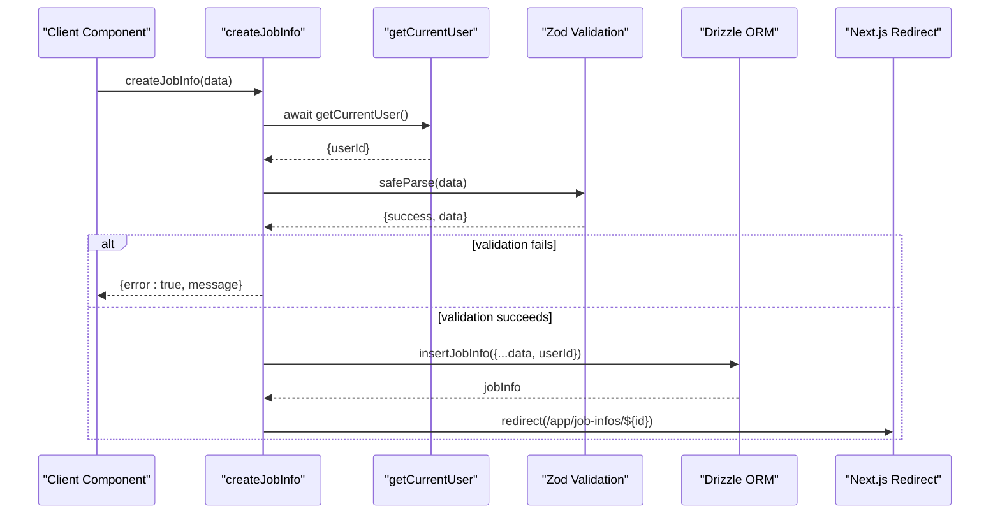
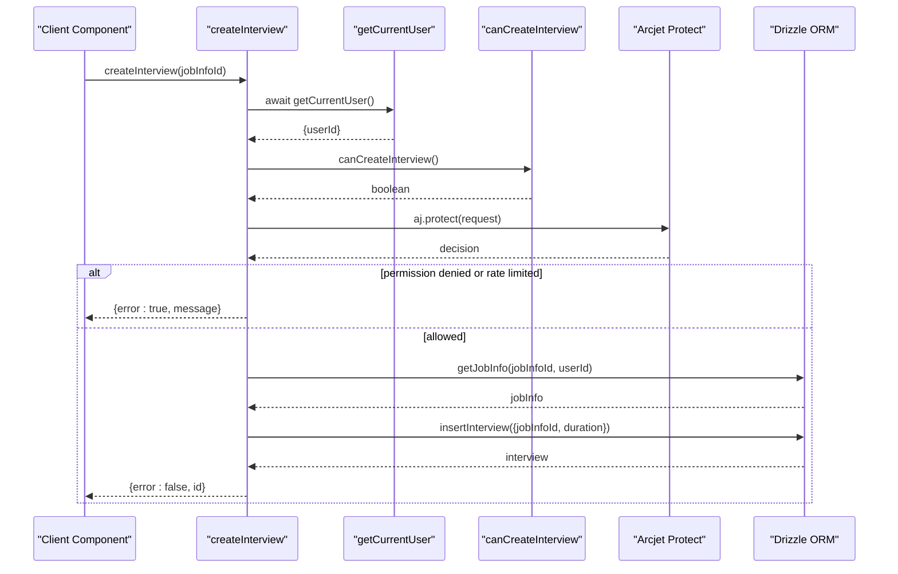
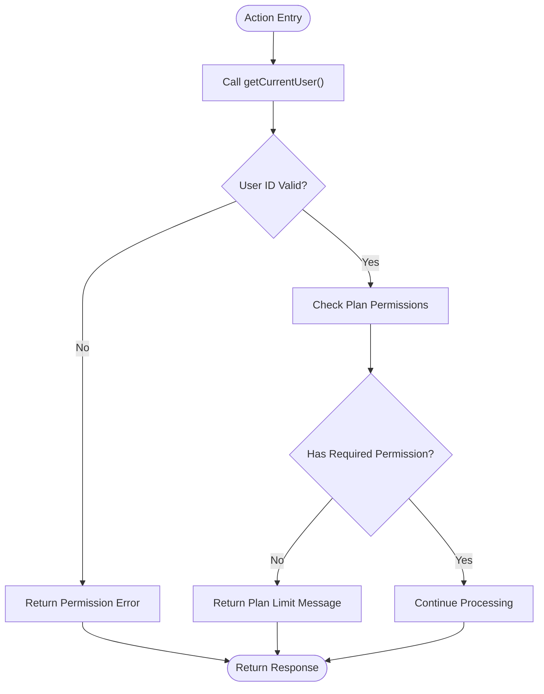

# Server Actions Pattern

<cite>
**Referenced Files in This Document**   
- [actions.ts](file://src/features/interviews/actions.ts)
- [actions.ts](file://src/features/jobInfos/actions.ts)
- [actions.ts](file://src/features/users/actions.ts)
- [getCurrentUser.ts](file://src/services/clerk/lib/getCurrentUser.ts)
- [hasPermission.ts](file://src/services/clerk/lib/hasPermission.ts)
- [schemas.ts](file://src/features/jobInfos/schemas.ts)
- [permissions.ts](file://src/features/interviews/permissions.ts)
- [dataCache.ts](file://src/lib/dataCache.ts)
- [dbCache.ts](file://src/features/jobInfos/dbCache.ts)
- [dbCache.ts](file://src/features/interviews/dbCache.ts)
</cite>

## Table of Contents
1. [Introduction](#introduction)
2. [Core Components](#core-components)
3. [Architecture Overview](#architecture-overview)
4. [Detailed Component Analysis](#detailed-component-analysis)
5. [Security Considerations](#security-considerations)
6. [Usage Examples](#usage-examples)
7. [Error Handling and Propagation](#error-handling-and-propagation)
8. [Conclusion](#conclusion)

## Introduction
The Server Actions pattern in darasa leverages Next.js Server Actions to enable secure, direct function calls from client components while executing business logic on the server. This architectural approach eliminates the need for traditional API routes for many operations, simplifying data flow and improving developer experience. The implementation encapsulates domain-specific logic within feature modules, ensuring separation of concerns and maintainability.

**Section sources**
- [actions.ts](file://src/features/interviews/actions.ts)
- [actions.ts](file://src/features/jobInfos/actions.ts)

## Core Components

The Server Actions pattern is implemented through several core components that work together to provide a robust, secure, and efficient execution environment. These include action functions that handle business logic, authentication utilities, permission checkers, input validators, database interaction layers, and caching mechanisms. Each feature module (such as jobInfos, interviews, questions) contains its own actions file that exports server-side functions callable from client components.

**Section sources**
- [actions.ts](file://src/features/interviews/actions.ts)
- [actions.ts](file://src/features/jobInfos/actions.ts)
- [actions.ts](file://src/features/users/actions.ts)

## Architecture Overview

```mermaid
graph TB
ClientComponent[Client Component] --> |Direct Call| ServerAction[Server Action]
ServerAction --> AuthCheck[Authentication Check<br/>getCurrentUser()]
AuthCheck --> PermissionCheck[Authorization Check<br/>hasPermission()]
PermissionCheck --> InputValidation[Input Validation<br/>Zod Schema]
InputValidation --> BusinessLogic[Business Logic Execution]
BusinessLogic --> DataLayer[Drizzle ORM Operations]
DataLayer --> Cache[Cache Management<br/>dataCache.ts]
Cache --> Response[Response to Client]
style ServerAction fill:#f9f,stroke:#333
style AuthCheck fill:#bbf,stroke:#333
style PermissionCheck fill:#bbf,stroke:#333
style InputValidation fill:#ffcc00,stroke:#333
style BusinessLogic fill:#9f9,stroke:#333
style DataLayer fill:#9f9,stroke:#333
style Cache fill:#9f9,stroke:#333
```

**Diagram sources**
- [actions.ts](file://src/features/interviews/actions.ts)
- [getCurrentUser.ts](file://src/services/clerk/lib/getCurrentUser.ts)
- [hasPermission.ts](file://src/services/clerk/lib/hasPermission.ts)
- [schemas.ts](file://src/features/jobInfos/schemas.ts)
- [dataCache.ts](file://src/lib/dataCache.ts)

## Detailed Component Analysis

### Job Creation Flow Analysis
The job creation process begins with a client component calling the `createJobInfo` server action. This action first authenticates the user via `getCurrentUser`, then validates the input against a Zod schema before persisting the data to the database. Upon successful creation, it redirects to the newly created job's page.



**Diagram sources**
- [actions.ts](file://src/features/jobInfos/actions.ts#L17-L37)
- [schemas.ts](file://src/features/jobInfos/schemas.ts#L4-L9)
- [getCurrentUser.ts](file://src/services/clerk/lib/getCurrentUser.ts#L7-L15)

**Section sources**
- [actions.ts](file://src/features/jobInfos/actions.ts)
- [schemas.ts](file://src/features/jobInfos/schemas.ts)

### Interview Initiation Flow Analysis
The interview initiation process demonstrates a more complex server action that incorporates rate limiting via Arcjet in addition to standard authentication and authorization checks. The `createInterview` action verifies both plan permissions and rate limits before creating a new interview record associated with a specific job.



**Diagram sources**
- [actions.ts](file://src/features/interviews/actions.ts#L29-L72)
- [permissions.ts](file://src/features/interviews/permissions.ts#L10-L47)
- [getCurrentUser.ts](file://src/services/clerk/lib/getCurrentUser.ts#L7-L15)

**Section sources**
- [actions.ts](file://src/features/interviews/actions.ts)
- [permissions.ts](file://src/features/interviews/permissions.ts)

### Question Submission Flow Analysis
While specific question submission actions are not fully visible in the provided context, the architecture suggests a similar pattern to job and interview creation. Questions would be handled by actions in the questions feature module, utilizing shared infrastructure for authentication, permission checking, and database operations.

**Section sources**
- [actions.ts](file://src/features/questions/actions.ts)
- [permissions.ts](file://src/features/questions/permissions.ts)

## Security Considerations

### Authentication and Authorization
All server actions begin with a call to `getCurrentUser` which retrieves the authenticated user's ID from Clerk. This ensures that every operation is performed in the context of an authenticated session. Authorization is enforced through the `hasPermission` function which checks feature flags stored in Clerk, allowing for flexible access control based on user plans.



**Diagram sources**
- [getCurrentUser.ts](file://src/services/clerk/lib/getCurrentUser.ts#L7-L15)
- [hasPermission.ts](file://src/services/clerk/lib/hasPermission.ts#L11-L14)
- [permissions.ts](file://src/features/interviews/permissions.ts#L10-L47)

**Section sources**
- [getCurrentUser.ts](file://src/services/clerk/lib/getCurrentUser.ts)
- [hasPermission.ts](file://src/services/clerk/lib/hasPermission.ts)
- [permissions.ts](file://src/features/interviews/permissions.ts)

### Input Validation
Input validation is implemented using Zod schemas, providing type safety and runtime validation. The `jobInfoSchema` defines the required structure and constraints for job information, with all server actions parsing untrusted input through `safeParse` to prevent invalid data from being processed.

**Section sources**
- [schemas.ts](file://src/features/jobInfos/schemas.ts)

### Rate Limiting
The system implements rate limiting using Arcjet, particularly evident in the interview creation flow. A token bucket algorithm limits users to 12 interviews per day with a refill rate of 4 tokens per day, protecting backend resources from abuse while providing a fair usage policy.

**Section sources**
- [actions.ts](file://src/features/interviews/actions.ts#L13-L21)

## Usage Examples

### Job Creation Payload Structure
When creating a job, the client passes an object matching the `jobInfoSchema` structure:
- name: string (minimum length 1)
- title: string | null
- experienceLevel: enum value from experienceLevels
- description: string (minimum length 1)

The server action validates this payload before insertion into the database.

**Section sources**
- [schemas.ts](file://src/features/jobInfos/schemas.ts)

### Interview Creation Payload Structure
The interview creation action accepts a simple object containing:
- jobInfoId: string (UUID reference to existing job)

This minimal payload reduces attack surface while the server-side logic handles default values like initial duration.

**Section sources**
- [actions.ts](file://src/features/interviews/actions.ts#L29-L33)

## Error Handling and Propagation

Server actions follow a consistent error handling pattern, returning structured error objects with clear messages rather than throwing exceptions. This approach enables predictable client-side handling and user-friendly error displays. Errors are categorized into authentication failures, validation errors, permission denials, and system errors, each with appropriate messaging.

The error propagation mechanism ensures that all potential failure points are explicitly handled and communicated back to the client, maintaining application stability even under unexpected conditions.

**Section sources**
- [actions.ts](file://src/features/interviews/actions.ts)
- [actions.ts](file://src/features/jobInfos/actions.ts)

## Conclusion
The Server Actions pattern in darasa provides a clean, secure, and maintainable architecture for handling server-side operations. By leveraging Next.js Server Actions, the application achieves direct function calls from client components while maintaining proper security boundaries through authentication, authorization, input validation, and